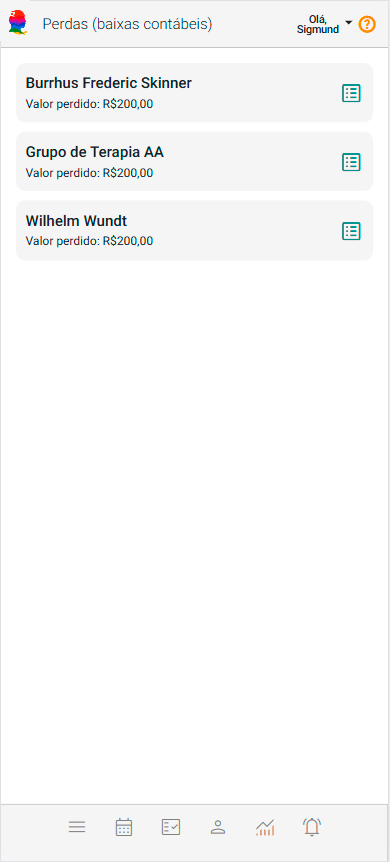

# Sobre Perdas (baixas contábeis)

O Painel "Perdas (baixas contábeis)" do eConsult é uma solução estratégica voltada para o controle e gestão de atendimentos com pagamentos inadimplentes que foram classificados como de difícil recebimento ou com presunção de não pagamento.

Com essa funcionalidade, você pode registrar baixas contábeis de forma organizada e transparente, acompanhando de perto os valores que, por critérios técnicos ou administrativos, passaram a ser considerados "**com difícil recuperação"**. Isso contribui para uma visão mais realista da saúde financeira do negócio, permitindo ajustes no planejamento e na projeção de receitas.

Além disso, o painel facilita a categorização e o acompanhamento desses casos, consolidando as informações em relatórios claros que apoiam a tomada de decisão e o cumprimento de práticas contábeis mais rigorosas.

Essa abordagem evita distorções nos indicadores financeiros, melhora a gestão de inadimplência e reforça o controle sobre as perdas efetivas da operação.

No painel, os clientes e grupos terapêuticos são apresentados de maneira visualmente intuitiva por meio de *cards* interativos, projetados para facilitar a identificação rápida mostrando o nome do cliente e valor total dos atendimento com registro de presução de não pagamento.

Para consultar estes atendimentos, com presunção de não pagamento, basta clicar no botão  localizado no *card* do cliente ou grupo terapêutico. Após selecionar o cliente ou grupo, o sistema exibirá as informações relevantes.

Nesta tela, é possível visualizar ou excluir registros de perdas ou, ainda, adicionar fundos para recuperação dos valores.

## Excluir registro de perda

1. Acione o botão  no *card* do cliente ou grupo terapêutico.

1. O sistema abre tela mostrando todas as perdas registradas para este cliente ou grupo.

    

1. Acione o botão  correspondente a perda que deseja excluir.

1. Confirme a exclusão clicando em "Sim".

1. A tela será atualizada já com a perda excluída.

## Adicionar fundos para recuperação de perdas

Você pode adicionar fundos (crédito) para o cliente a fim de fazer uma recuperação de perdas.

Este crédito gerará uma fatura no sistema como um recebimento contabilmente realizado.

1. Acione o botão  no *card* do cliente ou grupo terapêutico.

1. O sistema abre tela mostrando todas as perdas registradas para este cliente ou grupo.

    

1. Acione a opção "Incluir Crédito Antecipado" .

1. O sistema abre a tela "Novo Crédito".

    

1. Preencha os campos "Valor", "Data", "Forma de Pagamento", opcionalmente "Descrição" e acione o botão "Salvar".

    

1. O sistema atualizará a tela já com as perdas que puderam ser recuperadas com o valor do crédito.

    

## Mudar status de crédito de "Previsto" para "Realizado"

No eConsult, créditos com data futura são automaticamente classificados como "Previstos".

Para que sejam considerados "Realizados", é necessário confirmar a efetivação do pagamento. Essa mudança só ocorrerá se a data do pagamento for igual ou anterior à data atual.

1. No *card* do crédito acione a opção .

1. Preencha no campo "Data" a data que você recebeu efetivamente o valor correspondente ao crédito.

1. Ao indicar a data, o sistema passa a mostrar "Realizado" ao invés de "Previsto".

    

1. Acione o botão "Confirmar" .

1. O sistema passa a mostrar no *card* do crédito a informação "Realizado".

    

:::warning
    - Se o campo "Data" for preenchido com a data atual ou uma data anterior, o sistema exibirá automaticamente a indicação "Realizado" ao lado da data. 

        
    
    - Caso a data informada seja futura, o sistema mostrará a indicação "Previsto", sinalizando que o pagamento ainda está pendente.

        

    - Essa informação (Previsto ou Realizado) também estará visível no *card* correspondente ao crédito.

    Além disso, créditos com o status "Previsto" serão incluídos automaticamente no alerta respectivo do painel "Alertas", indicando que há um pagamento pendente de confirmação.

    

    Dessa forma, o painel "Alertas" reúne, em um só lugar, todos os créditos com pagamento previsto, facilitando o acompanhamento e a gestão dessas pendências.
:::

:::warning 
O sistema impede o registro de novos atendimentos para cliente ou grupo terapêutico que tem perdas registradas.
:::