# Sobre Campanhas de Cashback

As *Campanhas de Cashback* são estratégias promocionais desenvolvidas por você, especialista, para estimular a fidelização e o engajamento dos seus clientes. Nessas ações, um valor em dinheiro — fixo (em reais) ou percentual (%) — é devolvido ao cliente com base no total pago em atendimentos durante um determinado período de apuração, geralmente mensal.

A principal vantagem dessas campanhas está na sua **flexibilidade**: você define os critérios de elegibilidade conforme o perfil da sua clientela e os objetivos do seu negócio.

Entre as possibilidades de configuração, é possível segmentar por frequência de atendimentos, valor total gasto, engajamento, entre outros filtros. Essa personalização torna a campanha mais eficaz e alinhada ao comportamento de consumo dos seus clientes.

Ao usar o cashback de forma estratégica, você reforça o vínculo com seus clientes, estimula o retorno recorrente e agrega valor à sua proposta de atendimento.

---

## Incluir uma campanha de cashback

### Na aba "Regras":

1. No painel "Campanhas de Cashback", clique no botão **"Incluir Campanha"** .

2. Defina se a campanha estará ativa e atribua um nome.  
   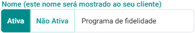  
   :::note  
   A campanha só será processada se estiver ativa.  
   :::

3. Indique o período de validade.  
   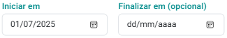  
   :::note  
   - A campanha só será processada se estiver dentro do período válido.  
   - Se o campo "Finalizar" estiver vazio, a campanha será processada indefinidamente.  
   :::

4. Informe a periodicidade de processamento (em meses).  
   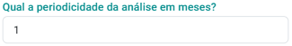  
   :::note  
   As campanhas são processadas no primeiro dia de cada mês.  
   :::

5. Defina o valor do cashback: valor fixo ou percentual sobre os gastos do cliente.  
   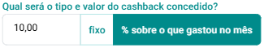  
   :::note  
   - Valor fixo: crédito concedido ao cliente.  
   - Percentual: devolução proporcional ao valor gasto no mês.  
   :::

6. Estabeleça há quantos meses o cliente deve estar cadastrado.  
   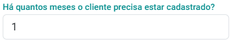

7. Selecione a pontuação mínima do cliente (estrelas), com base no período considerado.  
   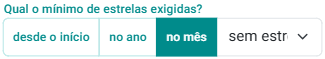  
   :::note  
   **Score do Cliente - Estrelas**: calculado conforme critérios definidos no sistema:  
   - ★★★★★ Excelente: muito acima da média em valor, frequência e engajamento.  
   - ★★★★ Bom: desempenho acima da média, com potencial de crescimento.  
   - ★★★ Normal: comportamento regular e estável.  
   - ★★ Alerta: queda nas interações ou valor gerado.  
   - ★ Crítico: baixo engajamento e risco de abandono.  
   :::

8. Defina o número mínimo de atendimentos realizados.  
   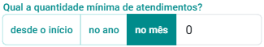

9. Informe o valor mínimo gasto em atendimentos.  
   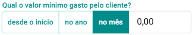

10. Estabeleça se o cliente pode ter desmarcações no mês da apuração.  
    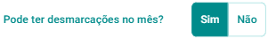

11. Estabeleça se o cliente pode ter remarcações no mês da apuração.  
    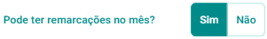

### Na aba "Excessões":

12. Indique os clientes que não devem receber cashback selecionando o cliente e acionando o botão .

13. Despois que preencher todas as informações, acione o botão "Salvar" .

---

## Como alterar uma campanha de cashback

1. No painel "Campanhas de Cashback", clique no botão  no card da campanha.

2. Faça as alterações desejadas.

3. Clique em **"Salvar"**  
   

---

## Como excluir uma campanha de cashback

1. No painel "Campanhas de Cashback", clique no botão  no card da campanha.

2. Confirme clicando em **"Sim"**.

:::warning
O sistema não permite campanhas com períodos sobrepostos.
:::

---

:::tip Dicas importantes
- O sistema verifica automaticamente, no primeiro dia de cada mês, quais campanhas e clientes atendem aos critérios.
- Clientes elegíveis recebem o cashback automaticamente, para uso em atendimentos futuros.
- É possível processar a campanha manualmente na primeira vez.
  
- O sistema mostra a data do último processamento.
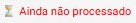 ou 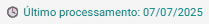
- O sistema mostra data do próximo processamento.
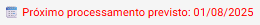  
- Também é possível visualizar resultados da campanha de forma simulada, sem efetivação dos cashbacks.
    
- Você pode ainda ver cashbacks efetivados de um determinado processamento.
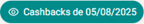  
:::
