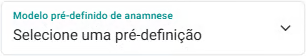
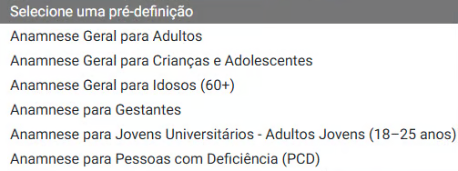
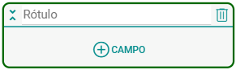
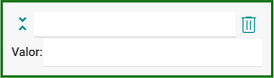
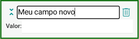
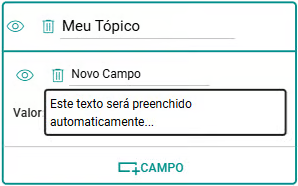

# Sobre Modelos de Anamnese

O prontuário do cliente é uma ferramenta essencial no eConsult, proporcionando um registro detalhado e organizado de todas as informações relacionadas ao histórico do cliente. O prontuário centraliza informações importantes e facilita o acompanhamento contínuo das necessidades do cliente.

Para vincular um prontuário a um cliente, é necessário que os **Modelos de Anamnese** estejam previamente cadastrados, pois estes serão utilizados como base na composição do prontuário.

:::tip Diferenças entre Prontuário e Anamnese

A diferença entre prontuário e anamnese está no conteúdo, na finalidade e no momento em que são utilizados. Veja:

### Anamnese

- **Definição:** É a entrevista inicial feita pelo profissional com seu cliente.
- **Objetivo:** Coletar informações subjetivas sobre o histórico do paciente, seus sintomas, hábitos, doenças anteriores, uso de medicamentos, antecedentes familiares, etc.
- **Importância:** Guia o raciocínio e orienta exames físicos e hipóteses diagnósticas.

### Prontuário
    - **Definição:** É o documento completo (físico ou eletrônico) que reúne todo o histórico do cliente dentro de um serviço de atendimentos.
    - **Objetivo:** Registrar todas as informações de forma organizada, contínua e legal, incluindo anamnese, exames, evoluções, prescrições, procedimentos, etc.
    - **Conteúdo típico:** 
        - Dados do profissional, 
        - Dados de identificação do cliente
        - **Anamnese**
        - Arquivos anexados vinculados ao cliente
        - Arquivos anexados vinculados aos atendimentos feitos
        - Histórico de atendimentos com suas anotações
    - **Importância:** Serve como documento legal, instrumento de comunicação entre profissionais e base para pesquisas e auditorias.
    - **Publicidade das informações do prontuário:** O prontuário reúne todas as informações e dados do cliente coletados durante os atendimentos. Como parte dessas informações pode incluir observações e anotações de uso exclusivo do profissional, cabe a ele (profissional) definir quais dados serão compartilhados (publicados) ou não com o cliente e, também, em que momento.
:::

O eConsult já vem com modelos adaptados ao seu perfil profissional, mas você pode personalizá-los ou criar novos modelos diretamente no painel "Modelos de Anamnese".

Veja os ["Modelos Pré-definidos de Anamnese do eConsult"](/docs/funcionalidades/modelo-anamnese/modelos-econsult).

Cada modelo de anamnese contêm "Tópicos", e dentro desses tópicos há "Campos".

Os tópicos são seções da anamnese, permitindo que as informações sejam registradas de maneira lógica e estruturada. Dentro de cada tópico, há campos específicos que definem os dados a serem preenchidos, como observações, diagnósticos, tratamentos, ou outros detalhes relevantes.

## Estrutura dos Modelos de Anamnese:

- **Tópicos:** São as divisões principais que categorizam as informações no prontuário, facilitando a organização.
- **Campos:** Dentro de cada tópico, encontram-se os campos específicos a serem preenchidos, que podem variar conforme o tipo de atendimento.

## Como Funciona:

- **Criação do Modelo:**  
  Ao cadastrar ou utilizar um modelo de anamnese no eConsult, você tem liberdade para definir os tópicos e os campos que deverão ser preenchidos. Isso permite adaptar cada modelo ao seu estilo de atendimento.

- **Personalização de Campos:**  
  Os nomes dos campos são totalmente personalizáveis, permitindo que você os ajuste conforme as necessidades específicas da sua prática profissional.

- **Adição e Remoção de Campos:**  
  É possível incluir novos campos ou remover os existentes dentro de cada tópico, de forma flexível e adaptável à realidade de cada público ou especialidade.

- **Uso dos Modelos no Prontuário:**  
  Ao iniciar um novo prontuário para um cliente, você pode utilizar um modelo previamente cadastrado como base. Ele serve como guia para o preenchimento estruturado dos tópicos e campos.  

  Além disso, mesmo após selecionar um modelo, você ainda pode personalizá-lo conforme o perfil ou necessidade individual de cada cliente.

## Benefícios dos Modelos de Anamnese:

- **Padronização:** Garante que todas as informações sejam coletadas de forma uniforme.
- **Eficiência:** Facilita a criação e o preenchimento de prontuários, economizando tempo e reduzindo erros.
- **Organização:** Ajuda a manter as informações bem estruturadas e acessíveis.

## Incluir um novo Modelo de Anamnese

1. No painel "Modelos de Anamnese" clique no botão "Incluir novo modelo de anamnese" .

1. O sistema abrirá a tela de cadastro pedindo que você selecione uma pré-definição.

    

1. Selecione uma das pré-definições disponibilizadas.

    

1. Informe ou mantenha o nome para o modelo de anamnese no campo "Título".

1. Ajuste a estrutura do modelo incluindo, alterando ou excluindo tópicos e seus respectivos campos conforme suas necessidades.

1. Acione o botão "Salvar" .

:::note
**Mostrar e ocultar campos e/ou valores de campos de um tópico:**

No momento do cadastro você pode mostrar ou ocultar os campos ou valores de campos de um determinado tópico (isto para melhorar sua navegação na tela apenas). Para isso use os botões  e  ao lado do tópico.
:::

## Incluir modelos padrão de anamnese do eConsult

1. No painel "Modelos de Anamnese" clique no botão "Restaurar Padrões do Sistema" .

1. O sistema restaura os modelos de anamnese mantendo somente os modelos padrões do sistema.

## Incluir novos tópicos

1. No painel **Modelos de Anamnese**, clique no botão de edição  do modelo em que deseja incluir o tópico.

1. Acione uma das opções "Incluir Tópico" .

1. Preencha o campo "Rótulo" com nome desejado para o novo tópico.

    

    :::note
    Os **novos tópicos** serão exibidos com **fundo em cinza claro** e um **contorno em verde destacado**, facilitando a identificação visual.  

    Esse destaque indica que o tópico ainda **não foi salvo** no sistema.
    :::

## Incluir campos num determinado tópico

1. Acione a opção "Adicionar Campo"  no tópico onde deseja incluir o novo campo.

1. o sistema passa a mostrar o novo campo em destaque.

    

1. Dê um nome para o campo.

    

1. Se preferir, opcionalmente, preencha um valor padrão para o campo.

    

1. Acione o botão "Salvar" .

    :::note
    Os **novos campos** serão exibidos com **fundo em cinza claro** e um **contorno em verde destacado**, facilitando a identificação visual.  

    Esse destaque indica que o campo ainda **não foi salvo** no sistema.
    :::

## Excluir campos ou tópicos

1. Utilize os botões  para excluir campos ou tópicos.

1. Acione o botão "Salvar"  para que a exclusão seja aplicada.

Os **Modelos de Anamnese no eConsult** oferecem flexibilidade e organização para que cada profissional estruture seus prontuários de acordo com suas necessidades. Ao personalizar tópicos e campos, é possível garantir que as informações mais relevantes sejam coletadas de forma prática e padronizada.

Dessa forma, o uso adequado dos modelos contribui para a qualidade do atendimento, a continuidade do cuidado e a segurança dos registros, tornando o prontuário um recurso ainda mais completo e eficaz.