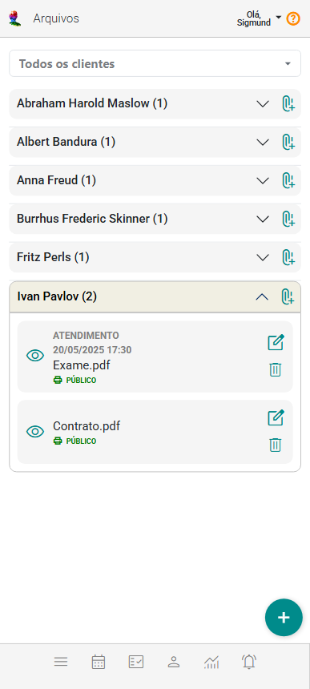
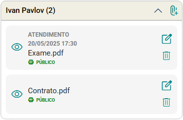
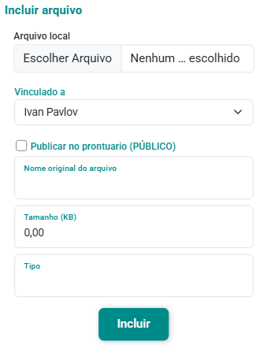

# Sobre Arquivos

O eConsult oferece um sistema de gerenciamento de arquivos integrado ao seu Google Drive, proporcionando uma solução centralizada e eficiente. Com essa integração, todos os seus documentos, relatórios, imagens e outros tipos de arquivos podem ser facilmente armazenados, acessados e compartilhados diretamente pela plataforma eConsult.

Essa integração não só simplifica o acesso aos arquivos, mas também melhora a organização, permitindo que você categorize e armazene seus documentos de forma estruturada e lógica, conforme suas necessidades. Com tudo centralizado no Google Drive, você garante que seus arquivos estejam protegidos e sincronizados em tempo real, com backups automáticos que evitam a perda de informações.

Para utilizar o sistema de gerenciamento de arquivos, é necessário configurar a integração com o seu Google Drive. Você pode fazer isso acessando o ["Painel Configurações => Integrações => Google Drive"](/docs/funcionalidades/configuracoes/visao-configuracoes) para conectar sua conta do Google Drive ao eConsult.

O painel Arquivos, utilizando o sistema de gerenciamento de arquivos, permite você visualizar e até anexar arquivos vinculados a um paciente, grupo terapêutico ou atendimento selecionado.

## Mostrar arquivos de um determinado paciente ou grupo terapêutico

1. Acione a opção  no paciente ou grupo atendimento.

1. O sistema mostra os *card* de arquivos correspondentes ao que foi selecionado.

    

## incluir arquivos

1. Indique o paciente ou grupo terapêutico desejado no campo "Paciente".

    

1. Acione o botão "Incluir novo arquivo" . O sistema abrira á tela de cadastro "Incluir Arquivo".

    

1. Acione a opção "Escolher Arquivo".

1. Selecione o arquivo desejado do computador ou dispositivo.

1. Uma vez selecionado o arquivo do seu computador ou dispositivo, o sistema preencherá automaticamente os campos "Nome Original do Arquivo", "Tamanho" e "Tipo".

1. No campo "Vinculado a", selecione o nome do paciente ou grupo terapêutico ao qual deseja vincular o arquivo. Se preferir vincular o arquivo a um atendimento específico, também é possível selecioná-lo nesse mesmo campo.

1. Marque, ou não, a opção "Publicar no Prontuário (PÚBLICO)".

1. Acione o botão "Incluir" .

:::tip DICAS

- Você também pode utilizar os botões  correspondentes para incluir arquivos diretamente para os clientes ou grupos terapêuticos respectivos.

- É possível utilizar os botões "Editar"  e "Excluir"  para modificar ou remover arquivos conforme necessário. Além disso, a opção "Visualizar"  permite que você examine o arquivo diretamente, facilitando a consulta e o gerenciamento dos arquivos.

:::