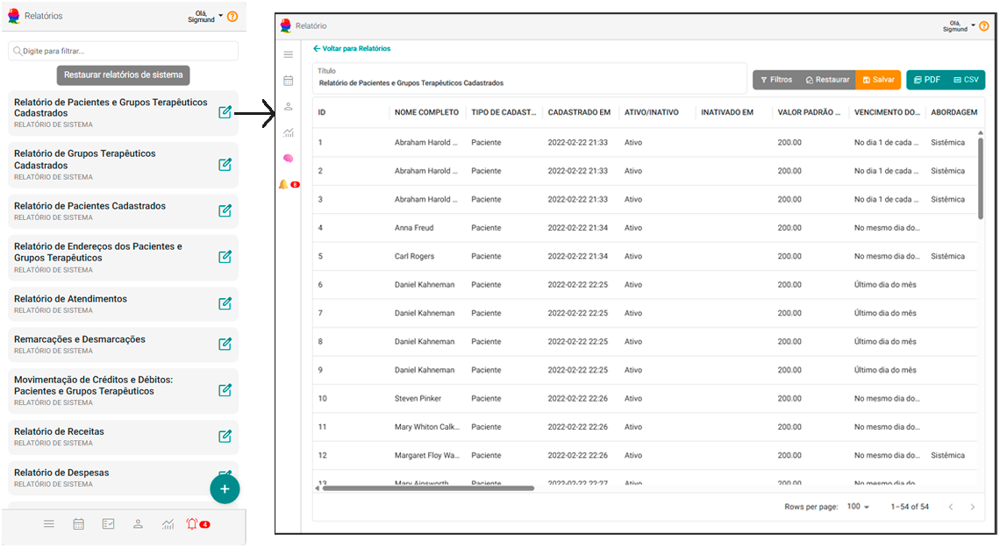
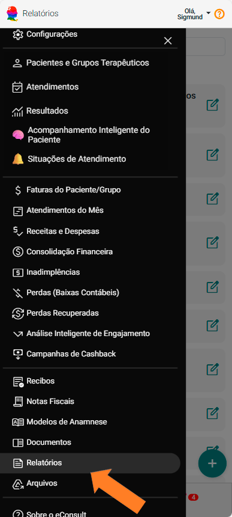

# Sobre Relatórios

No eConsult, o Painel Relatórios reúne um conjunto robusto de funcionalidades para a emissão de relatórios detalhados. Essas ferramentas permitem aos profissionais extrair informações valiosas sobre o desempenho operacional, financeiro e o relacionamento com seus pacientes. Os relatórios são fundamentais para proporcionar uma visão clara, organizada e estratégica dos atendimentos realizados, das receitas geradas e do comportamento dos pacientes.



A seguir, confira uma visão completa das funcionalidades do sistema e dos diversos tipos de relatórios que ele oferece:

## Tipos de Relatórios Emitidos

O Painel de Relatórios oferece diferentes tipos de relatórios que podem ser gerados conforme a necessidade do usuário.

### Relatórios de Atendimentos

Permitem a análise dos atendimentos realizados por meio da plataforma. Esses relatórios auxiliam no acompanhamento do desempenho da organização, na avaliação da qualidade dos serviços prestados e na identificação de oportunidades de melhoria contínua.



### Relatórios Financeiros

Apresentam uma visão detalhada das informações financeiras relacionadas à operação na plataforma. São indispensáveis para o monitoramento da saúde financeira, identificação de receitas e custos, além de servirem como base para decisões estratégicas voltadas à sustentabilidade e à lucratividade da organização.


### Relatórios de Pacientes e Grupos Terapêuticos

Esses relatórios são essenciais para avaliar a interação entre os pacientes (individuais ou em grupos) e a instituição. Oferecem dados quantitativos e qualitativos sobre os atendimentos realizados, possibilitando a consolidação de informações úteis para otimização de recursos, aprimoramento dos processos e elaboração de estratégias de fidelização.


:::tip Funcionalidades de Emissão
    Ao acessar um tipo de relatório, através do botão Imprimir , o sistema exibirá uma tela com opções de filtros personalizados, que variam conforme o tipo de relatório selecionado. Após aplicar os filtros desejados, o usuário poderá gerar os relatórios nos seguintes formatos:

    - **Gerar CSV :** Exporta os dados em um arquivo com extensão ``` .csv ```, ideal para análise em planilhas como o Microsoft Excel.

    - **Gerar PDF :** Gera um arquivo em formato ``` .pdf ```, pronto para impressão ou compartilhamento.
:::