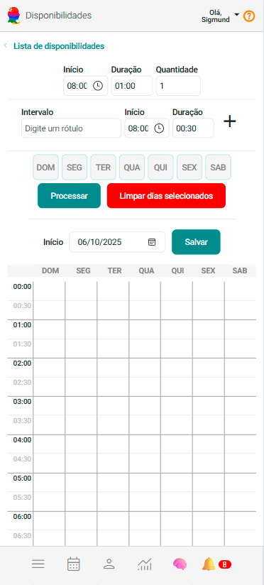
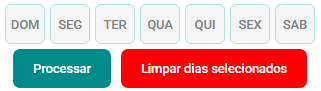
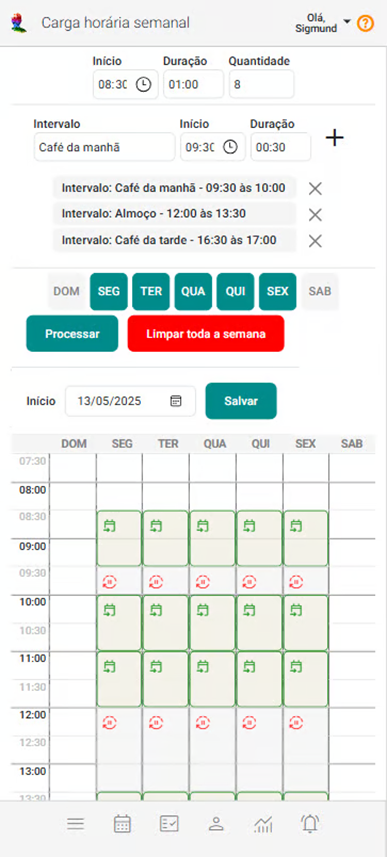

# Disponibilidades

Embora o cadastro de disponibilidades não seja uma configuração obrigatória, ela é altamente recomendado devido aos significativos benefícios que proporciona. Este cadastro permite um planejamento detalhado dos atendimentos ao longo das semanas, oferecendo uma visão clara e precisa da distribuição dos horários. Com essa visão, você pode alocar o tempo disponível de maneira mais eficiente, evitando conflitos.

Um planejamento bem estruturado não apenas otimiza a sua agenda, mas também melhora a eficiência no gerenciamento de horários e intervalos. Com o cadastro, você evita a sobreposição de atendimentos agendados para o mesmo horário e assegura que cada compromisso seja alocado corretamente. Isso proporciona um controle mais eficaz sobre os horários disponíveis, permitindo um gerenciamento mais eficiente dos intervalos e maximizando a utilização da sua agenda.

Esse nível de organização resulta em uma operação mais fluida e reduz a chance de conflitos de agendamento, promovendo um atendimento mais eficaz e uma experiência geral mais harmoniosa para todos os envolvidos.

## Incluir disponibilidades

1. No painel "Configurações", acione a opção "Disponibilidades".

2. O sistema abrirá a tela "Disponibilidades".

3. Acione a opção **Incluir Disponibilidades** .

4. O sistema mostrará a seguinte tela de configuração:

    

5. Indique o horário em que você inicia seus atendimentos nos dias selecionados. Exemplo: 08:30.

6. Especifique a duração de cada atendimento. No exemplo: 1 hora.

7. Informe a quantidade de atendimentos que você realiza durante o dia. Exemplo: 8 atendimentos.

    

8. Organize os intervalos diários, como café da manhã, almoço e café da tarde, para isso, você pode seguir este procedimento:
    
    - **Preencha os Campos:**

        - Intervalo: Insira o nome do intervalo, como "Café da Manhã", "Almoço" ou "Café da Tarde".
        - Início: Informe o horário de início do intervalo, por exemplo, "09:30" para o café da manhã.
        - Duração: Registre a duração do intervalo. Exemplo "01:30".
        - Clique na opção  para adicioná-lo.
        - Repita este procedimento para cada intervalo.

        
9. Marque os dias da semana em que as configurações devem ser aplicadas.

10. Clique em “Processar” para aplicar as configurações.

    

11. O sistema exibirá automaticamente as configurações processadas. Navegue para revisar e garantir que tudo foi configurado conforme o planejado.

    

:::note
- ** Disponibilidades:** Indica que o horário está liberado para atendimentos.
- ** Intervalos:** Indica que o horário está bloqueado para atendimentos e que trata-se de um intervalo.
:::

:::tip Outras Opções de Disponibilidades
- **Seleção de Dias:** O sistema permite que você selecione e processe um ou mais dias da semana de uma vez. Isso é especialmente útil se você tiver disponibilidades ou intervalos diferentes para cada dia. Por exemplo, se suas dispobilidades de sexta-feira é diferente de segunda-feira, você pode configurá-las separadamente.
- **Botão Limpar Dias Selecionados:** Se for necessário remover configurações feitas, basta clicar no botão “Limpar Dias Selecionados”. Isso apagará as configurações atuais apenas dos dias selecionados, permitindo que você reconfigure esses dias do zero, se necessário.
- **Data Início:** As disponibilidades configuradas serão aplicadas na agenda a partir da data que você inserir no campo "Início". Isso permite que você programe as mudanças com antecedência, controlando quando a nova configuração entrará em vigor.
- **Alteração de Configurações:** Se precisar ajustar cargas horárias ou intervalos que já foram cadastrados, utilize o botão de edição  na lista de Cargas Horárias. Isso facilita a atualização das configurações, garantindo que sua agenda reflita suas necessidades atuais.
- **Exclusão de Configurações:** Se precisar excluir cargas horárias que já foram cadastradas, utilize o botão de exclusão  na lista de Cargas Horárias.
Esses recursos proporcionam flexibilidade na configuração da sua agenda, permitindo que você adapte suas cargas horárias e intervalos de acordo com sua rotina semanal.
:::

---

## 🎞️ Vídeos Curtos

---

### 🎬 *Incluindo Disponibilidades*

<video
  src="/videos/configuracoes/incluindo-disponibilidades.mp4"
  height="auto"
  controls
  preload="metadata"
  style={{
    maxWidth: '100%',
    borderRadius: '12px',
    boxShadow: '0 4px 20px rgba(0,0,0,0.15)',
    margin: '8px 0'
  }}
>
  Seu navegador não suporta vídeo HTML5.
</video>

  Neste vídeo é possível verificar a inclusão de disponibilidades na agenda.

---