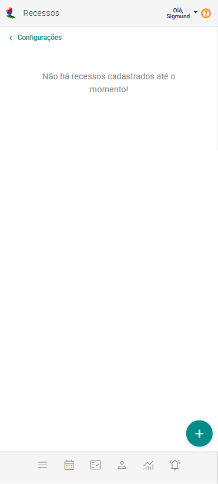
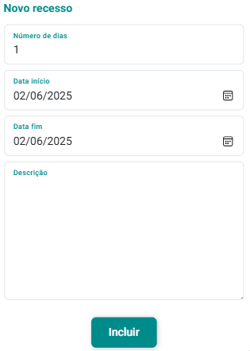
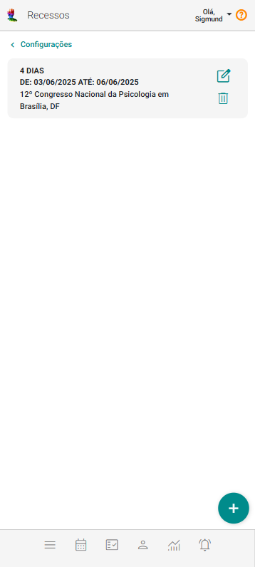
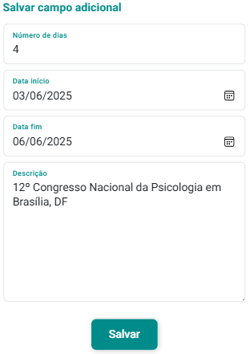

# Recessos

O cadastro de Recessos é uma ferramenta para manter sua agenda bem planejada, refletindo os períodos de pausa programados. Seja para feriados municipais, férias, capacitações ou períodos de folga específicos, o registro de dias de recesso garante um planejamento mais eficiente. Com essa funcionalidade, você evita agendar compromissos em datas que devem ser reservadas para descanso ou outras atividades importantes, assegurando que esses períodos sejam devidamente bloqueados.

## Incluir recesso

1. No painel "Configurações", acione a opção "Recessos".

    

2. Acione o botão **Incluir Recesso** .

3. O sistema abrirá o formulário de cadastro "Novo recesso".

    

4. Preencha os campos "Número de dias", "Data início", "Data fim" e "Descrição".

5. Acione o botão "Incluir" .

## Alterar recesso

1. No painel "Configurações", acione a opção "Recessos".

    

2. Acione o botão  no *card* do recesso que se quer alterar.

3. O sistema abrirá o formulário de cadastro de alteração de recesso.

    

4. Altere os campos "Número de dias", "Data início", "Data fim" e "Descrição".

5. Acione o botão "Salvar" .

:::warning
Se houver atendimentos previamente agendados no dia em que você pretende cadastrar um recesso, o sistema não permitirá a inclusão ou alteração do recesso e emitirá um aviso. Esse alerta ajuda a evitar conflitos na agenda, garantindo que você não sobreponha dias de recesso a compromissos já existentes. Certifique-se de revisar e ajustar qualquer compromisso conflitante antes de tentar cadastrar o recesso novamente.
:::

## Excluir recesso

1. No painel "Configurações", acione a opção "Recessos".

    

2. Acione o botão  no *card* do recesso que se quer excluir.

3. Confirme a exclusão acionando o botão **Sim**.

Cadastrar dias de recesso na agenda é uma prática essencial para manter um fluxo de trabalho organizado e evitar conflitos de horário, garantindo que todos os períodos de ausência sejam devidamente respeitados.

---

## 🎞️ Vídeos Curtos

---

### 🎬 *Incluindo Recesso*

<video
  src="/videos/configuracoes/incluindo-recesso.mp4"
  maxWidth="100%"
  height="auto"
  controls
  preload="metadata"
  style={{
    borderRadius: '12px',
    boxShadow: '0 4px 20px rgba(0,0,0,0.15)',
    margin: '8px 0'
  }}
>
  Seu navegador não suporta vídeo HTML5.
</video>

  Neste vídeo é possível verificar a inclusão de um recesso de 3 dias na agenda.

---