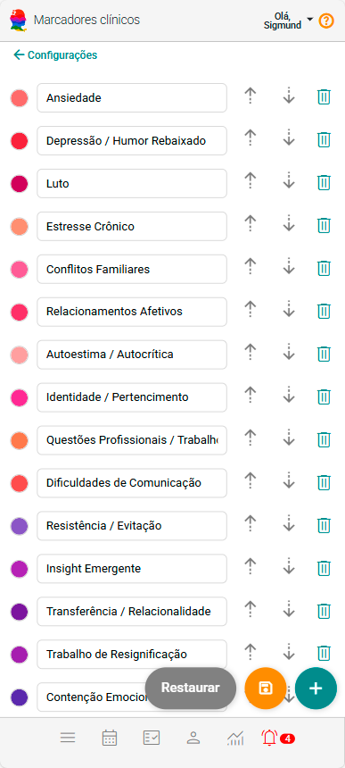
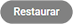

# Marcadores Clínicos

Os **Marcadores Clínicos** permitem ao psicólogo **destacar atendimentos** com etiquetas coloridas que representam temas, estados emocionais, fases do processo terapêutico ou qualquer outro elemento que você considere clinicamente relevante.

Eles funcionam como **indicadores visuais** na agenda e ajudam na **análise de evolução** ao longo dos atendimentos.

> **Exemplos de uso:**
> - Emoções predominantes (ex.: Ansiedade, Raiva, Tristeza)
> - Temas trabalhados (ex.: Luto, Autoestima, Família)
> - Etapa terapêutica (ex.: Avaliação, Reestruturação, Fechamento)
> - Situações importantes (ex.: Crise, Encaminhamento)

---

## Acessando a Tela de Marcadores

1. Acesse **Configurações** no menu lateral.
2. Clique em **Marcadores Clínicos**.

Você verá uma lista de marcadores que podem ser **editados, reordenados ou excluídos**.

---

## Alterando Marcadores Existentes

Para cada marcador é possível:

| Ação | Resultado |
|------|-----------|
| **Alterar nome** | Adapta o marcador ao seu referencial clínico. |
| **Alterar cor** | Ajusta a visualização na agenda. |
| **Reordenar** | Define prioridade visual. |
| **Excluir** | Remove marcadores que não fazem sentido para sua prática. |

---

## Criando um Novo Marcador

1. Clique em **Incluir novo marcador**  ou .
2. O sistema adicionará um item chamado *Novo Marcador*.
3. Renomeie e selecione a cor desejada.
4. Clique em **Salvar**.

> Dica: use nomes **curtos e específicos** — leitura mais rápida na agenda.

---

## Restaurando Marcadores Padrão

Caso deseje voltar à configuração inicial do eConsult:

1. Clique em **Restaurar** .
2. Confirme.

> ⚠️ Isto **substitui** sua lista atual pelos marcadores padrão.

---

## Salvando suas Alterações

Após editar, clique em **Salvar** ( ou ) para que:

- Os marcadores fiquem disponíveis na agenda
- Sejam aplicáveis aos atendimentos
- Apareçam no painel de análise de marcadores
- Possam ser utilizados ao longo do processo clínico

---

## Boas Práticas Clínicas

- Utilize entre **8 e 14 marcadores** → quantidade ideal para interpretação.
- Escolha **cores contrastantes** para leitura rápida.
- Evite marcadores vagos como *"OK"* ou *"Comum"*.
- Revise sua lista a cada **período terapêutico** (ex.: trimestralmente).

:::note Recomendação
Apesar de o sistema disponibilizar uma variedade ampla de marcadores, recomenda-se manter entre 8 e 14 em uso. Portanto, ao habilitar os marcadores do sistema, revise e exclua aqueles que não fazem parte da sua prática, mantendo apenas os que realmente utiliza.
:::

---

## Exemplo de Conjunto Personalizado

| Marcador | Cor | Grupo Clínico |
|---------|-----|---------------|
| Ansiedade | Tom quente (vermelho/salmão) | Emoções |
| Conflitos Familiares | Laranja | Temas Relacionais |
| Autoimagem | Azul claro | Construção Psicológica |
| Estabilização | Verde | Processo Terapêutico |
| Encerramento | Roxo | Etapa Terapêutica |

---

## Aplicação ao Longo do Processo

Ao usar marcadores sessão após sessão, é possível:

- Visualizar **padrões clínicos**
- Identificar **temas que persistem**
- Registrar mudanças de foco e evolução
- Apoiar decisões de **encaminhamento, supervisão e fechamento**

> Os Marcadores Clínicos **não são avaliativos** — são **narrativos**, expressam percepção terapêutica contextualizada.

---
