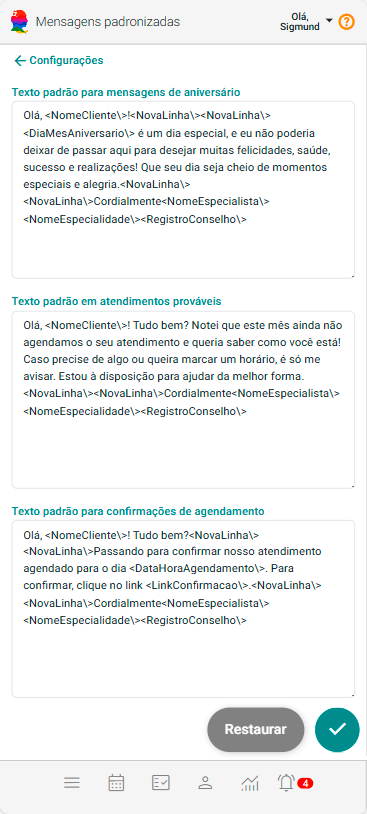
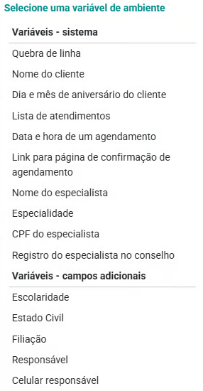

# Mensagens Padronizadas

O uso de mensagens padronizadas é uma estratégia essencial para otimizar a comunicação com pacientes e melhorar a eficiência dos atendimentos. Ao adotar mensagens predefinidas, garante-se agilidade nas interações, padronização da linguagem e um atendimento mais organizado e profissional.

## Texto Padrão para Mensagens de Aniversário

No painel Alertas o sistema mostra a opção de "Aniversariantes do Mês". Nesta funcionalidade o sistema permite o envio de uma mensagem para o paciente. Este campo cria um modelo padrão para esta mensagem. 

## Texto Padrão em Atendimentos Prováveis

No painel Alertas o sistema mostra uma opção de "Atendimentos Prováveis". Nesta funcionalidade o sistema permite o envio de uma mensagem para o paciente entrar em contato e agendar um atendimento. Este campo cria um modelo padrão para esta mensagem. 

## Texto Padrão para Confirmações de Atendimento

No painel Alertas o sistema mostra a opção "Confirmação". Nesta funcionalidade o sistema permite o envio de uma mensagem com link que permite o paciente confirmar um agendamento de atendimento. Este campo cria o modelo padrão para esta mensagem.

## Configurar Mensagens Padronizadas para Pacientes

1. No painel "Configurações", no grupo "Pacientes", acione a opção "Mensagens Padronizadas".

    

1. Altere as mensagens padronizadas desejadas.

    :::tip Use variáveis de ambiente
    O eConsult utiliza tags para variáveis de ambiente. Por exemplo, se você deseja que o sistema insira automaticamente o nome do paciente num texto padrão, basta utilizar a tag ```<NomeCliente>```.

    Existem várias variáveis de ambiente, para vê-las e utilizá-las, siga os passos abaixo:

    - Digite os caracteres @@ em qualquer lugar de qualquer um dos campos de mensagem.
    - O sistema abrirá a tela "Selecione uma Variável de Ambiente".

        

    - Clique sobre a variável desejada.
    - O sistema irá substituir os caracteres @@ pela tag da variável selecionada.

        :::note
        As variáveis de ambiente se dividem em dois grupos:
        - **Sistema:** são aquelas mais globais e fixas, disponibilizadas pelo próprio sistema.
        - **Campos Adicionais:** são aquelas definidas por você no tela Campos Adicionais.
        :::

1. Acione o botão **Salvar** .

:::note 
Você pode restaurar os textos com os padrões do sistema, se necessário, pressionando o botão **Restaurar**.


:::


