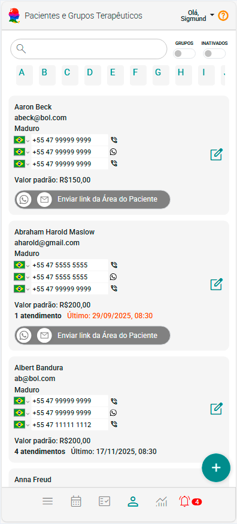
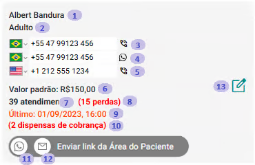
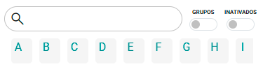

# Sobre Pacientes e Grupos Terapêuticos

O painel **Pacientes e Grupos Terapêuticos** do eConsult é uma ferramenta estratégica e indispensável para a gestão eficaz de informações cruciais no ambiente corporativo. Desenvolvido para atender às demandas de organizações que lidam com múltiplos atendimentos e perfis de pacientes, esse painel possibilita a centralização, organização e rápida consulta de dados relevantes, promovendo maior agilidade nos processos operacionais.

Por meio de uma interface intuitiva e funcional, o painel permite o acesso facilitado a informações detalhadas sobre os pacientes, bem como à estruturação de grupos terapêuticos conforme critérios personalizados. Isso garante maior controle, melhor distribuição de demandas e uma visão unificada das relações com os pacientes, o que resulta em um fluxo de trabalho mais eficiente e integrado.

Além disso, ao reunir todos os dados em um único ambiente, o painel contribui significativamente para a redução de erros, aumento da produtividade e tomada de decisões mais assertivas. **Todos os dados sensíveis que possam, direta ou indiretamente, identificar o paciente são criptografados em conformidade com a LGPD**, assegurando máxima proteção, privacidade e sigilo profissional.

Assim, o painel se torna uma peça-chave para organizações que buscam excelência na gestão de atendimentos e no relacionamento com o paciente, unindo eficiência operacional e segurança da informação.

## *Cards* de pacientes e de grupos terapêuticos

O painel Pacientes e Grupos Terapêuticos do eConsult oferece uma visão completa e organizada de todos os pacientes e grupos terapêuticos cadastrados, incluindo tanto os ativos quanto os inativos. Com uma navegação intuitiva e funcional, as informações são apresentadas em uma estrutura clara, por meio de uma lista de *cards*, que facilita a visualização, o acesso rápido e o gerenciamento eficiente dos dados.

<figure style={{ margin: 0, textAlign: "left", marginBottom: "20px" }}>
  
  <figcaption style={{ fontStyle: "italic"}}>Exemplo de card de um Paciente</figcaption>
</figure>

<figure style={{ margin: 0, textAlign: "left", marginBottom: "20px" }}>
  
  <figcaption style={{ fontStyle: "italic"}}>Exemplo de card de um Grupo Terapêutico</figcaption>
</figure>

Cada *card* apresenta informações essenciais de forma concisa, incluindo o "Nome" do paciente ou grupo de atendimeto, "Email", "Grupo etário", "Telefones", "Valor Padrão de Atendimento", "Número de Atendimentos Vinculados", e a "Data do Último Atendimento Agendado". Essa estrutura facilita a consulta rápida e eficiente dos principais dados de cada paciente ou grupo, permitindo que os profissionais acessem as informações necessárias com apenas um olhar.

Os *cards* também oferecem funcionalidades adicionais que tornam a gestão de pacientes e grupos completa. É possível, por exemplo, realizar ações de comunicação direta, como o envio de mensagens por WhatsApp  ou a realização de ligações telefônicas , tudo diretamente a partir do painel. Essas funcionalidades garantem uma gestão centralizada e eficiente, permitindo interações rápidas e personalizadas com os pacientes e com os grupos terapêuticos.

Além disso, nos *cards*, está disponível a opção "Enviar link para a Área do Paciente" . Essa funcionalidade permite que você compartilhe com seu paciente — ou com o responsável por um grupo terapêutico — um link exclusivo de acesso à "Área do Paciente", enviado via WhatsApp  ou E-mail .

O paciente ou grupo poderá acessar diversas informações relevantes, previamente definidas por você no cadastro individual. Essa abordagem facilita a comunicação, aumenta a transparência e oferece mais autonomia para o paciente ou grupo, ao mesmo tempo em que preserva seu controle sobre os acessos.

:::note
    Mais informações sobre a Área do Paciente, [clique aqui](/docs/funcionalidades/clientes-grupos/cadastro/aba-area-cliente).
:::

## Informações e botões que podem constar nos *cards* de Pacientes e Grupos Terapêuticos

Sendo:

1. **Nome do Paciente ou Grupo Terapêutico:** Exibe o nome do paciente ou do grupo.
1. **Grupo Etário do Paciente:** Informa o grupo etário do paciente ou grupo.
1. **Celular (Chamada Direta):** Número de celular com link para realizar chamadas diretamente pelo dispositivo.
1. **Celular (WhatsApp):** Número de celular com link direto para contato via WhatsApp.
1. **Telefone Fixo (Chamada Direta):** Número de telefone fixo com link para realizar chamadas diretamente pelo dispositivo.
1. **Valor Padrão de Atendimento:** Informa o valor padrão cadastrado para os atendimentos do paciente ou grupo.
1. **Atendimentos Agendados:** Indica a quantidade de atendimentos agendados para o paciente ou grupo até o momento.
1. **Perdas Registradas:** Mostra o número de perdas (baixas contábeis registradas) associadas ao paciente ou grupo.
1. **Data do Último Atendimento:** Exibe a data do último atendimento agendado. Se for superior a 30 dias, a data será exibida em vermelho.
1. **Dispensas de Cobrança:** Indica o número de dispensas de cobrança registradas para o paciente (dispensa de cobrança ocorre quando o atendimento não é pago e o valor é zerado manualmente).
1. **Envio de Link Área do Paciente via WhatsApp:** Botão que permite enviar o link de acesso a Área do Paciente via WhatsApp para o paciente ou grupo terapêutico.
1. **Envio de Link Área do Cliente via E-mail:** Botão que permite enviar o link de acesso a Área do Paciente por e-mail.
1. **Editar Cadastro:** Botão que abre a tela de cadastro do paciente em modo de edição.

## Filtros da lista de *cards*

A lista de *cards* no painel Pacientes e Grupos do eConsult foi desenvolvida para oferecer uma navegação ágil e eficiente. Para isso, o sistema disponibiliza diversas opções de filtragem, que permitem localizar rapidamente um paciente ou grupo específico. Entre os critérios disponíveis, estão:

- **Filtro Nome:** Digite parte ou o nome completo no campo de busca para encontrar o paciente ou grupo desejado.
- **Filtro Grupo:** É possível exibir apenas registros referentes a Grupos Terapêuticos.
- **Filtro Inatividade:** É possível exibir apenas registros ativos ou inativos, facilitando a gestão de atendimentos e a revisão de cadastros.
- **Filtros Letra Inicial:** Selecione a primeira letra do nome para visualizar somente os registros que iniciam com aquele caractere.

Essas opções de filtragem tornam a experiência de uso mais fluida, permitindo aos profissionais localizar, acessar e gerenciar os registros com rapidez e precisão, mesmo em bases de dados com grande volume de informações.

## Sobre inclusão de pacientes ou grupos terapêuticos

A inclusão de um paciente ou grupo é feita por meio do botão **Incluir novo paciente ou grupo** , disponível no Painel "Pacientes e Grupos". Para realizar o cadastro inicial, é necessário informar apenas o "nome" e o "sexo", o que permite um registro rápido — ideal para situações que exigem agilidade. Os demais dados podem ser preenchidos posteriormente, conforme sua necessidade e conveniência.

## Sobre edição de pacientes ou grupos terapêuticos

A edição (ou alteração) dos dados cadastrais de pacientes ou grupos é realizada de forma simples e direta. Para isso, utilize o botão  localizado no canto direito de cada *card* da lista de pacientes e grupos.

Ao clicar nesse botão , será aberta a tela de cadastro correspondente, já em modo de edição, permitindo atualizar todas informações do paciente ou grupo.

Essa funcionalidade foi pensada para proporcionar agilidade e praticidade, permitindo ajustes rápidos diretamente na visualização principal dos registros.

## Sobre exclusão de pacientes e grupos terapêuticos

O eConsult não permite a exclusão definitiva de pacientes ou grupos, em conformidade com a Lei Geral de Proteção de Dados (LGPD). Essa medida tem como objetivo preservar a integridade das informações e garantir a rastreabilidade do histórico de atendimentos.

Em vez disso, o sistema oferece a opção de inativar um paciente ou grupo. Ao ser inativado:

- O paciente ou grupo deixa de estar disponível para novos agendamentos;
- Todas as informações históricas são mantidas, permitindo acesso contínuo a registros, análises e relatórios;
- A reativação pode ser feita a qualquer momento, se for necessário retomar os atendimentos.

Essa abordagem assegura conformidade legal, além de garantir segurança, transparência e consistência nos dados do sistema.

