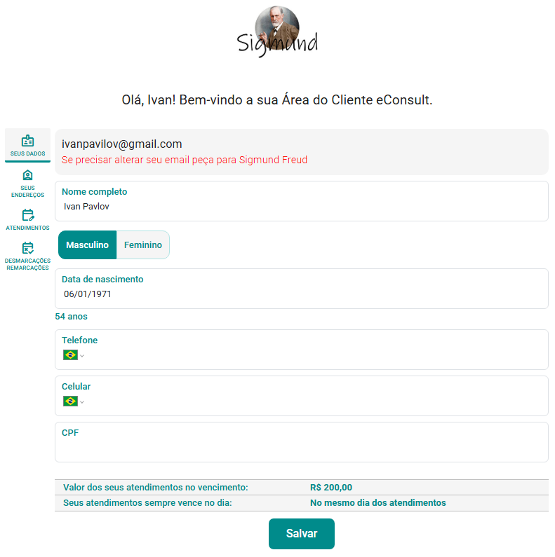

# Aba Área do Paciente

***Autonomia, transparência e vínculo terapêutico em um só ambiente.***

A **Área do Paciente** é uma funcionalidade exclusiva do **eConsult**, desenvolvida para oferecer ao paciente **autonomia, praticidade e acesso seguro** às suas informações clínicas e financeiras.  
Ela foi pensada para **fortalecer a relação de confiança** entre paciente e psicólogo, permitindo uma comunicação ética, organizada e transparente.

---

## Visão Geral

Cada paciente (ou grupo terapêutico) possui uma **área individual e criptografada**, acessível por um **link seguro e intransferível**, enviado pelo profissional.  
Nesse ambiente, o paciente pode:

- Visualizar **dados cadastrais** e **endereços** atualizados;  
- Consultar **agendamentos futuros e passados**;  
- Acompanhar **remarcações e cancelamentos**;  
- Baixar **recibos**, **documentos** e **notas fiscais**;  
- Acompanhar **faturas, créditos e perdas contábeis**;  
- E — se autorizado — **acessar seu prontuário clínico**, com anotações e evoluções liberadas pelo profissional.

> 🔒 Todos os dados são protegidos por criptografia e acesso autenticado, em conformidade com a LGPD e o Código de Ética Profissional do Psicólogo.

---

## Como Configurar os Acessos

1. No painel **Pacientes e Grupos Terapêuticos**, clique em  no *card* do paciente ou grupo desejado.  
2. Na tela de cadastro, abra a aba **Área do Paciente**.  
3. Marque as seções que o paciente poderá acessar:  
   - Prontuário  
   - Atendimentos  
   - Faturas  
   - Créditos e perdas  
   - Documentos  
   - Recibos  
   - Notas fiscais  
4. Clique em **Salvar** para registrar as permissões.

> 💡 Você pode alterar as permissões a qualquer momento, garantindo controle total sobre o que o paciente visualiza.

---

## Envio do Link de Acesso

1. No painel **Pacientes ou Grupos Terapêuticos**, identifique o card do paciente desejado.  
2. Clique em **Enviar link para Área do Paciente** .  
3. Escolha o meio de envio:
   -  **WhatsApp:**   
   -  **E-mail:**  
4. O paciente receberá o link seguro (token único) e poderá acessar sua área diretamente pelo navegador, sem login ou senha.

Na aba “Área do Paciente”, o profissional também pode:
- Clicar em **Abrir Área do Paciente**  para visualizar o ambiente;  
- Reenviar o link via o grupo de botões .

---

## Estrutura da Área do Paciente

A interface da Área do Paciente foi desenhada para ser **intuitiva, responsiva e humanizada**, mantendo clareza visual e foco na usabilidade.

#### Aba Seus Dados
- Dados cadastrais do paciente.  
- Permite atualização direta pelo paciente, exceto e-mail — que, caso precise ser alterado, só pode ser atualizado pelo profissional.

#### Aba Seus Endereços
- Dados cadastrais de endereços do paciente.  
- Permite atualização direta pelo paciente.

#### Aba Atendimentos
- Exibe atendimentos passados e futuros com data, hora e status.  
- Paciente só poderá visualizar.

#### Aba Desmarcações e Remarcações
- Exibe registros de desmarcações e remarcações do paciente.  
- Paciente só poderá visualizar.

#### Aba Faturas
- Exibe faturas emitidas para o paciente.  
- Paciente só poderá visualizar.

#### Aba Créditos e Perdas
- Mostra registros relacionados a créditos, débitos e perdas do paciente.
- Paciente só poderá visualizar. 

#### Aba Documentos e Arquivos
- Permite o paciente visualizar e imprimir documentos, sendo:
  - Prontuários: somente prontuários publicados e públicos
  - Recibos: somente recibos emitidos e não cancelados
  - Notas fiscais: todas as notas fiscais emitidas para o paciente
  - Documentos: todos os arquivos anexados, vinculados ao paciente e tornados públicos (com link para download)

---

## Segurança e Conformidade

A Área do Paciente segue o mesmo padrão de segurança aplicado aos módulos clínicos do eConsult:

- **Criptografia ponta a ponta (HTTPS + AES-256)**  
- **Links únicos e intransferíveis (token individual)**  
- **Controle de acesso granular** configurado pelo profissional  
- **Anonimização de dados** para IA e relatórios estatísticos  
- **Auditoria e rastreabilidade completa de acessos**

> 🧠 Nenhuma informação é compartilhada sem consentimento, e todos os acessos são registrados com data e hora.

---

## Boas Práticas

:::tip  
- Envie o link somente após verificar as permissões de acesso.  
- Utilize a Área do Paciente para fortalecer a transparência do processo terapêutico.  
- Oriente o paciente sobre o sigilo e a finalidade das informações visíveis.  
- Evite liberar prontuários ainda em elaboração.  
:::

---

## Comparativo com Outros Sistemas

#### Outros sistemas
- Área do paciente inexistente ou restrita a agendamentos.  
- Nenhum controle sobre o que o paciente pode acessar.  
- Falta de integração com faturas, notas fiscais e prontuário.  
- Comunicação dispersa (WhatsApp, e-mail, planilhas externas).

#### eConsult
- **Área unificada** com dados clínicos e financeiros.  
- **Controle total de acesso** pelo profissional.  
- **Links seguros** e integrados ao cadastro.  
- **Comunicação ética e centralizada.**

> 🔹 O eConsult é um dos poucos sistemas que oferece ao psicólogo **uma Área do Paciente realmente funcional e customizável**, conectando prontuário, financeiro e documentação em um só ambiente.

---

## Análise Crítica da Funcionalidade

#### 💼 Design funcional
O fluxo da Área do Paciente é simples e elegante: configuração → envio → acesso.  
O profissional controla tudo a partir do painel principal, sem precisar de portais externos.

#### 🔒 Segurança e ética
A arquitetura com **links criptografados e tokens únicos** é tecnicamente superior a sistemas baseados em login.  
Ela reduz o risco de acesso indevido e simplifica a experiência do paciente, sem comprometer a LGPD.

#### 💡 Experiência do usuário
A interface é responsiva e leve, otimizada tanto para desktop quanto para dispositivos móveis.  
A divisão por blocos (dados, atendimentos, finanças, documentos) é intuitiva e reduz curva de aprendizado.

#### 🧩 Diferencial clínico
A integração direta com **prontuário e finanças** é um diferencial marcante — poucos sistemas permitem que o paciente acompanhe sua jornada clínica e administrativa com tanta transparência e controle ético.

#### 📈 Potencial de expansão
O módulo está preparado para evoluir: chat seguro, upload de documentos pelo paciente e integração com teleatendimento são evoluções naturais dentro da arquitetura existente.

---

## Conclusão

A **Área do Paciente do eConsult** representa o ponto de encontro entre **transparência, ética e tecnologia**.  
Ela não apenas digitaliza a comunicação entre psicólogo e paciente, mas redefine a relação, transformando-a em um processo **colaborativo, seguro e centrado na confiança**.  

Com ela, o eConsult reafirma seu compromisso em unir **profundidade clínica**, **inteligência tecnológica** e **respeito absoluto à ética profissional.**

---

## 🎞️ Vídeos Curtos

---

#### 🎬 *Explorando a Aba Área do Paciente *

<video
  src="https://econsultapp.com/videos/pacientes-e-grupos-terapeuticos/explorando-area-do-paciente.mp4"
  height="auto"
  controls
  preload="metadata"
  style={{
    borderRadius: '12px',
    maxWidth: '100%',
    boxShadow: '0 4px 20px rgba(0,0,0,0.15)',
    margin: '8px 0'
  }}
>
  Seu navegador não suporta vídeo HTML5.
</video>

  Neste vídeo, é possível visualizar algumas das principais funcionalidades sobre a Área do Paciente.

