# Interação e Navegação do Painel Atendimentos

O painel Atendimentos se ajusta automaticamente ao tamanho da sua tela. Se você estiver utilizando um notebook, o painel será modulado para a versão desktop. Já em um smartphone, ele se adaptará para a versão mobile, garantindo uma experiência de uso otimizada em qualquer dispositivo.

<figure style={{ margin: 0, textAlign: "center", marginBottom: "20px" }}>
  
  <figcaption style={{ fontStyle: "italic"}}>Versão Desktop</figcaption>
</figure>

<figure style={{ margin: 0, textAlign: "center", marginBottom: "20px" }}>
  
  <figcaption style={{ fontStyle: "italic"}}>Versão mobile (agenda do dia)</figcaption>
</figure>

<figure style={{ margin: 0, textAlign: "center", marginBottom: "20px" }}>
  
  <figcaption style={{ fontStyle: "italic"}}>Versão mobile (agenda da semana)</figcaption>
</figure>

## Calendário

O calendário do painel Atendimentos permite que você selecione uma data específica. Ao escolher um dia, o painel é atualizado para exibir as informações correspondentes a esse dia.

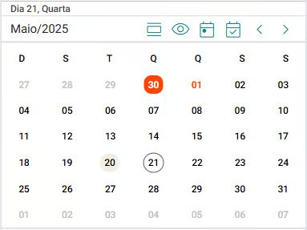

No topo do calendário, é exibido o dia atualmente selecionado, bem como o mês e o ano em exibição.

O calendário utiliza diferentes cores e estilos para indicar informações específicas sobre os dias:

- 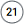**Dia Selecionado:** Representado por um círculo com contorno cinza.

- 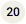**Data Atual ou Dia de Hoje:** Mostrada com um fundo cinza.

- 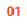**Feriados:** Letra em vermelho.

- **Recessos:** Fundo vermelho e letra branca.

- **Dias Fora do Mês de Exibição:** Exibidos em cinza, indicando que pertencem ao mês anterior ou posterior.

    

Além disso, o topo do calendário contém um conjunto de botões para navegação e interação, permitindo fácil acesso às funções do painel.

- **Agenda do Dia:** Indica que o painel está exibindo os atendimentos agendados no dia selecionado, incluindo disponibilidades e intervalos. Ao ativar esta opção, o sistema passará a mostrar os agendamentos da semana correspondente ao dia selecionado, e o botão será substituído por .

    - *Este botão só será exibido na versão de visão Mobile.*
    
- **Agenda da Semana:** Indica que o painel está exibindo os atendimentos agendados na semana do dia selecionado. Ao ativar esta opção, o sistema passará a mostrar os agendamentos do dia selecionado, e o botão será substituído por .

    - *Este botão só será exibido na versão de visão Mobile.*
    
- **Calendário sendo Exibido:** Indica que o painel está exibindo o calendário do mês. Ao selecionar esta opção, o calendário será ocultado e o botão será substituído por .

    - *Este botão só será exibido na versão de visão Mobile.*
    
- **Calendário sendo Ocultado:** Indica que o painel está ocultando o calendário do mês. Ao selecionar esta opção, o calendário será exibido e o botão será substituído por .

    - *Este botão só será exibido na versão de visão Mobile.*
    
- **Dia Atual:** Ao ser acionado, se a opção "Agenda do Dia" estiver ativa, o dia atual será automaticamente selecionado como foco, exibindo os atendimentos programados para esse dia, incluindo disponibilidades e intervalos. Se a opção "Agenda da Semana" estiver ativa, a semana atual será selecionada como foco, mostrando os atendimentos programados para toda a semana.

- **Dia Selecionado:** Ao ser acionado, se a opção "Agenda do Dia" estiver ativa, o sistema exibirá os atendimentos programados para o dia selecionado, incluindo disponibilidades e intervalos. Se a opção "Agenda da Semana" estiver ativa, o sistema exibirá os atendimentos programados para toda a semana correspondente ao dia selecionado.

- **Semana/Mês Anterior:** Move o calendário para exibir a semana ou o mês anterior.

- **Semana/Mês Posterior:** Move o calendário para exibir a semana ou o mês posterior.# Disponibilidades, Intervalos e Recessos

No painel Atendimentos, as disponibilidades, intervalos e recessos são exibidos de forma clara e organizada. Dias específicos que foram cadastrados como recesso são automaticamente bloqueados, assim como intervalos de tempo previamente definidos. Isso garante que a agenda esteja sempre atualizada, refletindo fielmente as suas necessidades e evitando agendamentos em períodos indesejados.

- Você pode configurar disponibilidades e bloquear horários (intervalos) diretamente na página [Disponibilidades](/docs/funcionalidades/configuracoes/agenda/carga-horária-semanal).

- A agenda refletirá as configurações feitas em [Disponibilidades](/docs/funcionalidades/configuracoes/agenda/carga-horária-semanal), mostrando as disponibilidades e os intervalos. 

- Nas disponibilidades, os atendimentos podem ser agendados normalmente, através do botão , enquanto que os intervalos, não permitem este tipo de agendamento.

- As disponibilidades são indicadas pelo texto "V A G O", o que significa que o horário está livre (vago) e pronto para receber um agendamento.

    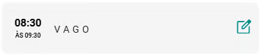

- Os intervalos são identificados pelos nomes definidos durante a configuração de disponibilidades.

    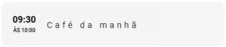

- Já os atendimentos agendados mostram o nome do paciente ou grupo terapêutico, status e valores.

    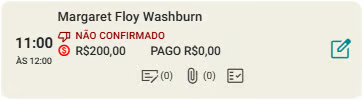

## Incluir um agendamento de um atendimento dentro de uma disponibilidade

1. No *card* da disponibilidade (horário) acione o botão .

1. Se a disponibilidade for no futuro, o sistema mostrará a tela:
    
    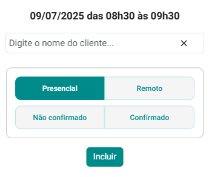

1. Se a disponibilidade for no passado, o sistema mostrará:

    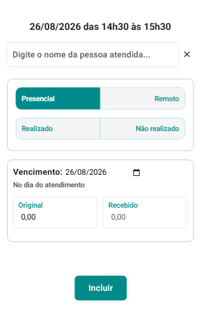

1. Preencha o campo "Paciente", informe se o atendimento será "Presencial" ou "Remoto", informe se este atendimento está ou não "Confirmado" (no caso de disponibilidades futuras) ou se foi ou não "Realizado" (no caso de disponibilidades passadas).

1. Acione o botão "Incluir" .

## Agendar múltiplos atendimentos

1. Acione o botão "Agendar atendimento" .

1. O sistema abrirá a tela "Agendamento".

    

1. Preencha o campo "Paciente".

1. Preencha o campo "Qtde." com o número total de atendimentos que você deseja agendar.

1. No campo "A partir de", informe a data em que os agendamentos devem começar.

1. No campo "A primeira", escolha o dia da semana em que os atendimentos devem ser realizados.

1. Se desejar configurar os agendamentos de acordo com disponibilidades previamente definidas, acione o botão "". O sistema exibirá opções de horário baseadas nas disponibilidades previamente configuradas. Selecione uma disponibilidade de horário adequada.

    

1. Escolha a periodicidade desejada para os atendimentos: "Semanal", "Quinzenal" ou "Mensal".

1. Selecione se os atendimentos serão presenciais ou remotos.

1. Informe o valor de cada atendimento no campo correspondente.

1. Acione a opção "Ver Disponibilidades" . O sistema abrirá a tela de análise de disponibilidades, onde você poderá revisar os horários disponíveis.

1. Marque ou desmarque as disponibilidades que deseja agendar e acione o botão "Agendar Marcados"  para confirmar e finalizar os agendamentos dos atendimentos.

1. Em dias úteis, ou seja, sem recesso ou feriado, o sistema marcará automaticamente esses dias com um check. Mantenha esta marcação ou desmarque caso prefira não agendar neste dia.
​​
1. Em dias sem recesso, mas que são feriados, o sistema deixará esses dias inativados e desmarcados. Mantenha desmarcado ou marque caso queira agendar neste feriado.
​​
1. Em dias de recesso, o sistema manterá esses dias inativos. Você não tem a opção de marcar estes dias pois recessos são dias bloqueados para agendamentos.

:::note Agendar fora de disponibilidades
    É possível incluir agendamentos fora dos horários definidos como disponibilidades. Para isso basta acionar a opção .

    Os atendimentos agendados fora das disponibilidades serão mostrados com uma moldura pontilhada.

    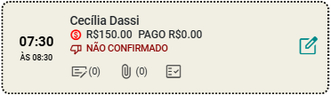
:::

:::note Uso sem disponilidades configuradas
    Embora seja possível configurar disponibilidades e intervalos através da opção "Configurações => Disponibilidades", o eConsult pode ser utilizado mesmo sem essa configuração. Nesse caso, a agenda não exibirá informações sobre disponibilidades e intervalos, mas os agendamentos de atendimentos ainda poderão ser realizados normalmente através do botão .
:::

:::note Recessos

    Você pode bloquear agendamentos num dia inteiro ou intervalo de dias utilizando a funcionalidade Recessos.
    
    - Ao selecionar um dia na agenda, o sistema verifica se essa data consta no cadastro de recessos.
    
    - Se a data selecionada estiver cadastrada como recesso, o sistema exibirá a mensagem "RECESSO" e, após a palavra "RECESSO", o sistema exibirá também a descrição que foi dada ao recesso durante o cadastro.

        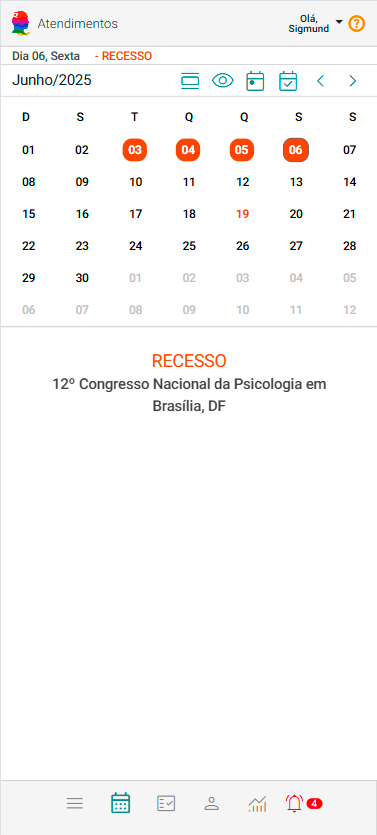

    - Em caso de recesso, a agenda bloqueará automaticamente a data, impedindo qualquer agendamento de atendimento nesse dia.
:::

---

## 🎞️ Vídeos Curtos

---

#### 🎬 *Agendando um atendimento*

<video
  src="https://econsultapp.com/videos/atendimentos/incluindo-um-atendimento.mp4"
  height="auto"
  controls
  preload="metadata"
  style={{
    borderRadius: '12px',
    maxWidth: '100%',
    boxShadow: '0 4px 20px rgba(0,0,0,0.15)',
    margin: '8px 0'
  }}
>
  Seu navegador não suporta vídeo HTML5.
</video>

  Neste vídeo, é possível acompanhar o agendamento de um atendimento.

---

#### 🎬 *Agendando múltiplos atendimentos*

<video
  src="https://econsultapp.com/videos/atendimentos/incluindo-atendimentos-multiplos.mp4"
  height="auto"
  controls
  preload="metadata"
  style={{
    borderRadius: '12px',
    maxWidth: '100%',
    boxShadow: '0 4px 20px rgba(0,0,0,0.15)',
    margin: '8px 0'
  }}
>
  Seu navegador não suporta vídeo HTML5.
</video>

  Neste vídeo, é possível acompanhar o agendamento de múltiplos atendimentos.

