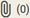
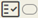
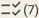

# Interação e Navegação do *Card* de Atendimentos

A lista de atendimentos no eConsult exibe todos os atendimentos agendados para o dia selecionado, organizados em *cards* individuais. Cada *card* contém informações mínimas sobre o atendimento, incluindo:

- **Hora de início e fim:** Mostra o início e fim do atendimento.
- **Nome do paciente ou grupo:** Nome do paciente ou grupo terapêutico ao qual o atendimento está relacionado.
- **Status de realização ou confirmação:** Apresenta um informe sobre o status atual do atendimento (confirmado, não confirmado, realizado, não realizado ou, se não houver, informe pendente).
- **Valor e valor pago:** Indica o valor do atendimento e quanto já foi pago.

<figure style={{ margin: 0, textAlign: "center", marginBottom: "20px" }}>
  
  <figcaption style={{ fontStyle: "italic"}}>Card de atendimento</figcaption>
</figure>

Os *cards* mostram alguns ícones informativos como:

|Ícone|Indicação|
|-|-|
||Podendo ser exibido abaixo do nome do paciente ou grupo terapêutico, indicando que se trata de um atendimento remoto. Se este icone não for mostrado, significa que o atendimento é presencial.|
||Podendo ser exibido ao lado do valor do atendimento, indicando que este valor ainda não foi 100% (cem por cento) recebido.|
||Podendo ser exibido ao lado do valor do atendimento, indicando que este valor foi 100% (cem por cento) recebido.|
||Indica que se trata de um atendimento passado que ainda não tem um informe de "Realizado" ou "Não Realizado". |
||Se o atendimento for futuro indica que está com a opção "Não Confirmado". Se o atendimento for passado indica que está com a opção "Não Realizado".|
||Se o atendimento for futuro indica que está com a opção "Confirmado". Se o atendimento for passado indica que está com a opção "Realizado".|

Além dos ícones informativos, os *cards* também disponibilizam os seguintes botões de ação:

|Botão|Ação|
|-|-|
||**Anotações:** Mostra a quantidade de anotações e permite abrir a [tela de gestão de Anotações Clínicas](/docs/funcionalidades/atendimentos/anotacoes).|
||**Arquivos:** Mostra a quantidade de arquivos vinculados e permite abrir a [tela de gestão de arquivos do atendimento](/docs/funcionalidades/atendimentos/arquivos).|
||**Marcadores Clínicos:** Mostra as cores dos marcadores clínicos vinculados ao atendimento e permite fazer a gestão destes [marcadores](/docs/funcionalidades/atendimentos/marcadores-clinicos).|
||**Informe de Presença (somente para grupos terapêuticos):** Mostra a quantidade de membros vinculados ao grupo terapêutico e permite o [registro de ausências e presenças](/docs/funcionalidades/atendimentos/presenca-pagamentos).​|
||**Alteração:** Permite abrir a tela de alteração de informações do atendimento e, inclusive, recebimentos.|