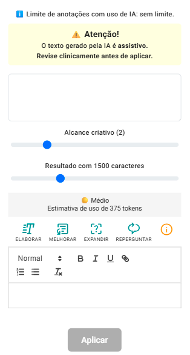

# Inteligência Artificial em Anotações Clínicas

O eConsult conta com inteligência artificial nativa para agilizar tarefas do dia a dia, como no caso de anotações clínicas.

Ao incluir ou editar uma anotação, aparece o botão , que abre um editor que permite sugestões automáticas baseadas em IA.

Ao clicar nesse botão, será exibida a tela de edição de texto com recursos de Inteligência Artificial. Nessa interface, você poderá aprimorar conteúdos, desenvolver textos ou obter respostas com base no propósito e material inserido.

Essa tela faz parte de uma ferramenta interativa projetada para apoiar a criação, revisão e desenvolvimento de textos. Utilizando IA, ela oferece uma experiência intuitiva e eficiente, facilitando a produção de conteúdos mais claros, objetivos e bem estruturados — mesmo para quem não tem familiaridade com técnicas de escrita.

## Campo de Entrada de Texto (Superior)

Neste campo, você digita o conteúdo base que deseja trabalhar. Pode ser uma frase, um parágrafo, uma pergunta ou até mesmo um esboço de ideia. É a partir desse texto que a inteligência artificial irá gerar as sugestões e melhorias, de acordo com a funcionalidade escolhida.

## Controles Deslizantes (Personalização de Resposta)

A tela tem dois controles para personalização de resposta

1. **Alcance Criativo**

    

    Este controle ajusta o nível de criatividade que a IA aplicará ao texto gerado.

    - Valores mais baixos (próximos de 0) resultam em respostas mais objetivas, diretas e concisas.
    - Valores mais altos (até 10) geram textos mais elaborados, com maior liberdade criativa — ideal para conteúdos envolventes, opinativos ou com tom mais expressivo.

2. **Limite de Caracteres**

    

    Esse controle permite definir um número máximo de caracteres para a resposta da IA, ajudando a manter o conteúdo dentro de um tamanho desejado.

## Botões de Ação

Abaixo dos controles, estão disponíveis três botões que definem como a IA irá processar o texto inserido:

1. **Elaborar:**  A IA criará um novo texto com base no Modelo de Registro Clínico escolhido, expandindo o conteúdo sem ser criativa.

1. **Melhorar:**  A IA corrigirá erros ortográficos e aperfeiçoará a fluidez do seu texto, mantendo o conteúdo original.

1. **Expandir:**  A IA adicionará complementos clínicos coerentes de forma criativa ao texto, tentando não alterar o sentido original.

1. **Reperguntar:**  O sistema transferirá o texto da resposta para o campo superior, dando início a um novo ciclo de interação com a IA.

## Campo de Resultado (Inferior)

A resposta gerada pela IA será exibida neste campo, permitindo visualização imediata do conteúdo processado.

## Botão "Aplicar"

Após selecionar a ação desejada e ajustar os parâmetros, clique no botão "Aplicar" para que o sistema utilize o texto gerado como anotação no atendimento.

---

Cada usuário do **eConsult** tem acesso a **192.000 tokens por mês** para utilizar os recursos de inteligência artificial integrados à plataforma.

Esse limite é **renovado automaticamente no primeiro dia de cada mês** e corresponde a uma quantidade generosa de uso, suficiente para os atendimentos e tarefas do dia a dia.

Cada usuário do **eConsult** conta com uma cota mensal de **192.000 tokens** para utilizar os recursos de inteligência artificial integrados à plataforma.

Esse limite é renovado automaticamente no primeiro dia de cada mês e oferece uma quantidade ampla o suficiente para cobrir, com folga, os atendimentos e tarefas do dia a dia.

:::warning **Importante:**  
- Esse limite existe apenas como medida de proteção contra abusos e uso excessivo fora do propósito da ferramenta. Ele garante que todos os usuários tenham uma experiência estável, rápida e segura no uso da IA.

- Se você atingir o limite mensal, a IA será temporariamente desativada até o início do próximo mês, quando o saldo de tokens será renovado automaticamente.
:::

---

## 🎞️ Vídeos Curtos

---

#### 🎬 *Incluindo Anotação Clínica SOAP*

<video
  src="https://econsultapp.com/videos/atendimentos/usando-ia-em-anotacoes-clinicas.mp4"
  height="auto"
  controls
  preload="metadata"
  style={{
    borderRadius: '12px',
    maxWidth: '100%',
    boxShadow: '0 4px 20px rgba(0,0,0,0.15)',
    margin: '8px 0'
  }}
>
  Seu navegador não suporta vídeo HTML5.
</video>

  Neste vídeo, é possível acompanhar a inclusão de uma anotação estruturada no formato SOAP, com o suporte da inteligência artificial como ferramenta de apoio clínico.

---

#### 🎬 *Incluindo Anotação SOAP com Escalas Psicológicas*

<video
  src="https://econsultapp.com/videos/atendimentos/usando-ia-em-anotacoes-clinicas-avaliacao-psicologica.mp4"
  height="auto"
  controls
  preload="metadata"
  style={{
    borderRadius: '12px',
    maxWidth: '100%',
    boxShadow: '0 4px 20px rgba(0,0,0,0.15)',
    margin: '8px 0'
  }}
>
  Seu navegador não suporta vídeo HTML5.
</video>

  Neste vídeo, é possível acompanhar a inclusão de uma anotação clínica estruturada no formato SOAP, integrando também escalas e inventários psicológicos aplicados durante o atendimento. O processo demonstra como a inteligência artificial pode auxiliar na análise dos resultados, na interpretação dos escores e na elaboração de hipóteses clínicas, oferecendo suporte ao raciocínio profissional sem substituir o julgamento do psicólogo.

