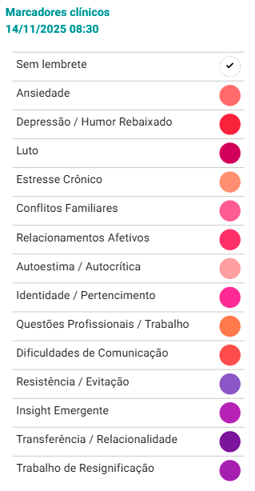
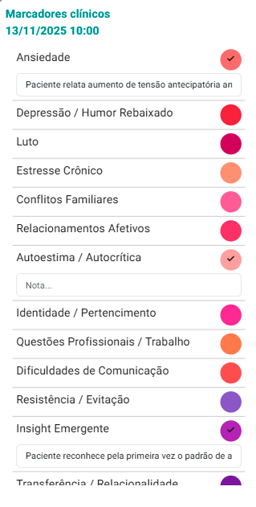
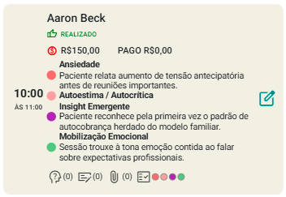

# Marcadores Clínicos

A funcionalidade "Marcadores Clínicos" no sistema eConsult é uma ferramenta estratégica e altamente eficaz para aprimorar a organização, o foco e a qualidade dos atendimentos realizados. Com ela, os profissionais podem configurar até **quetro tipos diferentes de marcadores por atendimento**, cada um representado por uma **cor distinta**, o que proporciona uma visualização rápida e intuitiva das informações essenciais relacionadas a cada caso.

Essa **codificação por cores** permite que os usuários identifiquem com facilidade os marcadores vinculados a um atendimento específico, facilitando a distinção entre diferentes categorias de ações, como follow-ups, pendências administrativas, exames a serem solicitados, entre outros. Dessa forma, as prioridades são evidenciadas com clareza, reduzindo a chance de esquecimentos e contribuindo para uma tomada de decisão mais ágil e assertiva.

Além disso, os marcadores clínicos funcionam como um apoio visual contínuo durante o fluxo de trabalho, permitindo que o profissional mantenha o **foco nas tarefas mais relevantes** e otimize a gestão do tempo.

Em resumo, os "Marcadores Clínicos" representam um recurso valioso dentro do eConsult, que alia praticidade, clareza visual e gestão estratégica para elevar o padrão dos serviços prestados.

## Atribuir marcador clínico ao atendimento

1. Acione a opção  no *card* do atendimento que deseja atribuir lembrete.

    

1. O sistema abre a tela "Marcador clínico para o Atendimento".

    

1. Selecione os marcadores desejados (4 no máximo) clicando nas cores disponíveis e, se necessário, adicione uma breve anotação para cada marcador.

    

1. Após fechar a tela de marcadores o sistema atualizará automaticamente o *card* do atendimento, exibindo as cores dos marcadores associados e suas respectivas anotações.

    

:::tip
1. Para desvincular todos os marcadores de um atendimento, basta acionar a opção "Sem marcador" na tela "Marcadores clínicos para atendimento".

1. O sistema permite 4 marcadores no máximo por atendimento.
:::