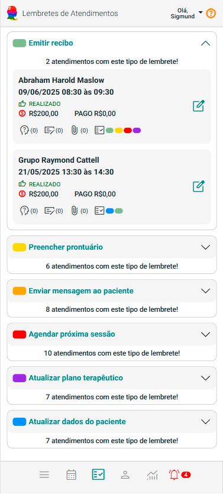
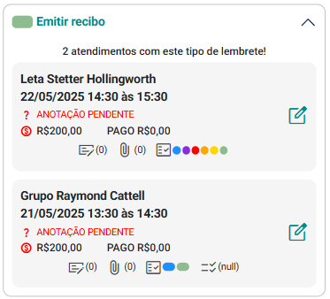

# Sobre Marcadores Clínicos

Os **Marcadores Clínicos** no eConsult são uma ferramenta que apoia o acompanhamento do processo terapêutico ao permitir que o psicólogo **identifique, sinalize e acompanhe temas, focos, eventos e dinâmicas recorrentes** ao longo das sessões.

Diferentemente de simples etiquetas visuais, os Marcadores Clínicos funcionam como **eixos de sentido**, facilitando a leitura longitudinal do caso e contribuindo para uma prática mais consciente, organizada e alinhada às necessidades clínicas do paciente.

Quando um atendimento recebe um marcador, ele passa a ser agrupado com outros atendimentos que compartilham aquele mesmo tema ou foco clínico. Isso gera uma visão clara do que está atravessando o processo terapêutico, fortalecendo a continuidade do cuidado e evitando que elementos importantes se percam na rotina.

### Por que isso é útil?

- Ajuda a **visualizar temas recorrentes** ao longo do processo terapêutico.
- Facilita a **preparação para supervisões** e elaboração de relatórios clínicos.
- Contribui para **organizar o percurso terapêutico** do paciente.
- Apoia a **memória clínica**, evitando perda de nuances importantes entre sessões.

---

## Exemplo prático

Imagine que, ao longo das sessões, diferentes pacientes tragam questões relacionadas a:

**"Luto"**

Ao aplicar esse marcador aos atendimentos relevantes, o eConsult irá **agrupar esses atendimentos** automaticamente. Dessa forma, você tem uma visão transversal clara de como esse tema aparece em diferentes processos — ou ao longo do tempo com um mesmo paciente.

Essa visualização **auxilia na elaboração de hipóteses clínicas**, compreensão de evolução e tomada de decisão terapêutica.

---

## *Cards* de Atendimento com Marcadores

Os *cards* de atendimento exibidos nos grupos de Marcadores Clínicos oferecem uma visão objetiva dos dados essenciais da sessão, sem perder de vista o contexto clínico.

Cada card apresenta:

- **Data e Horário da Sessão**
- **Paciente Vinculado**
- **Status da Sessão** (confirmado, realizado, não realizado etc.)
- **Valor / Valor Pago** (quando aplicável)
- **Outros marcadores associados**

Isso permite navegar rapidamente pelos atendimentos com um olhar **clínico e contextualizado**, preservando o fio narrativo do processo.

---

:::tip
Assim como no painel principal de Atendimentos, o painel de Marcadores Clínicos permite acessar:

- **Anotações** da sessão  
- **Arquivos** vinculados  
- **Marcadores clínicos** configurados  
- **Informes de presença e pagamentos** (no caso de grupos terapêuticos)  

E ainda possibilita ações como **Remarcar, Desmarcar, Excluir, alterar Modalidade e Status**, além de registrar **Recebimentos**, tudo a partir de um único botão:

:::

---

## Em resumo

Os **Marcadores Clínicos**:

- Não são apenas etiquetas coloridas.
- São **ferramentas de leitura clínica**, que apoiam a continuidade, profundidade e coerência do processo terapêutico.
- Ajudam o psicólogo a **ver o processo como narrativa**, e não como sessões isoladas.

> **Eles ajudam a nomear aquilo que atravessa o processo terapêutico — para que não se perca, para que possa ser trabalhado.**
