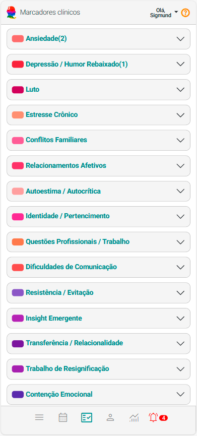
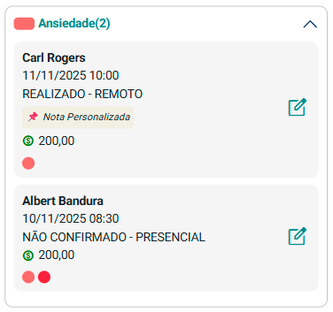

# Sobre Marcadores Clínicos

Os **Marcadores Clínicos** são uma ferramenta estruturante do eConsult que permite ao psicólogo **destacar temas, focos terapêuticos e acontecimentos relevantes** que atravessam os atendimentos ao longo do tempo.

Eles ajudam a **organizar a narrativa clínica**, facilitando a visualização de:

- padrões recorrentes  
- momentos críticos  
- mudanças de funcionamento  
- evolução do processo terapêutico  

Mais do que simples etiquetas, os marcadores funcionam como **eixos de sentido clínico**:  
eles agrupam atendimentos que compartilham o mesmo foco, tornando possível **enxergar o caso como continuidade**, e não como encontros isolados.

---

## Como funciona

No cadastro de **Atendimentos**, você pode:

- atribuir **um ou mais marcadores** a cada sessão  
- registrar uma **observação clínica específica** daquele marcador naquele encontro  

Na tela **Marcadores Clínicos**, o eConsult:

- agrupa automaticamente os atendimentos por marcador  
- apresenta a sequência cronológica de ocorrências  
- permite visualizar rapidamente **a evolução de cada tema ao longo do tempo**

> Isso possibilita acompanhar o **movimento do processo terapêutico**, e não apenas eventos pontuais.

---

## Estrutura da Tela

Na tela *Marcadores Clínicos*:

- Cada marcador aparece como um **item expansível**, com:
  - sua **cor clínica**
  - o **contador de atendimentos relacionados**

Ao expandir um marcador, são exibidos **cards de atendimento** contendo:

- Nome do paciente  
- Data e horário da sessão  
- Status da sessão (Realizado, Confirmado, etc.)  
- Modalidade (Presencial ou Remoto)  
- Valor acordado  
- Marcadores associados  
- Observação clínica daquele marcador na sessão (quando houver)  

Cada card também possui ação direta para:

- revisar anotações  
- alterar status  
- remarcar ou desmarcar  
- registrar pagamentos  

Tudo sem sair do painel de leitura clínica.

---

## O papel das cores nos Marcadores Clínicos

As cores dos marcadores **não são decorativas**.  
Elas fazem parte do **modelo clínico-visual do eConsult**, permitindo que o psicólogo compreenda o estado do cuidado **em poucos segundos**.

A definição das cores segue quatro critérios combinados:

| Critério | O que representa | Pergunta clínica implícita |
|----------|------------------|----------------------------|
| **Gravidade / urgência** | Intensidade do risco ou sofrimento | *Preciso agir agora?* |
| **Domínio fenomenológico** | Tipo de fenômeno clínico | *É sintoma, risco, contexto ou processo?* |
| **Posição no processo terapêutico** | Momento do cuidado | *Estamos em crise, intervenção ou estabilização?* |
| **Legibilidade cognitiva** | Rapidez de leitura visual | *Entendo o estado do caso em 1 segundo?* |

### Significado clínico das famílias de cores

| Família de cor | Categoria clínica | Sentido terapêutico |
|----------------|-------------------|---------------------|
| **Preto / vermelho escuro** | Risco clínico | Prioridade máxima, necessidade de cuidado imediato |
| **Vermelho / laranja** | Sintomas e sofrimento ativo | Alta carga emocional e ativação psíquica |
| **Rosa / roxo médio** | Funcionamento e padrões | Aspectos estruturais do caso, não necessariamente crise |
| **Amarelo / âmbar** | Contexto e rede | Fatores ambientais relevantes ao tratamento |
| **Roxo / violeta** | Processo terapêutico | Elaboração, insight, dinâmica relacional |
| **Azul / verde** | Estágio do tratamento | Organização do cuidado, estabilização e alta |

> A cor comunica rapidamente **onde o paciente está no processo**, sem substituir o julgamento clínico do psicólogo.

---

## Por que usar Marcadores Clínicos?

Os marcadores contribuem diretamente para a qualidade do cuidado:

| Benefício | Descrição |
|-----------|-----------|
| **Clareza do processo** | Permite perceber recorrências e acompanhar transformações clínicas. |
| **Preparação para supervisão** | Reconstrói rapidamente o percurso terapêutico do caso. |
| **Base para documentos clínicos** | Apoia relatórios, pareceres e laudos com maior precisão. |
| **Memória clínica longitudinal** | Evita perda de informações relevantes ao longo do tempo. |
| **Leitura rápida de risco** | As cores destacam situações que exigem maior atenção. |

---

## Exemplo ilustrativo

---

## Em resumo

Os **Marcadores Clínicos**:

- não são apenas etiquetas coloridas  
- constituem uma **ferramenta de leitura clínica longitudinal**  
- permitem observar o caso como **processo contínuo**  
- apoiam decisões terapêuticas com mais consistência  

> **Eles nomeiam o que atravessa o processo —  
> para que possa ser reconhecido, acompanhado e transformado.**
