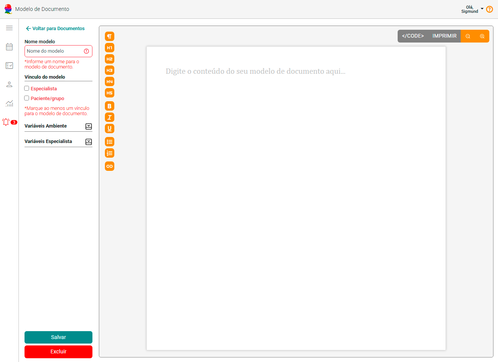
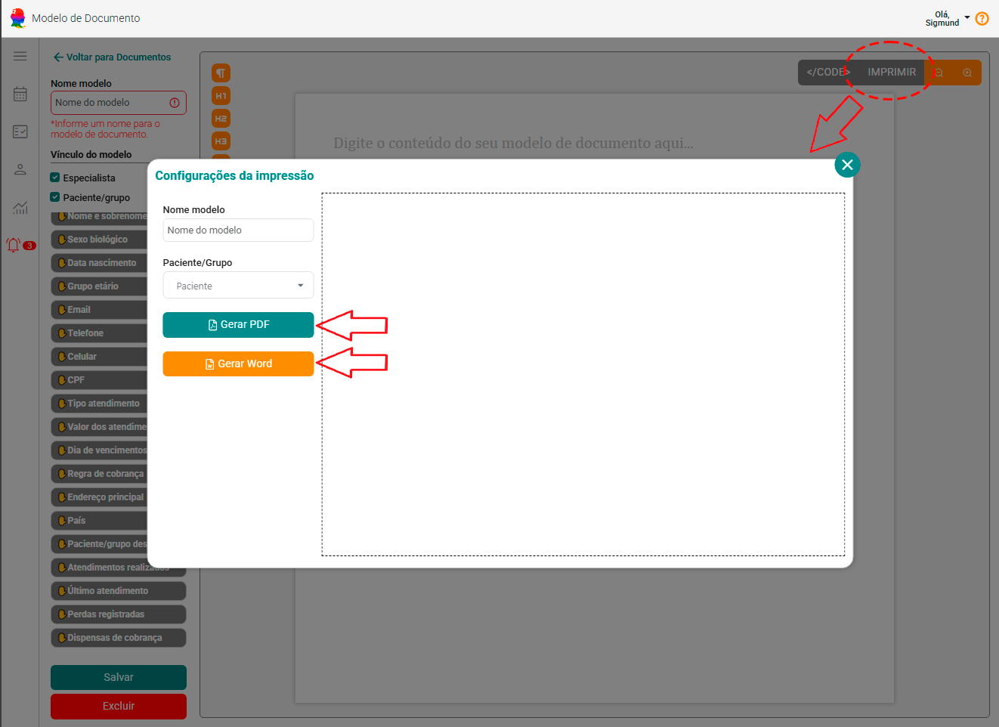

# Sobre Documentos

O módulo **Documentos** do eConsult foi desenvolvido para simplificar a **criação, personalização e emissão de relatórios, declarações e demais documentos psicológicos**, diretamente dentro da plataforma — de forma segura, organizada e integrada aos dados clínicos do paciente.

Essa funcionalidade elimina a necessidade de editores externos, oferecendo um ambiente completo onde o profissional pode **gerar modelos personalizados**, **inserir variáveis automáticas**, **visualizar em tempo real** e **exportar para PDF ou Word** com apenas um clique.

## Principais Recursos

---

### Modelos Inteligentes
O eConsult permite criar e gerenciar modelos de documentos reutilizáveis — como **relatórios psicológicos, declarações, termos e pareceres técnicos**.  
Esses modelos podem conter **variáveis dinâmicas** (ex.: `@@p.nome@@`, `@@e.registro_conselho@@`) que são automaticamente substituídas pelos dados reais do paciente, grupo terapêutico ou profissional no momento da emissão.

---

### Edição Visual e Código HTML
O módulo de documentos possui dois modos de edição:
- **Visual (Preview Editável):** semelhante a um editor de texto, com visualização instantânea do resultado.
- **Código HTML:** para usuários avançados, permitindo ajustes finos no layout e estilos diretamente via código, com destaque de sintaxe e formatação automática via "Monaco Editor".

Essa abordagem híbrida garante flexibilidade tanto para psicólogos quanto para administradores técnicos.

---

### Vinculação a Pacientes/Grupos ou Contas
Cada modelo pode ser vinculado a um contexto específico, garantindo que o documento esteja acessível **somente nos locais corretos de uso**:
- Conta do profissional (ex.: termos institucionais)
- Paciente ou grupo terapêutico (ex.: declarações individuais)

Ao imprimir um documento, o sistema automaticamente insere as informações correspondentes ao vínculo escolhido.

---

### Variáveis Automáticas
O eConsult inclui uma biblioteca de **variáveis de substituição** que automatizam a geração de dados:
- **Paciente:** nome, CPF, data de nascimento, idade etc.  
- **Profissional:** nome, registro no conselho, especialidade etc.  
- **Atendimento:** data, tipo de sessão, local etc.  
- **Sistema:** data atual, hora, nome do documento etc.

Essas variáveis podem ser inseridas no modelo usando o seletor lateral de variáveis.

<figure style={{ margin: 0, textAlign: "left", marginBottom: "20px" }}>
  
  <figcaption style={{ fontStyle: "italic"}}>Variáveis de ambiente</figcaption>
</figure>

<figure style={{ margin: 0, textAlign: "left", marginBottom: "20px" }}>
  
  <figcaption style={{ fontStyle: "italic"}}>Variáveis Especialista</figcaption>
</figure>

<figure style={{ margin: 0, textAlign: "left", marginBottom: "20px" }}>
  
  <figcaption style={{ fontStyle: "italic"}}>Variáveis Paciente/Grupo</figcaption>
</figure>

---

### Exportação em PDF e Word
A partir de qualquer documento, é possível **gerar versões em PDF ou Word (DOCX)** fielmente formatadas, prontas para impressão ou envio digital.  
O sistema utiliza o mesmo layout HTML renderizado, garantindo **padronização visual** e **preservação da identidade profissional**.

---

### Substituição e Pré-visualização Instantânea
Durante a edição, o sistema substitui automaticamente todas as variáveis por seus valores reais e mostra uma **pré-visualização em tempo real** do documento final — incluindo quebras de página, cabeçalho e rodapé.

Isso permite validar o conteúdo antes da emissão e garante que cada documento saia **pronto e consistente**.

### Integração com Outras Funcionalidades
Os documentos se integram de forma nativa com:
- **Prontuário Eletrônico:** publicação opcional no histórico clínico do paciente.  
- **Arquivos (Google Drive):** armazenamento e sincronização automática de documentos emitidos.  
- **Notas Fiscais (Focus NFe):** inclusão de relatórios anexos a faturas e comprovantes.  
- **AI Assistente:** geração automática de textos técnicos, relatórios ou pareceres com base em prompts personalizados.

---

## Como Acessar

1. No menu principal, selecione **Documentos**.
2. Escolha uma das opções: imprimir um documento a partir de um modelo, editar ou excluir um modelo existente, ou criar um novo modelo de documento.
3. Ao imprimir:
   - Clique em **Gerar PDF** ou **Gerar Word**.
3. Ao editar, dupicar ou criar um modelo:
   - Utilize o **modo visual** para pré-visualizar o resultado.  
   - Ou o **modo código** para editar o HTML diretamente.
   - Ao finalizar, clique em **Salvar Modelo**.

---

## Benefícios para o Psicólogo

✅ Reduz tempo gasto com formatação manual  
✅ Centraliza documentos clínicos e administrativos  
✅ Garante consistência visual e técnica  
✅ Facilita o cumprimento das normas do CFP e LGPD  
✅ Integra com outros módulos (Arquivos, Prontuário, Financeiro)

---