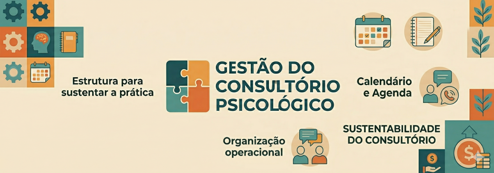

# 🧩 Gestão do Consultório Psicológico

A prática clínica não depende apenas da qualidade técnica do atendimento.

Para que um consultório funcione de forma saudável ao longo do tempo, também é necessário estrutura, organização e previsibilidade operacional.

Agenda, comunicação com pacientes, cobranças, financeiro, processos internos e organização da rotina fazem parte da sustentação da prática profissional — ainda que muitas vezes sejam tratados como “mera burocracia”.

Na realidade, uma gestão desorganizada impacta diretamente a experiência do profissional, a continuidade dos atendimentos e a sustentabilidade do consultório.

<!-- truncate -->

---

## 🧠 Gestão não é burocracia — é estrutura para sustentar a prática

A formação clínica costuma preparar o psicólogo para conduzir atendimentos, formular hipóteses e acompanhar pacientes.

Mas raramente prepara para gerir um consultório.

Com isso, muitos profissionais acabam aprendendo na prática — de forma improvisada — como lidar com:

- organização da agenda  
- faltas e remarcações  
- cobranças e inadimplência  
- comunicação com pacientes  
- sobrecarga operacional  
- crescimento do consultório  

Quando esses processos não estão bem estruturados, o resultado costuma ser:

- retrabalho  
- perda de tempo administrativo  
- aumento do estresse operacional  
- dificuldade de expansão  
- sensação de desorganização constante  

---

## ⚠️ Gestão desorganizada não afeta apenas o administrativo

Problemas de gestão impactam mais do que a rotina operacional.

Eles interferem em fatores como:

- previsibilidade financeira  
- regularidade dos atendimentos  
- percepção de profissionalismo  
- experiência do paciente  
- capacidade do profissional de sustentar sua prática no longo prazo  

Organizar o consultório não significa “mercantilizar” a prática.

Significa criar estrutura para que ela seja sustentável.

---

## 📚 O que você encontrará nesta série

Nesta área reunimos conteúdos voltados à gestão prática e estratégica do consultório psicológico, abordando temas como:

### 🗓️ Agenda e organização operacional

- Estruturação da agenda clínica  
- Distribuição de horários  
- Organização da rotina semanal  
- Redução de retrabalho administrativo  

---

### 🔄 Continuidade e retenção de pacientes

- Faltas e ausências recorrentes  
- Abandono terapêutico  
- Estratégias para melhorar retenção  
- Continuidade operacional do acompanhamento  

---

### 💬 Comunicação e relacionamento operacional

- Confirmação e lembrete de sessões  
- Follow-up após faltas  
- Boas práticas de comunicação com pacientes  
- Limites e organização do contato fora da sessão  

---

### 💰 Financeiro e sustentabilidade

- Cobrança profissional  
- Inadimplência  
- Organização financeira do consultório  
- Sustentabilidade econômica da prática clínica  

---

### 🧑‍💼 Operação e apoio administrativo

- Delegação de tarefas  
- Secretária / assistente  
- Processos internos  
- Escalabilidade operacional  

---

## 🚀 Gestão é parte da maturidade profissional

Um consultório sustentável não depende apenas de agenda cheia.

Depende de organização.

Depende de processos.

Depende de estrutura.

Quanto mais madura a gestão do consultório, maior tende a ser a previsibilidade, a eficiência operacional e a capacidade do profissional de manter uma prática saudável no longo prazo.

---

## Continue explorando

Abaixo você encontrará os conteúdos desta série organizados por tema.

Eles foram estruturados para ajudar psicólogos a desenvolver uma gestão mais organizada, sustentável e profissional de seus consultórios.
