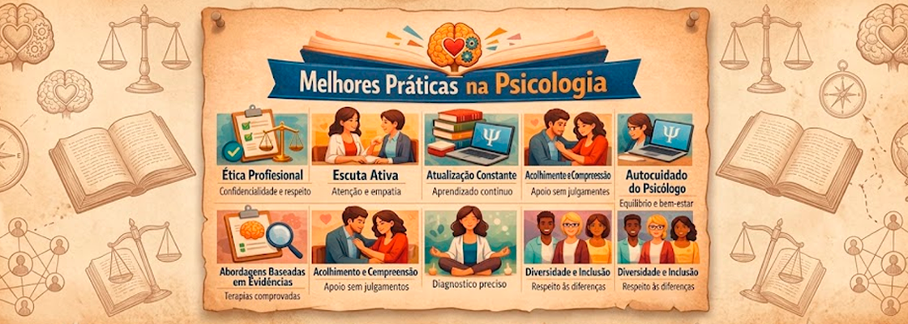
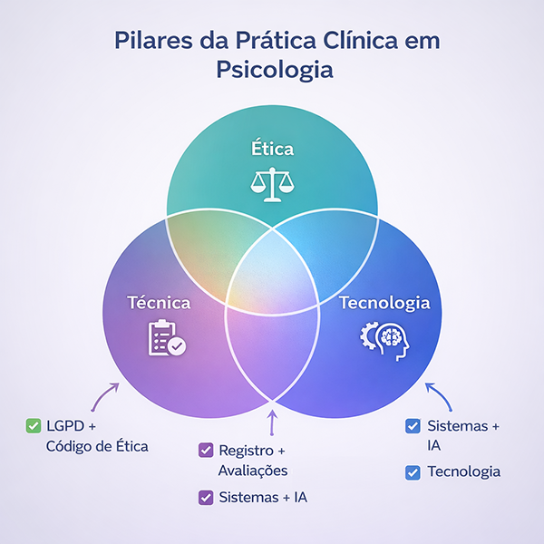
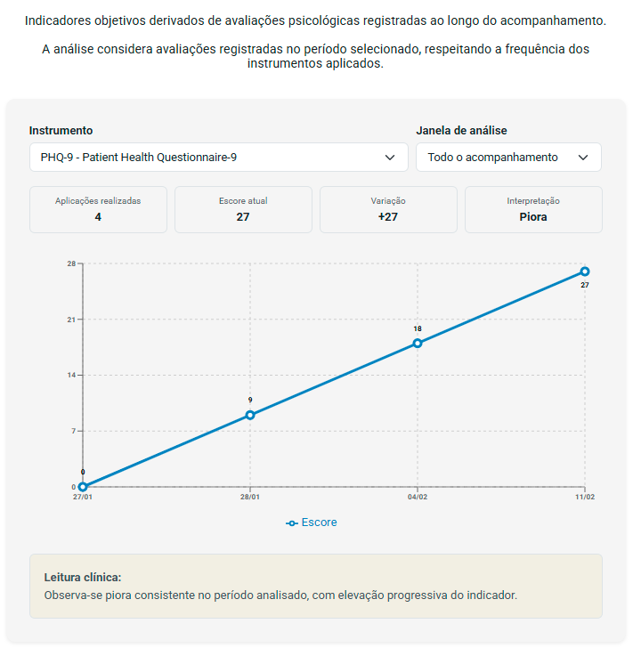

# 🧠 Prática Clínica em Psicologia

Muitos psicólogos conduzem boas sessões…  
mas não conseguem descrever com clareza a evolução dos seus pacientes ao longo do tempo.

A prática clínica em psicologia vai muito além do atendimento em si.

Mas, na prática, muitos profissionais ainda lidam com registros fragmentados, dificuldade de acompanhar a evolução dos pacientes e falta de clareza sobre o que está mudando ao longo do tempo.

> O principal problema da prática clínica contemporânea não é falta de técnica — é falta de estrutura longitudinal.

A prática clínica de excelência é longitudinal e baseada em dados. Isso significa transformar sessões isoladas em uma linha do tempo coesa, permitindo identificar padrões, avaliar intervenções e sustentar decisões clínicas com maior precisão.

---

## 🧭 Navegação rápida

- ⚠️ [Desafios comuns na prática clínica](#%EF%B8%8F-desafios-comuns-na-pr%C3%A1tica-cl%C3%ADnica)  
- 🧠 [Mudança de paradigma na prática clínica](#-mudan%C3%A7a-de-paradigma-na-pr%C3%A1tica-cl%C3%ADnica)  
- 💻 [Como escolher um sistema para psicólogos](#-como-escolher-um-sistema-para-psic%C3%B3logos)  
- 🎯 [Por que estruturar a prática clínica](#-por-que-estruturar-a-pr%C3%A1tica-cl%C3%ADnica)  
- 🧱 [Modelo de prática clínica moderna](#-modelo-de-pr%C3%A1tica-cl%C3%ADnica-moderna)  
- 🚨 [Gestão de risco e alertas clínicos](#-gest%C3%A3o-de-risco-e-alertas-cl%C3%ADnicos)  
- 🔄 [Interoperabilidade e continuidade do cuidado](#-interoperabilidade-e-continuidade-do-cuidado)  
- 📱 [Jornada digital do paciente](#-jornada-digital-do-paciente)  
- 🤖 [Inteligência artificial na psicologia clínica](#-intelig%C3%AAncia-artificial-na-psicologia-cl%C3%ADnica)  
- 🧠 [Pilares da prática clínica moderna](#-pilares-da-pr%C3%A1tica-cl%C3%ADnica-moderna)  
- 📊 [Exemplo real de evolução clínica longitudinal](#-exemplo-real-de-evolu%C3%A7%C3%A3o-cl%C3%ADnica-longitudinal)  
- 🚀 [Conclusão](#-conclus%C3%A3o)  

---

## ⚠️ Desafios comuns na prática clínica

- registros clínicos pouco estruturados  
- dificuldade em acompanhar evolução  
- sobrecarga administrativa  
- falta de integração entre dados  

👉 O resultado é uma prática baseada em memória e impressão — e não em análise clínica estruturada.

👉 Isso leva a uma prática reativa, e não analítica.

---

## 🧠 Mudança de paradigma na prática clínica

Para evoluir a prática clínica, não basta adicionar ferramentas — é necessário mudar a forma de pensar.

A transição central é:

- de **sessões isoladas** → para **processo ao longo do tempo**  
- de **memória clínica** → para **estrutura e registro contínuo**  
- de **impressão subjetiva** → para **análise baseada em dados**  

Essa mudança redefine o papel do psicólogo:

> De alguém que conduz sessões  
> para alguém que acompanha trajetórias clínicas.

---

## 💻 Como escolher um sistema para psicólogos?

Um sistema não deve ser apenas operacional — ele deve apoiar o raciocínio clínico.

### 📊 Comparação entre diferentes abordagens de sistemas para psicólogos

| Critério | eConsult | Psicomanager | iClinic | Zenklub / Vittude |
|---|---|---|---|---|
| **Foco principal** | Inteligência clínica longitudinal | Gestão clínica para psicólogos | Gestão médica geral | Plataforma de conexão paciente-profissional |
| **Prontuário psicológico** | Estruturado para raciocínio clínico | Estruturado conforme CFP | Estruturado e personalizável | Registro de atendimentos |
| **Análise da evolução clínica** | Estruturada para acompanhamento longitudinal com apoio de IA | Recursos de organização de evoluções | Não possui estrutura voltada para análise clínica longitudinal | Não estruturado para análise longitudinal |
| **Apoio com IA** | Apoio à análise clínica e identificação de padrões | Apoio à documentação | Automação de processos | Não possui foco específico em suporte clínico com IA |
| **Conformidade (LGPD/CFP)** | Estrutura voltada à segurança e controle de acesso | Conformidade declarada | Conformidade declarada | Estrutura da plataforma |
| **Público-alvo** | Psicólogos com foco em aprofundamento clínico | Psicólogos focados em gestão | Clínicas médicas e multiprofissionais | Psicólogos em busca de pacientes |

👉 A maioria dos sistemas resolve a operação.  
👉 Poucos realmente apoiam a prática clínica.

---

## 🎯 Por que estruturar a prática clínica?

Sem estrutura:

- prática fragmentada  
- dependência de memória  
- baixa clareza clínica  

Com estrutura:

- decisões mais consistentes  
- acompanhamento real do paciente  
- maior segurança clínica e ética  

---

## 🧱 Modelo de prática clínica moderna

Uma prática clínica estruturada se sustenta em alguns componentes fundamentais:

### 🧠 1. Registro clínico estruturado

Registrar não é apenas documentar — é organizar o raciocínio clínico.

Modelos como o **SOAP** ajudam a estruturar o pensamento ao longo do tempo.

---

### 📈 2. Acompanhamento longitudinal

Permite:

- identificar padrões  
- avaliar intervenções  
- compreender a trajetória do paciente  

👉 Aqui a clínica deixa de ser pontual e passa a ser contínua.

---

### 📊 3. Uso de instrumentos e indicadores

Inclui:

- escalas (PHQ-9, GAD-7, WHO-5)  
- instrumentos próprios  
- indicadores clínicos  

👉 Dados deixam de ser acessórios e passam a apoiar decisões.

---

### 🚨 4. Leitura de risco e continuidade

Permite identificar:

- piora progressiva  
- abandono terapêutico  
- rupturas de vínculo  

👉 A clínica passa a antecipar, não apenas reagir.

---

### ⚙️ 5. Organização da prática

Inclui:

- agenda  
- atendimentos  
- financeiro  

👉 Sustenta a consistência operacional da clínica.

---

## 🚨 Gestão de risco e alertas clínicos

Uma prática estruturada permite identificar sinais críticos:

- piora progressiva  
- abandono  
- ideação suicida  

👉 A análise longitudinal permite antecipação de riscos.

---

## 🔄 Interoperabilidade e continuidade do cuidado

O paciente não pertence ao sistema.

Um bom sistema deve permitir:

- exportação de dados  
- leitura clara por outro profissional  
- continuidade do cuidado  

---

## 📱 Jornada digital do paciente

A prática clínica hoje envolve:

- primeiro contato  
- agendamento  
- atendimento  
- acompanhamento  

👉 A tecnologia deve integrar esse fluxo sem quebrar o vínculo terapêutico.

---

## 🤖 Inteligência artificial na psicologia clínica

A IA não substitui o psicólogo.

Ela pode:

- identificar padrões  
- sintetizar informações  
- apoiar o raciocínio clínico  

👉 A IA ilumina — não decide.

---

## 🧠 Pilares da prática clínica moderna

- Ética  
- Técnica  
- Tecnologia  

👉 O valor está na integração entre eles.

---

## 📊 Exemplo real de evolução clínica longitudinal

👉 A evolução clínica precisa ser visível, analisável e interpretável.

---

## 🚀 Conclusão

A clínica não acontece apenas na sessão.

Ela acontece na continuidade, na análise e na capacidade de acompanhar o paciente ao longo do tempo.

Sem isso:

- há atendimento  
- mas não necessariamente há evolução  

---

## 🧠 Em resumo

A prática clínica de excelência exige:

- estrutura  
- continuidade  
- análise  

👉 Sessões acontecem.  
👉 Evolução precisa ser acompanhada.

---