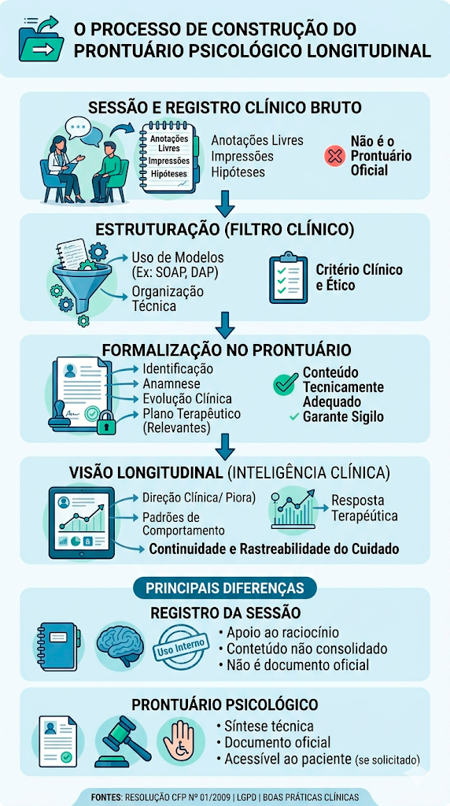

# Prontuário Psicológico: Modelos Word e PDF para Baixar

Se você chegou até aqui, provavelmente está procurando um modelo de prontuário psicológico pronto para utilizar na sua prática clínica.

Talvez esteja se perguntando:

- O que realmente deve constar no prontuário?
- Meu modelo está de acordo com as orientações do CFP?
- Como registrar as sessões de forma organizada?
- Como documentar a evolução do paciente?
- Existe um modelo que eu possa adaptar para minha realidade clínica?

Você não está sozinho.

Essas são algumas das dúvidas mais comuns entre psicólogos que desejam manter registros clínicos consistentes, organizados e tecnicamente adequados.

Para ajudar, disponibilizamos gratuitamente modelos de prontuário psicológico para diferentes modalidades de atendimento.

---

## 📥 Modelos de Prontuário Psicológico para Download

### 👤 Modelo de Prontuário Psicológico Individual (Word e PDF)

Ideal para atendimentos individuais de psicoterapia.

#### O que este modelo contém?

- Identificação do paciente
- Histórico clínico
- Queixas principais
- Hipóteses diagnósticas
- Prognóstico
- Plano terapêutico
- Evolução clínica
- Registros SOAP
- Encaminhamentos
- Síntese clínica longitudinal

📄 [Baixar PDF](../static/pdf/prontuario-individual-exemplo.pdf)

📝 [Baixar Word](../static/word/Prontuário%20Mariana%20Soares.docx)

---

### 💑 Modelo de Prontuário Psicológico para Casal (Word e PDF)

Modelo desenvolvido para terapia de casal.

#### O que este modelo contém?

- Identificação do casal
- Histórico do relacionamento
- Motivo da consulta
- Dinâmica relacional
- Comunicação do casal
- Objetivos terapêuticos
- Plano de intervenção
- Evolução do processo
- Indicadores de coesão conjugal
- Registros SOAP
- Síntese longitudinal

📄 [Baixar PDF](../static/pdf/prontuario-casal-exemplo.pdf)

📝 [Baixar Word](../static/word/Prontuário%20Casal%20Maria%20e%20João.docx)

---

### 👨‍👩‍👧 Modelo de Prontuário Psicológico Familiar (Word e PDF)

Modelo voltado para terapia familiar.

#### O que este modelo contém?

- Composição familiar
- Histórico da família
- Dinâmica familiar
- Comunicação entre membros
- Papéis e responsabilidades
- Avaliação inicial
- Objetivos terapêuticos
- Evolução familiar
- Indicadores de coesão
- Registros SOAP
- Acompanhamento longitudinal

📄 [Baixar PDF](../static/pdf/prontuario-familia-exemplo.pdf)

📝 [Baixar Word](../static/word/Prontuário%20Família%20Oliveira.docx)

---

### 👥 Modelo de Prontuário para Grupo Terapêutico (Word e PDF)

Modelo destinado a grupos terapêuticos e grupos de apoio.

#### O que este modelo contém?

- Identificação do grupo
- Critérios de inclusão
- Objetivos terapêuticos
- Plano terapêutico coletivo
- Metas de curto, médio e longo prazo
- Evolução coletiva
- Participação e engajamento
- Indicadores de coesão grupal
- Registros SOAP
- Síntese longitudinal do grupo

📄 [Baixar PDF](../static/pdf/prontuario-grupo-exemplo.pdf)

📝 [Baixar Word](../static/word/Prontuário%20Grupo%20Terapêutico%20Reconstruindo%20Caminhos.docx)

---

## ⚠️ Um prontuário não é apenas um formulário

Baixar um modelo de prontuário é um ótimo ponto de partida.

Mas existe um erro comum na prática clínica:

Muitos profissionais acreditam que o prontuário é apenas um documento onde são armazenados registros das sessões.

Na realidade, ele faz parte de um processo muito maior.

O prontuário organiza informações importantes do caso.

Mas a compreensão da evolução do paciente depende da forma como essas informações são registradas, conectadas e analisadas ao longo do tempo.

Por isso, antes de utilizar qualquer modelo, vale entender qual é o papel do prontuário dentro da prática clínica.

---

## 🧾 O que é prontuário psicológico?

O prontuário psicológico é o registro técnico do acompanhamento realizado pelo psicólogo.

Mais do que uma exigência documental, ele é um instrumento que organiza informações clinicamente relevantes, sustenta a continuidade do cuidado e protege tanto o paciente quanto o profissional.

Quando bem estruturado, deixa de ser apenas um arquivo de registros e passa a apoiar a compreensão da evolução clínica ao longo do tempo.

Ele deve conter minimamente:

- Identificação do paciente
- Anamnese
- Registros estruturados das sessões (apenas o que for clinicamente pertinente)
- Avaliações
- Evolução clínica
- Plano terapêutico

👉 Sua função principal é:

> **garantir continuidade, coerência e rastreabilidade do cuidado**

---

## ⚖️ Registro da sessão, modelos clínicos e prontuário

Esse é um dos pontos mais importantes — e frequentemente confundidos na prática clínica.

Para compreender corretamente, é necessário separar três níveis diferentes do registro clínico.

### 🧠 1. Registro clínico da sessão

É o registro realizado pelo psicólogo durante ou após o atendimento.

Pode incluir:

- Observações livres
- Impressões clínicas
- Hipóteses em construção
- Elementos ainda não organizados

👉 Sua função é:

> **apoiar o raciocínio clínico do profissional**

⚠️ Importante:

- Não precisa estar estruturado
- Não é, necessariamente, parte do prontuário
- Pode conter conteúdos ainda não consolidados

---

### 🧩 2. Modelos de registro clínico (ex: SOAP, DAP, BIRP)

Os modelos são formas de **organizar tecnicamente o registro da sessão**.

Eles não são o prontuário —  
são uma forma de estruturar o conteúdo antes (ou durante) sua formalização.

Exemplos:

- SOAP
- DAP
- BIRP

👉 Função dos modelos:

> **transformar o registro clínico em um formato estruturado e compreensível**

---

### 🧾 3. Prontuário psicológico

O prontuário é o **documento clínico oficial**.

Ele deve conter:

- Registros organizados e relevantes
- Conteúdo tecnicamente adequado
- Informações que sustentem o acompanhamento do caso

✔️ Pode ser solicitado pelo paciente  
✔️ Deve seguir linguagem técnica  
✔️ Representa a síntese do processo terapêutico

---

### 🔄 Relação entre os três níveis

O prontuário não é uma cópia da sessão.

Ele é resultado de um processo clínico:

```text
🗣️ Sessão
      ↓
📝 Registro Clínico
      ↓
🧩 Estruturação (SOAP)
      ↓
📄 Prontuário Psicológico
      ↓
📈 Evolução Psicológica
      ↓
🔄 Acompanhamento Longitudinal
```

👉 Ou seja:

- O psicólogo registra a sessão
- Organiza o conteúdo (ex: SOAP)
- E decide se deve compor o prontuário


<small>
Mais do que registrar atendimentos, o prontuário psicológico consolida informações clinicamente relevantes ao longo do tempo, sustentando a análise da evolução e a tomada de decisão terapêutica.
</small>

---

### ⚠️ Critério clínico e ético

Nem toda informação da sessão deve ser incluída no prontuário.

A decisão deve considerar:

- Pertinência clínica
- Relevância para o acompanhamento
- Clareza técnica
- Impacto ético

---

👉 Essa distinção é essencial para:

- proteger o sigilo profissional
- evitar interpretações inadequadas
- manter a qualidade do registro clínico
- garantir segurança ética e jurídica

---

## 📜 Normas do CFP sobre prontuário

O psicólogo tem o dever de manter registro técnico dos atendimentos realizados.

Esse registro deve ser materializado de forma organizada e documental,  
sendo o prontuário psicológico o principal instrumento para isso.

Ele é regulamentado pelo **Conselho Federal de Psicologia (CFP)**, incluindo:

- Resolução CFP nº 01/2009
- Atualizações sobre guarda, sigilo e acesso

Essas normas estabelecem:

- Obrigatoriedade de manutenção de prontuário
- Responsabilidade do psicólogo sobre os registros
- Critérios de armazenamento, sigilo e acesso

---

### ⚠️ Importante: registro clínico vs prontuário

Embora o registro clínico da sessão seja obrigatório,  
isso não significa que todo o seu conteúdo deva ser incluído integralmente no prontuário.

👉 O prontuário deve conter:

- Informações clinicamente relevantes
- Registros estruturados
- Conteúdo tecnicamente adequado

👉 Já o registro clínico da sessão pode incluir:

- Elementos em construção
- Hipóteses ainda não consolidadas
- Observações de uso interno

---

👉 Portanto:

> O prontuário é uma **síntese técnica e estruturada do atendimento**,  
> definida a partir do julgamento clínico do psicólogo.

---

👉 Seguir essas diretrizes é fundamental para:

> **proteção ética e legal do profissional**

---

## 🧩 Estrutura de um prontuário clínico

Um prontuário de qualidade precisa de:

### ✔️ Estrutura

Organização padronizada dos registros

### ✔️ Clareza

Linguagem técnica, objetiva e precisa

### ✔️ Continuidade

Capacidade de acompanhar evolução ao longo do tempo

---

## 🧠 Modelos de registro clínico

Os modelos organizam o registro clínico da sessão e facilitam sua formalização no prontuário.

### 👉 Principais modelos

- SOAP
- DAP
- BIRP

---

👉 Para garantir consistência técnica no seu registro:

- 🔗 [SOAP na psicologia: guia completo](/pratica-clinica/soap-psicologia)

---

## 📈 Evolução clínica no prontuário

O prontuário não deve registrar apenas eventos.

Ele deve permitir compreender:

- Direção clínica (melhora, piora, estabilidade)
- Padrões comportamentais
- Resposta terapêutica

👉 A prática moderna exige:

> **leitura longitudinal do paciente**

---

👉 Aprofunde este tema:

- 🔗 [Evolução psicológica](/pratica-clinica/evolucao-psicologica)

---

## 📊 Escalas e avaliações psicométricas no prontuário

Em alguns contextos clínicos, o psicólogo pode utilizar escalas psicométricas, questionários padronizados e outros instrumentos de avaliação para complementar o acompanhamento do paciente.

Nesses casos, é importante compreender quais informações devem ser registradas no prontuário e como esses dados podem contribuir para a análise clínica ao longo do tempo.

---

### ✔️ O que registrar

- Nome do teste e referência (bibliografia)
- Resultado do teste (escore e classificação)
- Data de aplicação
- Contexto clínico
- Interpretação técnica

---

### 📈 O mais importante: evolução ao longo do tempo

Mais relevante do que um teste isolado é sua evolução:

- Comparação entre sessões
- Identificação de melhora ou piora
- Apoio à tomada de decisão clínica

👉 O prontuário deve permitir essa leitura longitudinal.

---

### ⚠️ O que não é obrigatório incluir

As perguntas e respostas completas dos testes/avaliações, na maioria dos casos,  
não precisam constar no prontuário.

Elas podem ser mantidas como registro complementar,  
quando necessário para análise clínica mais detalhada.

---

👉 Em resumo:

> O prontuário deve conter **informação clínica relevante**,  
> e não necessariamente todo o conteúdo bruto da avaliação.

---

## ⚠️ Erros comuns no prontuário

- Registros vagos
- Falta de padronização
- Atraso no preenchimento
- Mistura de opinião com observação
- Falta de continuidade

👉 Veja exemplos:

- 🔗 [Erros nos registros clínicos](/blog/erros-soap-psicologia)

---

## 🔐 LGPD e compartilhamento com o paciente

O prontuário contém dados sensíveis e deve ser protegido durante todo o seu armazenamento.

---

### 📄 Acesso pelo paciente

O paciente pode solicitar acesso ao prontuário.

Essa entrega deve ser realizada de forma:

- Técnica
- Responsável
- Adequada ao contexto clínico

---

### ⚠️ Responsabilidade após o compartilhamento

Após a entrega ao paciente:

- O documento passa a estar sob sua posse
- O paciente pode armazenar ou compartilhar as informações

👉 Nesse momento, o controle sobre o uso do documento deixa de ser do psicólogo.

---

### 🧠 Responsabilidade do psicólogo

Mesmo após a entrega, o psicólogo permanece responsável por:

- A qualidade técnica do conteúdo
- A adequação ética das informações
- A proteção de dados de terceiros

---

👉 Portanto:

> O prontuário deve ser elaborado considerando que poderá ser compartilhado fora do contexto clínico.

---

👉 Saiba mais:

- 🔗 [LGPD para psicólogos](https://documents.econsult.app.br/blog/seguranca)

---

## 💻 Prontuário de papel vs prontuário eletrônico

| Critério             | Papel                | Eletrônico             |
| -------------------- | -------------------- | ---------------------- |
| Organização          | Limitada             | Estruturada            |
| Busca de informações | Difícil              | Instantânea            |
| Segurança            | Risco físico         | Controle de acesso     |
| LGPD                 | Difícil conformidade | Mais aderente          |
| Evolução clínica     | Manual               | Estruturada e contínua |

---

## 🧠 Prontuário como inteligência clínica

O prontuário evoluiu.

Hoje ele pode:

- Organizar o raciocínio clínico
- Reduzir carga cognitiva
- Identificar padrões

👉 Ele deixa de ser:

> um registro passivo

👉 e passa a ser:

> **uma ferramenta ativa de análise clínica**

---

## 🚀 Integração com sistemas clínicos

Sistemas modernos permitem:

- Registro estruturado
- Visualização longitudinal
- Integração com agenda e financeiro
- Apoio com inteligência clínica

---

👉 Conheça uma abordagem baseada em inteligência clínica:

- 🔗 https://econsult.app.br/prontuario-eletronico-psicologos

---

## ✅ Checklist rápido do prontuário

Antes de finalizar seu registro, verifique:

- [ ] Registro feito no mesmo dia
- [ ] Linguagem técnica e objetiva
- [ ] Evolução clínica descrita
- [ ] Plano terapêutico atualizado
- [ ] Apenas informações clinicamente pertinentes incluídas

---

## 📚 Glossário rápido

**Anamnese**  
Levantamento inicial da história do paciente

**Hipótese diagnóstica**  
Possível explicação clínica baseada nos dados

**Conduta terapêutica**  
Plano de intervenção definido

---

## ❓ Perguntas frequentes (FAQ)

### O prontuário psicológico é obrigatório?

Sim. O psicólogo deve manter registros técnicos que permitam documentar o acompanhamento realizado, observando as normas e orientações do Conselho Federal de Psicologia (CFP).

---

### O prontuário pode ser solicitado pelo paciente?

Sim. O prontuário faz parte dos registros do atendimento e pode ser acessado pelo paciente, observados os critérios éticos e legais aplicáveis.

---

### O que deve constar em um prontuário psicológico?

De forma geral, o prontuário deve conter informações clinicamente relevantes para a continuidade do cuidado, como identificação do paciente, anamnese, registros clínicos, avaliações, evolução e plano terapêutico.

---

### Preciso registrar tudo o que acontece na sessão?

Não necessariamente.

O prontuário não é uma transcrição completa da sessão. Cabe ao psicólogo avaliar quais informações são clinicamente relevantes e devem ser formalizadas no registro.

---

### O registro clínico da sessão faz parte do prontuário?

Não necessariamente.

O registro clínico pode conter observações, hipóteses e anotações de trabalho do profissional. O prontuário é uma síntese técnica construída a partir do julgamento clínico do psicólogo.

---

### SOAP é a mesma coisa que prontuário?

Não.

O SOAP é um modelo de organização do registro clínico. O prontuário é o documento clínico que reúne informações relevantes sobre o acompanhamento do paciente.

---

### Posso utilizar linguagem informal no prontuário?

Não é recomendado.

O prontuário deve utilizar linguagem técnica, objetiva e compatível com a finalidade clínica e documental do registro.

---

### Qual é a diferença entre prontuário e evolução psicológica?

O prontuário é o conjunto organizado de informações do acompanhamento.

A evolução psicológica corresponde à análise das mudanças, padrões e progressos observados ao longo do tempo e pode ser registrada dentro do prontuário.

---

## 🧠 Próximos passos para evoluir sua prática clínica

O prontuário é apenas uma parte do processo clínico.

---

## 👉 Para aprofundar sua prática:

- 🔗 [Prática Clínica](/pratica-clinica)
- 🔗 [SOAP na Psicologia: guia completo, exemplos práticos e como aplicar na clínica](/pratica-clinica/soap-psicologia)
- 🔗 [Marcadores Clínicos na Psicologia: o que são, como usar e por que transformam a prática clínica](/pratica-clinica/marcadores-clinicos-psicologia)
- 🔗 [Evolução Psicológica](/pratica-clinica/evolucao-psicologica)
- 🔗 [Avaliação Psicológica na Prática Clínica: como usar instrumentos de forma ética e estratégica](/pratica-clinica/avaliacao-psicologica-pratica-clinica)
- 🔗 [Sistema de Acompanhamento Clínico Longitudinal: o futuro da prática em psicologia](/pratica-clinica/sistema-acompanhamento-clinico-longitudinal)
- 🔗 [Prática Clínica com eConsult](/pratica-clinica/pratica-clinica-com-econsult)

---

