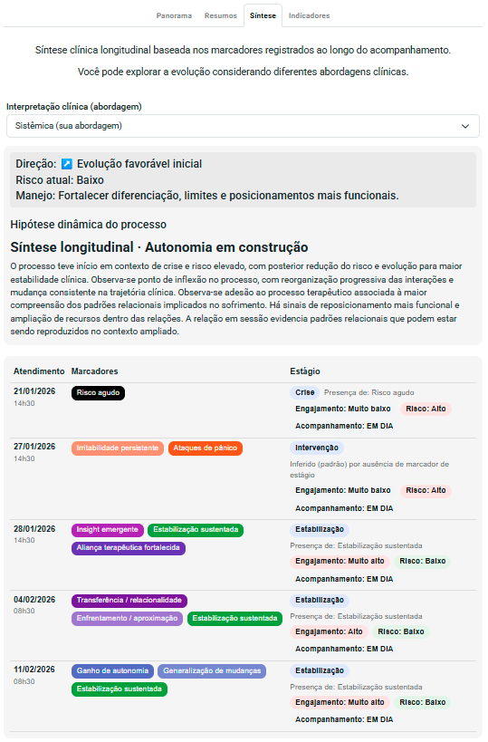
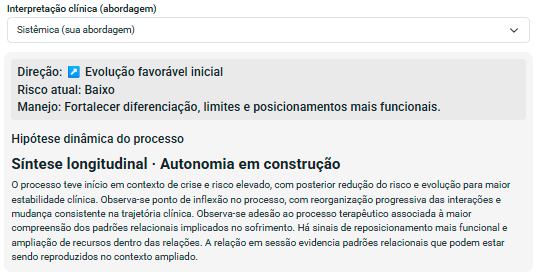

# Evolução psicológica

A evolução psicológica é o núcleo do trabalho clínico.

Mais do que registrar sessões, o psicólogo precisa responder:

> **O paciente está evoluindo? Em que direção? E por quê?**

Essa resposta, porém, não é simples.

Na prática, acompanhar a evolução de um paciente é um dos maiores desafios da clínica —  
especialmente quando o acompanhamento depende apenas de memória, anotações soltas ou registros pouco estruturados.

---

## 🧭 Navegação rápida

- 📈 O que é evolução psicológica  
- ⚠️ Por que é difícil acompanhar a evolução do paciente  
- 🧠 A importância do acompanhamento longitudinal  
- 🔍 Como analisar a evolução clínica na prática  
- 📊 Indicadores e sinais de evolução  
- ⚠️ Erros comuns na análise da evolução  
- 💻 O papel dos sistemas na análise clínica  
- 🧠 Evolução como suporte ao raciocínio clínico  

---

## 📈 O que é evolução psicológica?

A evolução psicológica é a análise da trajetória do paciente ao longo do tempo.

Ela envolve compreender:

- Mudanças no comportamento  
- Variações emocionais  
- Resposta às intervenções  
- Padrões recorrentes  
- Direção clínica (melhora, piora, estabilidade)  

👉 Não se trata de um evento isolado, mas de um **processo contínuo**.

---

## ⚠️ Por que é tão difícil acompanhar a evolução?

Na prática clínica, a evolução raramente é linear.

E o principal problema não está no paciente —  
está na forma como a informação é registrada e analisada.

---

### 🧩 Desafios comuns do psicólogo

- Registros dispersos entre sessões  
- Falta de padronização nas anotações  
- Dificuldade de resgatar informações antigas  
- Dependência da memória clínica  
- Tempo limitado para análise entre atendimentos  

---

### 🧠 Consequência direta

> O psicólogo passa a **intuir a evolução**, em vez de analisá-la de forma estruturada.

Isso aumenta:

- Carga cognitiva  
- Insegurança clínica  
- Risco de perda de informações importantes  

---

## ⚠️ Quando a evolução vira percepção subjetiva

Na prática clínica, é comum que o acompanhamento da evolução fique baseado principalmente na percepção do paciente.

Frases como:

- “Estou me sentindo melhor”  
- “A terapia está me fazendo bem”  

passam a funcionar como principal critério de continuidade do processo terapêutico.

---

Embora essas percepções sejam importantes, elas não substituem uma análise clínica estruturada.

Sem acompanhamento longitudinal:

- mudanças sutis podem passar despercebidas  
- padrões importantes deixam de ser identificados  
- intervenções podem não ser ajustadas com precisão  

---

👉 O resultado é uma prática que, muitas vezes, se apoia mais em sensação do que em análise.

---

## 🧠 Prontuário como construção contínua

Na prática clínica, é comum que o prontuário seja elaborado apenas quando necessário —  
geralmente quando solicitado pelo paciente ou por demanda externa.

---

No entanto, esse não é o modelo ideal.

O prontuário não deve ser uma reconstrução retrospectiva do caso.

👉 Ele deve ser uma **construção contínua, sessão a sessão**.

---

### 🔄 Um fluxo clínico mais consistente

- Registro da anamnese na primeira sessão  
- Revisão da evolução antes de cada atendimento  
- Planejamento clínico baseado no histórico  
- Registro estruturado após cada sessão  
- Atualização progressiva do prontuário  

---

👉 Nesse modelo:

> o prontuário já está pronto quando necessário —  
> porque foi construído ao longo do cuidado

---

👉 E mais importante:

> o psicólogo passa a **acompanhar a evolução em tempo real**,  
> e não apenas reconstruí-la depois

---

## 🧠 A importância do acompanhamento longitudinal

A prática clínica moderna exige uma mudança de perspectiva:

👉 sair do foco na sessão isolada  
👉 e passar para a **trajetória do paciente**

---

### 🔄 O que muda com a visão longitudinal

| Foco tradicional        | Abordagem longitudinal              |
|------------------------|------------------------------------|
| Sessão atual           | Histórico completo do paciente     |
| Impressão imediata     | Padrões ao longo do tempo          |
| Registro isolado       | Integração entre sessões           |
| Observação pontual     | Tendências clínicas                |

---

👉 A pergunta deixa de ser:

> "Como foi a sessão de hoje?"

👉 E passa a ser:

> **"O que está acontecendo com esse paciente ao longo do tempo?"**

---

## 🔍 Como analisar a evolução na prática

A análise da evolução não depende apenas de experiência clínica —  
ela pode (e deve) ser estruturada.

---

### ✔️ 1. Comparação entre sessões

- O paciente está melhor, pior ou igual?  
- O que mudou desde o último atendimento?  

---

### ✔️ 2. Identificação de padrões

- Repetição de comportamentos  
- Oscilações emocionais  
- Momentos críticos recorrentes  

---

### ✔️ 3. Resposta às intervenções

- O plano terapêutico está funcionando?  
- Houve mudança após determinada abordagem?  

---

### ✔️ 4. Integração de dados clínicos

- Registros das sessões  
- Avaliações psicológicas  
- Indicadores clínicos  

---

👉 A evolução não está em um único registro.  
Ela emerge da **conexão entre eles**.

---

## 📊 Indicadores de evolução clínica

A evolução pode ser observada através de diferentes dimensões:

---

### 🧠 Clínicos

- Redução de sintomas  
- Aumento de insight  
- Mudança de padrões disfuncionais  

---

### 📈 Comportamentais

- Adesão ao tratamento  
- Frequência nas sessões  
- Participação ativa  

---

### 💬 Subjetivos

- Relato do paciente  
- Percepção de melhora  
- Mudanças na narrativa  

---

👉 O mais importante:

> **Nenhum indicador isolado define a evolução.**  
> É o conjunto que constrói a leitura clínica.

---

## ⚠️ Erros comuns na análise da evolução

- Basear-se apenas na última sessão  
- Ignorar histórico do paciente  
- Falta de registro consistente  
- Interpretação sem dados estruturados  
- Confundir percepção subjetiva com evolução real  

---

👉 Veja também:

- 🔗 [Erros nos registros clínicos](/blog/erros-soap-psicologia)

---

## 💻 O papel dos sistemas na análise da evolução

Aqui acontece uma virada importante na prática clínica.

Sistemas bem estruturados não servem apenas para registrar —  
eles ajudam a **pensar clinicamente**.

---

### 🔍 O que sistemas tradicionais fazem

- Armazenam informações  
- Organizam dados  
- Facilitam acesso  

👉 Mas deixam toda a análise por conta do psicólogo

---

### 🧠 O que sistemas modernos permitem na análise da evolução clínica

- Visualização longitudinal do paciente  
- Identificação de padrões automaticamente  
- Integração entre registros, avaliações e histórico  
- Apoio ao raciocínio clínico  

---

***👉 Exemplo de acompanhamento clínico longitudinal estruturado — com síntese da evolução, indicadores e apoio ao raciocínio clínico:***

<small>
Nesta visão, é possível identificar a direção clínica, nível de risco, estágio do processo e padrões ao longo do tempo — permitindo uma leitura clara da evolução do paciente sem depender exclusivamente da memória clínica e apoiando decisões sobre condução e planejamento das próximas sessões.
</small>

---

👉 O sistema deixa de ser:

> um repositório de dados  

👉 e passa a ser:

> **um instrumento de inteligência clínica**

---

## 🧠 Redução da carga cognitiva do psicólogo

Um dos maiores ganhos do acompanhamento longitudinal estruturado é:

> **👉 reduzir o esforço mental necessário para compreender e conduzir o caso clínico**

---

### ✔️ Sem estrutura

- Psicólogo precisa lembrar do histórico do paciente  
- Reinterpretar dados a cada sessão  
- Reconstruir mentalmente a trajetória clínica  

---

### ✔️ Com suporte adequado

- Informação já organizada  
- Padrões evidentes  
- Evolução mais clara  

👉 Na prática, isso significa visualizar a evolução do paciente de forma organizada e contínua, sem precisar reconstruir o caso a cada sessão.

---

***👉 Exemplo de acompanhamento clínico longitudinal com visualização da evolução ao longo do tempo:***

<small>
Nesta visão, é possível acompanhar a evolução do paciente ao longo das sessões, identificando padrões, mudanças clínicas, níveis de risco e resposta ao tratamento — sem depender exclusivamente da memória do psicólogo.
</small>

---

👉 Resultado:

- Mais segurança clínica  
- Mais tempo para o cuidado  
- Melhor tomada de decisão  

---

## 🧠 Evolução como suporte ao raciocínio clínico

A evolução não é apenas um registro —  
ela orienta a condução do caso ao longo do tempo.

---

Ela permite:

- Ajustar condutas terapêuticas com base na evolução  
- Identificar riscos e mudanças no quadro clínico  
- Antecipar dificuldades no processo terapêutico  
- Validar ou revisar hipóteses clínicas  

👉 Na prática, a evolução deixa de ser apenas observada e passa a ser interpretada de forma estruturada.

---

***👉 Exemplo de síntese clínica longitudinal com direcionamento terapêutico:***

<small>
Nesta visão, é possível identificar a direção clínica, nível de risco, hipóteses em construção e sugestões de manejo — transformando a evolução do paciente em um suporte direto para decisões terapêuticas.
</small>

---

👉 Em outras palavras:

> **A evolução transforma dados em direção clínica**

---

## 🔗 Integração com prontuário e sistemas

A análise da evolução depende de registros estruturados e integrados ao longo do acompanhamento.

---

👉 Por isso, é fundamental integrar:

- Prontuário estruturado  
- Modelos e marcadores clínicos (ex: SOAP)  
- Avaliações psicológicas  
- Histórico completo do paciente  

👉 Na prática, isso significa transformar dados clínicos — como marcadores clínicos — em registros estruturados, reduzindo o esforço do psicólogo com apoio de inteligência artificial.

---

***👉 Integração entre marcadores clínicos e geração automática de anotação clínica com IA:***

<small>
Nesta visão, os marcadores clínicos e informações da sessão são integrados para gerar automaticamente uma anotação estruturada — reduzindo o esforço de registro, mantendo consistência clínica e apoiando o raciocínio do psicólogo.
</small>

---

👉 Com isso, prontuário, evolução e análise clínica deixam de ser etapas separadas e passam a funcionar como um sistema integrado de apoio à prática clínica.

---

👉 Aprofunde:

- 🔗 [Prontuário psicológico](/prontuario-psicologico)  
- 🔗 [SOAP na psicologia](#)  
- 🔗 [Sistema para psicólogos](#)  

---

## 🚀 Evolução clínica na prática moderna

A prática clínica está mudando.

Hoje, não basta registrar —  
é preciso **compreender a trajetória do paciente com clareza**.

---

👉 O diferencial não está em ter dados  
👉 mas em conseguir **interpretá-los ao longo do tempo**

---

## ✅ Checklist rápido de evolução clínica

Antes de concluir sua análise, verifique:

- [ ] Comparei com sessões anteriores  
- [ ] Identifiquei padrões ao longo do tempo  
- [ ] Considerei resposta às intervenções  
- [ ] Usei dados clínicos (e não apenas percepção)  
- [ ] Avaliei a direção clínica do caso  

---

## 📚 Glossário rápido

**Evolução clínica**  
Mudança do paciente ao longo do tempo  

**Análise longitudinal**  
Leitura integrada do histórico do paciente  

**Direção clínica**  
Tendência do caso (melhora, piora, estabilidade)  

---

## ❓ Perguntas frequentes (FAQ)

### A evolução deve ser registrada em todas as sessões?
Idealmente sim, mesmo que de forma breve, para garantir continuidade do acompanhamento.

### Posso avaliar evolução apenas pela percepção do paciente?
Não. A percepção é importante, mas deve ser integrada com outros dados clínicos.

### Evolução sempre significa melhora?
Não. Pode indicar melhora, piora ou estabilidade — e todas são clinicamente relevantes.

### O que é acompanhamento clínico longitudinal?
É a análise do paciente ao longo do tempo, considerando múltiplas sessões, registros, avaliações e padrões clínicos.

Diferente da análise pontual, o acompanhamento longitudinal permite compreender:

- tendências clínicas  
- resposta ao tratamento  
- mudanças consistentes no comportamento  

### Como aplicar o acompanhamento longitudinal na prática?
Para aplicar o acompanhamento longitudinal, é necessário:

- registrar sessões de forma estruturada  
- revisar o histórico antes de cada atendimento  
- integrar dados clínicos (registros, avaliações, indicadores)  
- analisar padrões ao longo do tempo  

👉 Sem estrutura, esse processo depende da memória do psicólogo.  
👉 Com suporte adequado, ele se torna parte natural da prática clínica.