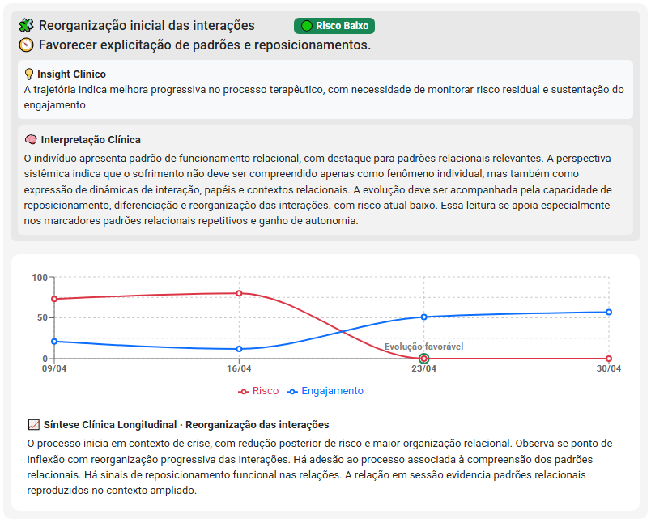
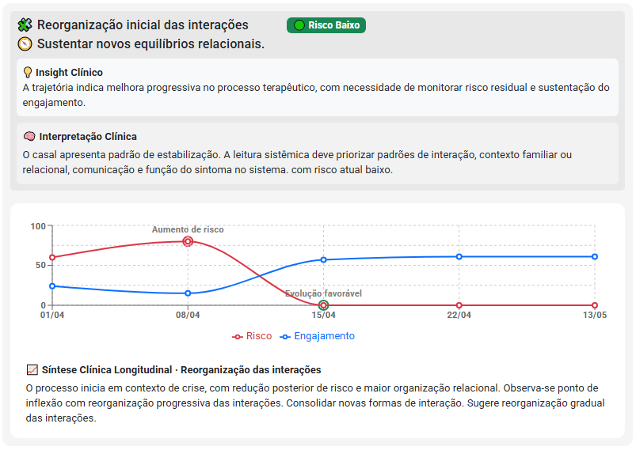
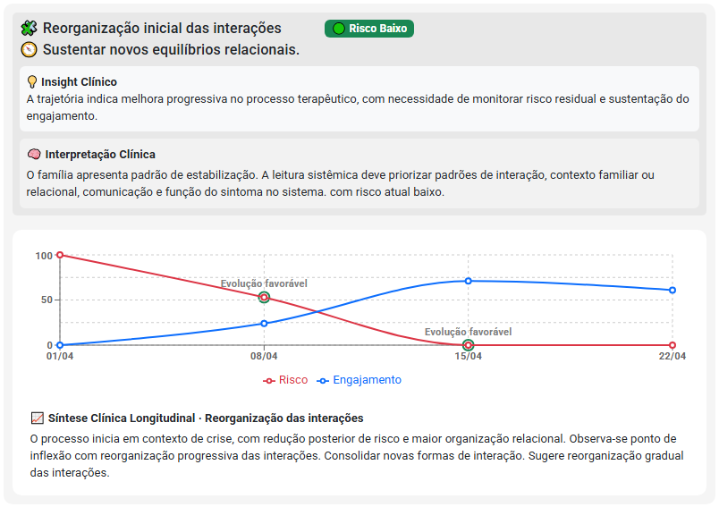
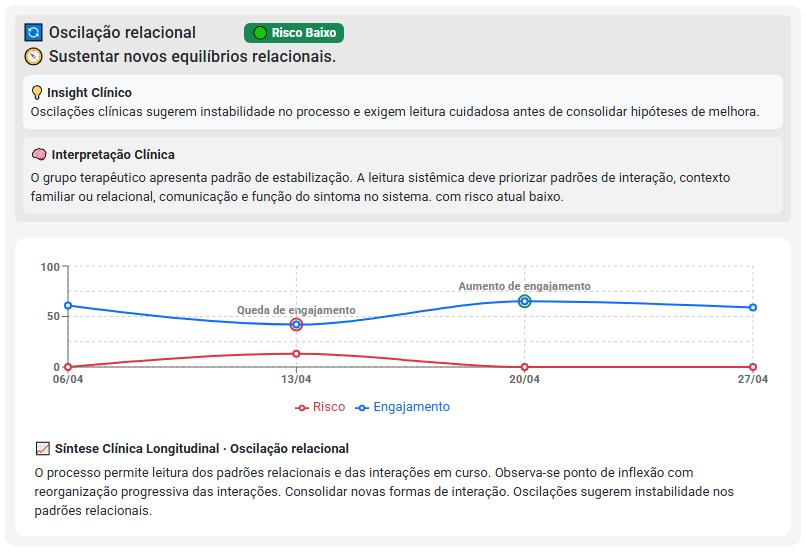

---

id: 04_evolucao-psicologica
title: "Evolução Psicológica: Exemplos Práticos, Modelos e Como Fazer na Clínica"
slug: "/evolucao-psicologica"
sidebar_position: 4
description: "Veja exemplos de evolução psicológica para prontuário, modelos práticos e entenda como analisar a evolução da pessoa cuidada ao longo do tempo."
---

import Tabs from '@theme/Tabs';
import TabItem from '@theme/TabItem';


# Evolução Psicológica: Exemplos Práticos, Modelos e Como Fazer

Se você pesquisou por **evolução psicológica**, provavelmente está procurando:

* exemplos prontos;
* modelos para prontuário;
* formas de registrar a evolução da pessoa cuidada;
* orientações sobre o que escrever.

Essas são dúvidas muito comuns na prática clínica.

Mas existe uma questão ainda mais importante:

> Como identificar se a pessoa cuidada realmente está evoluindo?

A evolução psicológica não é apenas um texto registrado no prontuário.

Ela representa a interpretação clínica das mudanças observadas ao longo do processo terapêutico.

---

## 📚 Navegação Rápida

### 📄 Precisa de modelos e exemplos?

* 📝 [Modelos de Prontuário Psicológico para Download](#-modelos-de-prontuário-psicológico-para-download)
* 📋 [Exemplos de SOAP na Psicologia](#-exemplos-de-soap-na-psicologia)

### 🧠 Quer entender o que realmente é Evolução Psicológica?

* ⚠️ [Evolução Psicológica é muito mais do que registros SOAP ou prontuários](#️-mas-evolução-psicológica-é-muito-mais-do-que-registros-soap-ou-prontuários)
* 🗺️ [Como a Evolução Psicológica é construída](#️-como-a-evolução-psicológica-é-construída-ao-longo-do-processo-terapêutico)

### 📈 Quer aprender a analisar a evolução da pessoa cuidada?       

* 📈 [O desafio de acompanhar a evolução ao longo do tempo](#-o-desafio-de-acompanhar-a-evolução-ao-longo-do-tempo)
* 🧠 [O que é Análise Longitudinal na Psicologia](#-o-que-é-análise-longitudinal-na-psicologia)
* 📊 [Como Fazer uma Análise Longitudinal](#-como-fazer-uma-análise-longitudinal)
* 🧩 [Como Marcadores Clínicos apoiam a análise longitudinal](#-como-marcadores-clínicos-podem-apoiar-a-análise-longitudinal)

### 📄 Quer ver exemplos práticos de Evolução Psicológica?

* 👤 [Exemplo de Evolução Individual, de casal, família e grupo terapêutico](#-exemplos-de-evolução-psicológica)

### 🎯 Quer compreender a proposta do eConsult?

* 🎯 [Evolução Psicológica é compreender a trajetória](#-evolução-psicológica-é-compreender-a-trajetória)

---

## 📥 Modelos de Prontuário Psicológico para Download

### 👤 Modelo de Prontuário Psicológico Individual (Word e PDF)

Ideal para atendimentos individuais de psicoterapia.

#### O que este modelo contém?

- Identificação da pessoa cuidada
- Histórico clínico
- Queixas principais
- Hipóteses diagnósticas
- Prognóstico
- Plano terapêutico
- Evolução clínica
- Registros SOAP
- Encaminhamentos
- Síntese clínica longitudinal

📄 [Baixar PDF](../static/pdf/prontuario-individual-exemplo.pdf)

📝 [Baixar Word](../static/word/Prontuário%20Mariana%20Soares.docx)

---

### 💑 Modelo de Prontuário Psicológico para Casal (Word e PDF)

Modelo desenvolvido para terapia de casal.

#### O que este modelo contém?

- Identificação do casal
- Histórico do relacionamento
- Motivo da consulta
- Dinâmica relacional
- Comunicação do casal
- Objetivos terapêuticos
- Plano de intervenção
- Evolução do processo
- Indicadores de coesão conjugal
- Registros SOAP
- Síntese longitudinal

📄 [Baixar PDF](../static/pdf/prontuario-casal-exemplo.pdf)

📝 [Baixar Word](../static/word/Prontuário%20Casal%20Maria%20e%20João.docx)

---

### 👨‍👩‍👧 Modelo de Prontuário Psicológico Familiar (Word e PDF)

Modelo voltado para terapia familiar.

#### O que este modelo contém?

- Composição familiar
- Histórico da família
- Dinâmica familiar
- Comunicação entre membros
- Papéis e responsabilidades
- Avaliação inicial
- Objetivos terapêuticos
- Evolução familiar
- Indicadores de coesão
- Registros SOAP
- Acompanhamento longitudinal

📄 [Baixar PDF](../static/pdf/prontuario-familia-exemplo.pdf)

📝 [Baixar Word](../static/word/Prontuário%20Família%20Oliveira.docx)

---

### 👥 Modelo de Prontuário para Grupo Terapêutico (Word e PDF)

Modelo destinado a grupos terapêuticos e grupos de apoio.

#### O que este modelo contém?

- Identificação do grupo
- Critérios de inclusão
- Objetivos terapêuticos
- Plano terapêutico coletivo
- Metas de curto, médio e longo prazo
- Evolução coletiva
- Participação e engajamento
- Indicadores de coesão grupal
- Registros SOAP
- Síntese longitudinal do grupo

📄 [Baixar PDF](../static/pdf/prontuario-grupo-exemplo.pdf)

📝 [Baixar Word](../static/word/Prontuário%20Grupo%20Terapêutico%20Reconstruindo%20Caminhos.docx)

---


## 📋 Exemplos de SOAP na Psicologia

Os exemplos abaixo são ilustrativos e devem ser adaptados à realidade clínica de cada caso.

<Tabs>

<TabItem value="individual" label="👤 Individual">

📍 Exemplo SOAP – Primeira Sessão

```text
S (Subjetivo)
Paciente começa a reinterpretar o término afetivo de forma menos autoculpabilizante.

O (Objetivo)
Refere melhora parcial do sono, redução das crises ansiosas e maior sensação de controle emocional.

A (Avaliação)
Os dados indicam um processo terapêutico positivo, com ressignificação de experiências e aumento da autonomia, sugerindo uma estabilização sustentada e redução de sintomas ansiosos.

P (Plano)
Continuar o monitoramento do progresso, reforçando a autonomia e a ressignificação, além de promover estratégias que sustentem a estabilidade emocional.
```

📍 Exemplo SOAP – Sessão de Evolução Inicial

```text
S (Subjetivo)
Paciente relata autocobrança atual associada a padrões familiares de crı́tica excessiva e expressa receio de decepcionar a terapeuta ao falar sobre suas fragilidades pessoais. A pessoa cuidada também menciona ter conseguido conversar sobre emoções com uma amiga próxima, ao invés de se isolar.

O (Objetivo)
Observa-se que o indivíduo demonstra maior confiança no processo terapêutico e maior abertura emocional, embora ainda apresente sintomas ansiosos, com leve redução percebida.

A (Avaliação)
A sessão foi focada na identificação de gatilhos emocionais e estratégias iniciais de enfrentamento, indicando um progresso no engajamento e na aliança terapêutica, apesar da presença de padrões relacionais disfuncionais e perfeccionismo rı́gido.

P (Plano)
Continuar o trabalho de identificação de gatilhos emocionais e desenvolver estratégias de enfrentamento, promovendo a reflexão sobre padrões relacionais e a autocobrança, além de monitorar a evolução dos sintomas ansiosos e fortalecer a aliança terapêutica.
```

📍 Exemplo SOAP – Situação de Crise

```text
S (Subjetivo)
Paciente relata piora importante da ansiedade após conflito familiar ocorrido no final de semana, descrevendo também um episódio recente de ataques de pânico com falta de ar, tremores e sensação de perda de controle em local público. A pessoa cuidada menciona ter evitado sair de casa e faltado ao trabalho após a crise ansiosa.

O (Objetivo)
Observa-se um estado de crise com alto risco, evidenciado pela intensidade dos sintomas ansiosos e pela evitação comportamental. A relação crı́tica e invalidante com familiares próximos éum estressor relevante.

A (Avaliação)
A situação atual sugere um quadro de crise aguda, com necessidade de contenção e monitoramento. A dependência emocional e as crenças centrais negativas podem estar contribuindo para a vulnerabilidade da pessoa cuidada.

P (Plano)
Recomenda-se continuidade do acompanhamento psicológico, com foco na contenção emocional e na exploração gradual dos temas evitados. Considerar encaminhamento para avaliação psiquiátrica para manejo dos sintomas ansiosos, se necessário.
```

📍 Exemplo SOAP – Sessão de Acompanhamento

```text
S (Subjetivo)
Paciente relata tensão constante, insônia e preocupação excessiva relacionada ao trabalho e ao término afetivo, além de sensação frequente de vazio e perda de motivação. O sofrimento intenso após término recente e o medo de rejeição foram destacados. Sente-se “insuficiente” e responsabiliza-se excessivamente pelos conflitos vividos. O ambiente profissional é descrito como sobrecarregado emocionalmente, com dificuldade em estabelecer limites. A pessoa cuidada apresentou choro frequente e dificuldade para organizar emoções durante a sessão.

O (Objetivo)
Primeira sessão focada em levantamento de histórico emocional, contexto atual e principais demandas clı́nicas. Observou-se necessidade de estabilização emocional devido à intensidade do sofrimento apresentado.

A (Avaliação)
Os dados indicam a presença de ansiedade significativa, humor deprimido e dificuldades de regulação emocional, sugerindo um quadro de vulnerabilidade emocional. A dinâmica afetiva e os estressores ocupacionais parecem contribuir para o sofrimento da pessoa cuidada.

P (Plano)
Recomenda-se continuidade do acompanhamento psicológico, com foco na estabilização
emocional e manejo das emoções. Sugere-se explorar estratégias de enfrentamento e estabelecer
limites no contexto profissional, além de trabalhar a autoimagem e a autocrı́tica da pessoa cuidada.
```

</TabItem>

<TabItem value="casal" label="💑 Casal">

📍 Exemplo SOAP – Primeira Sessão

```text
S (Subjetivo)
O casal relata brigas quase diárias, com alta tensão emocional e dificuldade para estabilizar conversas sobre temas sensíveis. Ambos referem sentir-se frequentemente criticados e incompreendidos pelo parceiro.

O (Objetivo)
Observa-se uma crise conjugal aguda, marcada por sofrimento relacional, instabilidade emocional e comunicação predominantemente defensiva. Há alternância entre busca de proximidade e afastamento emocional.

A (Avaliação)
Os dados sugerem um momento crítico na relação, com padrões de comunicação que dificultam a resolução de conflitos e favorecem o distanciamento afetivo. A dinâmica relacional indica um ciclo repetitivo de crítica, defesa e evitação emocional.

P (Plano)
Dar continuidade ao acompanhamento psicológico, com foco em estratégias de comunicação assertiva, manejo de conflitos e compreensão das dinâmicas relacionais do casal.
```

📍 Exemplo SOAP – Sessão de Evolução Inicial

```text
S (Subjetivo)
O casal relata que conseguiu conversar sobre temas difíceis sem grandes conflitos e expressa desejo de reorganizar a relação. Ambos demonstram disposição para compreender melhor as necessidades emocionais do parceiro.

O (Objetivo)
Observa-se melhora na escuta ativa, maior tolerância à fala do parceiro e participação mais colaborativa durante a sessão.

A (Avaliação)
Os dados indicam avanços iniciais na comunicação conjugal e maior capacidade de compreensão mútua. O ambiente terapêutico apresenta condições mais favoráveis para o fortalecimento da aliança entre os parceiros.

P (Plano)
Fortalecer estratégias de escuta ativa, validação emocional e comunicação colaborativa, monitorando o progresso da dinâmica relacional.
```

📍 Exemplo SOAP – Situação de Crise

```text
S (Subjetivo)
O casal relata aumento significativo das discussões durante a semana, com episódios frequentes de conflito, sensação de esgotamento emocional e dificuldade para interromper padrões repetitivos de confronto.

O (Objetivo)
Observa-se escalada dos conflitos, comunicação defensiva e redução da capacidade de validação emocional entre os parceiros. A tensão emocional permanece elevada.

A (Avaliação)
A situação sugere um período de instabilidade relacional importante, caracterizado por dificuldades de regulação emocional e manutenção de padrões disfuncionais de interação. O vínculo encontra-se fragilizado pela repetição dos conflitos.

P (Plano)
Manter acompanhamento psicológico intensivo, trabalhando comunicação assertiva, regulação emocional e estratégias de resolução de conflitos, visando reduzir a escalada das discussões.
```

📍 Exemplo SOAP – Sessão de Acompanhamento

```text
S (Subjetivo)
Maria relata sentir-se mais ouvida e emocionalmente validada. João verbaliza inseguranças com maior abertura e refere sentir-se mais confortável para expressar vulnerabilidades. O casal relata sensação de maior proximidade afetiva e fortalecimento da relação.

O (Objetivo)
Observa-se aumento da comunicação validante, maior abertura emocional e fortalecimento da conexão afetiva entre os parceiros. Temas delicados conseguem ser discutidos sem escaladas significativas de conflito.

A (Avaliação)
Os dados sugerem progresso consistente na relação, com fortalecimento da segurança relacional, melhora da qualidade da comunicação e aumento da capacidade de regulação emocional do casal.

P (Plano)
Dar continuidade ao acompanhamento psicológico, reforçando estratégias de comunicação saudável, validação emocional e sustentação dos avanços obtidos no processo terapêutico.
```

</TabItem>

<TabItem value="familia" label="👨‍👩‍👧 Família">

📍 Exemplo SOAP – Primeira Sessão

```text
S (Subjetivo)
Durante a sessão, ocorreu um conflito familiar intenso envolvendo pais e filho adolescente, com discussões relacionadas à rotina, uso de celular e desempenho escolar. Lucas apresentou comportamento mais isolado, com pouca participação nas conversas.

O (Objetivo)
Observou-se uma dinâmica familiar marcada por interrupções frequentes, dificuldade de escuta entre os membros e elevada tensão emocional. A mãe assumiu frequentemente uma posição intermediadora entre pai e filho.

A (Avaliação)
Os dados indicam uma escalada importante da tensão familiar, com dificuldades na comunicação e sinais de sobrecarga emocional parental. O ambiente familiar apresenta características de insegurança emocional e baixa capacidade de diálogo.

P (Plano)
Dar continuidade ao acompanhamento familiar, promovendo estratégias de comunicação mais eficazes, organização das interações familiares e redução dos padrões de conflito.
```

📍 Exemplo SOAP – Sessão de Evolução Inicial

```text
S (Subjetivo)
Lucas demonstra resistência inicial ao processo terapêutico, relatando dificuldades para compartilhar experiências pessoais. Os pais expressam preocupação com os conflitos familiares e com a dificuldade de estabelecer limites.

O (Objetivo)
Observa-se uma dinâmica familiar rígida, com o pai assumindo postura mais autoritária e a mãe exercendo papel conciliador. Apesar das tensões, todos os membros participam ativamente da sessão.

A (Avaliação)
A resistência do adolescente e os padrões rígidos de funcionamento familiar sugerem necessidade de fortalecimento da segurança emocional e flexibilização dos papéis familiares.

P (Plano)
Manter o acompanhamento familiar, trabalhando comunicação, flexibilização dos papéis familiares e estratégias que favoreçam a participação emocional de Lucas.
```

📍 Exemplo SOAP – Situação de Evolução Positiva

```text
S (Subjetivo)
A família relata redução das discussões mais intensas durante a semana e maior capacidade de diálogo. Lucas refere sentir-se mais ouvido pelos pais, enquanto os responsáveis relatam esforço para validar emoções antes de estabelecer limites.

O (Objetivo)
Observa-se maior equilíbrio na participação dos membros, redução das interrupções e construção conjunta de acordos relacionados à rotina e ao uso de eletrônicos.

A (Avaliação)
Os dados indicam melhora significativa na comunicação familiar, com aumento da colaboração entre os membros e fortalecimento da capacidade parental de escuta e responsividade emocional.

P (Plano)
Dar continuidade ao trabalho de validação emocional, construção de acordos familiares e fortalecimento das práticas de comunicação saudável.
```

📍 Exemplo SOAP – Sessão de Acompanhamento

```text
S (Subjetivo)
A família relata redução da intensidade dos conflitos e maior facilidade para conversar sobre situações difíceis sem discussões prolongadas. Os pais referem melhora no cumprimento dos combinados familiares e Lucas demonstra maior disposição para participar das interações familiares.

O (Objetivo)
Observa-se maior espontaneidade emocional do adolescente, menor postura defensiva e aumento da colaboração entre os membros da família. O diálogo ocorre com menor hostilidade e maior capacidade de negociação.

A (Avaliação)
Os dados sugerem fortalecimento da segurança emocional familiar, melhora da comunicação e maior clareza na definição de limites. O sistema familiar demonstra evolução positiva e maior capacidade de resolução de conflitos.

P (Plano)
Manter o acompanhamento familiar, reforçando os limites estabelecidos, promovendo atividades que fortaleçam os vínculos familiares e monitorando a manutenção dos avanços obtidos.
```

</TabItem>

<TabItem value="grupo" label="👥 Grupo">

📍 Exemplo SOAP – Primeira Sessão

```text
S (Subjetivo)
Os participantes demonstram curiosidade sobre o funcionamento do grupo e apresentam postura cautelosa durante os primeiros compartilhamentos. Relatam expectativas em relação ao processo terapêutico e observam atentamente as interações entre os membros.

O (Objetivo)
Observa-se um clima grupal acolhedor, com participação ativa dos integrantes nas apresentações iniciais. Apesar da ansiedade natural do primeiro encontro, os participantes demonstram respeito e disponibilidade para escuta.

A (Avaliação)
Os dados sugerem a formação de um ambiente seguro e receptivo, favorecendo a identificação entre os participantes e reduzindo sentimentos de isolamento. Há potencial para desenvolvimento da coesão grupal.

P (Plano)
Dar continuidade ao processo terapêutico, incentivando a troca de experiências e fortalecendo a participação colaborativa dos membros do grupo.
```

📍 Exemplo SOAP – Sessão de Evolução Inicial

```text
S (Subjetivo)
Mariana relata dificuldade em perceber proximidade emocional entre os participantes. Felipe comenta redução da espontaneidade nas trocas e sensação de maior distanciamento no grupo. Juliana apresenta menor abertura emocional durante a sessão.

O (Objetivo)
Observa-se diminuição da coesão grupal, com momentos de silêncio, menor espontaneidade e funcionamento defensivo. Apesar disso, os participantes demonstram capacidade de apoiar e validar os relatos uns dos outros.

A (Avaliação)
Os dados indicam fragilidade temporária do vínculo grupal, comum em fases iniciais de desenvolvimento do grupo. A necessidade de intervenções mais ativas para sustentação do enquadre permanece presente.

P (Plano)
Monitorar a coesão grupal, estimular maior profundidade nas trocas emocionais e fortalecer o apoio mútuo entre os participantes.
```

📍 Exemplo SOAP – Situação de Evolução Positiva

```text
S (Subjetivo)
Os participantes relatam sentir maior confiança para compartilhar experiências pessoais. Ricardo reconhece dificuldades de aproximação emocional após receber devolutivas do grupo. Juliana refere sentir-se mais acolhida e segura para participar das discussões.

O (Objetivo)
Observa-se aumento da espontaneidade, continuidade das trocas emocionais e maior capacidade de escuta entre os participantes. O grupo consegue sustentar conteúdos emocionais mais profundos sem ruptura do vínculo grupal.

A (Avaliação)
Os dados indicam fortalecimento da coesão grupal e ampliação da capacidade de reflexão coletiva. O ambiente terapêutico favorece processos de elaboração emocional e produção de insights relevantes.

P (Plano)
Dar continuidade ao aprofundamento das reflexões grupais, mantendo o espaço seguro para compartilhamento emocional e fortalecimento dos vínculos entre os participantes.
```

📍 Exemplo SOAP – Sessão de Acompanhamento

```text
S (Subjetivo)
Ricardo relata insegurança ao compartilhar aspectos mais sensíveis de sua trajetória pessoal. Mariana percebe maior proximidade e confiança entre os participantes. Felipe refere sentir-se mais confortável para contribuir com opiniões e acolher relatos dos demais membros.

O (Objetivo)
Observa-se envolvimento consistente dos participantes, boa circulação das falas e trocas colaborativas. Os membros oferecem validação emocional e sustentam o vínculo grupal mesmo diante da ausência de um participante.

A (Avaliação)
Os dados sugerem estabilização positiva da dinâmica grupal, com fortalecimento do apoio mútuo, aumento da confiança entre os membros e manutenção de um ambiente terapêutico seguro.

P (Plano)
Manter o acompanhamento grupal, reforçando estratégias de apoio mútuo, aprofundamento emocional e preservação dos vínculos construídos ao longo do processo terapêutico.
```

</TabItem>

</Tabs>

---

## ⚠️ Mas Evolução Psicológica é muito mais do que registros SOAP ou prontuários

Ao procurar por exemplos de evolução psicológica, é comum imaginar que a evolução seja apenas o texto registrado no prontuário após uma sessão.

Na prática, o texto é apenas a documentação.

A evolução psicológica acontece na pessoa cuidada.

Ela pode ser observada em mudanças como:

* redução ou aumento de sintomas;
* fortalecimento da autonomia;
* ampliação do insight;
* melhora da regulação emocional;
* mudanças relacionais;
* fortalecimento da aliança terapêutica;
* aumento do engajamento no processo terapêutico.

O registro da evolução procura documentar essas mudanças.

Mas a evolução em si não está no texto.

Ela está na trajetória construída ao longo das sessões.

Por isso, compreender a evolução psicológica envolve mais do que saber o que escrever no prontuário.

Envolve observar padrões, identificar mudanças significativas e compreender como a pessoa cuidada se transforma ao longo do processo terapêutico.

Em outras palavras:

> O texto registra a evolução.
>
> A evolução acontece no processo terapêutico.


***Exemplo de evolução psicológica longitudinal construída a partir da trajetória clínica observada ao longo das sessões, integrando risco, engajamento, marcadores clínicos e síntese clínica.***

---

## 🗺️ Como a Evolução Psicológica é construída ao longo do processo terapêutico

A evolução psicológica não surge de forma isolada.

Ela é construída gradualmente a partir das informações registradas ao longo do acompanhamento.

De forma simplificada, esse processo pode ser representado assim:

```text
🗣️ Sessão
      ↓
📝 Registro Clínico
      ↓
🧩 Estruturação (SOAP)
      ↓
📄 Prontuário Psicológico
      ↓
📈 Evolução Psicológica
      ↓
🔄 Acompanhamento Longitudinal
```

A evolução psicológica não nasce do prontuário.

Ela emerge do conjunto de sessões, registros, observações e interpretações clínicas construídas ao longo do tempo.


***Fluxo visual mostrando como os dados das sessões
são transformados em análise longitudinal.***

Cada etapa possui uma função específica.

A sessão produz informações clínicas.

Os registros organizam essas informações.

O SOAP ajuda a estruturar o raciocínio clínico.

O prontuário consolida os registros relevantes do acompanhamento.

A evolução psicológica procura interpretar as mudanças observadas ao longo do tempo.

E o acompanhamento longitudinal amplia essa análise, permitindo compreender padrões, tendências e a trajetória clínica da pessoa cuidada.

Por isso, a evolução psicológica não deve ser entendida apenas como um texto registrado após uma sessão.

Ela representa uma leitura clínica construída progressivamente ao longo de todo o processo terapêutico.

---

## 📈 O desafio de acompanhar a evolução ao longo do tempo

Muitos psicólogos conseguem perceber intuitivamente que a pessoa cuidada está evoluindo.

O desafio é explicar por quê.

Após dezenas de sessões, torna-se cada vez mais difícil conectar registros dispersos, recuperar informações importantes e identificar padrões sem depender da memória clínica.

Registrar uma evolução psicológica após uma sessão costuma ser relativamente simples.

O desafio aparece após meses de acompanhamento.

Com o passar do tempo, o psicólogo precisa responder perguntas como:

* A pessoa cuidada está evoluindo?
* Houve progresso consistente ou apenas oscilações momentâneas?
* Quais padrões continuam se repetindo?
* O vínculo terapêutico se fortaleceu?
* O risco aumentou ou diminuiu?
* O tratamento está caminhando na direção esperada?

Quando as informações ficam distribuídas entre registros, SOAPs e prontuários, grande parte dessas respostas passa a depender da memória clínica e da releitura de diversas sessões.

É justamente nesse ponto que a análise longitudinal se torna relevante.

---


## 🧠 O que é Análise Longitudinal na Psicologia?

A análise longitudinal consiste em observar a pessoa cuidada ao longo do tempo, identificando padrões, mudanças, momentos de crise, fatores de proteção e sinais de evolução clínica.

Diferentemente da análise de uma única sessão, a análise longitudinal procura compreender a trajetória da pessoa cuidada.

Por exemplo:

Uma sessão isolada pode indicar ansiedade elevada.

Mas somente a observação de várias sessões permite responder perguntas como:

- A ansiedade está diminuindo?
- Existem recaídas recorrentes?
- A pessoa cuidada está desenvolvendo recursos de enfrentamento?
- O engajamento terapêutico aumentou?
- O risco clínico permanece o mesmo?

Em outras palavras:

👉 A sessão mostra o momento.

👉 A análise longitudinal mostra a trajetória.

---

## 📈 Como Fazer uma Análise Longitudinal?

Uma forma prática de realizar análises longitudinais é observar quatro dimensões ao longo das sessões:

### 1. Sintomas e sofrimento

- Houve melhora?
- Houve piora?
- Existem oscilações frequentes?

### 2. Funcionamento emocional e relacional

- A pessoa cuidada desenvolveu maior autonomia?
- Houve mudanças nos relacionamentos?
- Surgiram novos recursos emocionais?

### 3. Engajamento terapêutico

- A adesão ao processo aumentou?
- Existe maior participação e abertura emocional?
- A aliança terapêutica se fortaleceu?

### 4. Direção clínica

Ao observar várias sessões em conjunto, é possível identificar tendências como:

- Evolução favorável
- Estabilização
- Oscilação
- Estagnação
- Crise

A direção clínica nem sempre é visível em uma única sessão.

Ela emerge da observação da trajetória ao longo do tempo.

---

## 🧩 Como Marcadores Clínicos podem apoiar a Análise Longitudinal?

Um dos maiores desafios da prática clínica é acompanhar dezenas de sessões sem depender exclusivamente da memória.

Os Marcadores Clínicos foram propostos para apoiar esse processo.

Ao registrar fenômenos clinicamente relevantes durante as sessões, o psicólogo passa a construir uma linha do tempo clínica da pessoa cuidada.

Com o acúmulo de sessões, torna-se possível visualizar padrões, tendências, momentos de crise, fatores protetivos e sinais de evolução que dificilmente seriam percebidos analisando cada sessão de forma isolada.


***Painel de acompanhamento longitudinal com evolução
dos marcadores clínicos ao longo das sessões.***

A partir dessa estrutura, o profissional pode identificar:

- momentos de crise;
- períodos de estabilização;
- fortalecimento da aliança terapêutica;
- aumento do engajamento;
- ganho de autonomia;
- evolução clínica.

Os registros contam o que aconteceu em cada sessão.

Os marcadores ajudam a compreender a trajetória construída ao longo do processo terapêutico.

---

## 📄 Exemplos de Evolução Psicológica

A evolução psicológica não se resume ao texto registrado no prontuário.

Ela pode ser representada por análises clínicas longitudinais que integram registros, marcadores clínicos, indicadores de risco, engajamento e interpretação profissional.

Os exemplos abaixo ilustram como a evolução psicológica pode ser analisada ao longo do tempo em diferentes contextos terapêuticos, integrando registros clínicos, marcadores clínicos, indicadores de risco, engajamento terapêutico e síntese clínica longitudinal.

<Tabs>

<TabItem value="individual" label="👤 Individual">



</TabItem>

<TabItem value="casal" label="💑 Casal">



</TabItem>

<TabItem value="familia" label="👨‍👩‍👧 Família">



</TabItem>

<TabItem value="grupo" label="👥 Grupo">



</TabItem>

</Tabs>

---

## 🎯 Evolução Psicológica é compreender a trajetória

Registrar uma evolução psicológica é importante.

Mas compreender a evolução da pessoa cuidada é ainda mais importante.

A prática clínica não acontece em uma única sessão.

Ela acontece ao longo de semanas, meses e, muitas vezes, anos de acompanhamento.

Por isso, a evolução psicológica não deve ser entendida apenas como um texto para o prontuário.

Ela é uma tentativa de compreender como a pessoa cuidada muda ao longo do tempo.

👉 O registro documenta a sessão.

👉 A evolução interpreta a trajetória.

A evolução psicológica deixa de ser apenas um registro quando o profissional consegue observar padrões, tendências e transformações ao longo do tempo.

É justamente essa perspectiva longitudinal que permite compreender não apenas o que aconteceu em uma sessão, mas o caminho que a pessoa cuidada está construindo durante o processo terapêutico.

E quando essa trajetória passa a ser acompanhada de forma estruturada ao longo do tempo, surge uma nova possibilidade:

não apenas registrar mudanças, mas compreender continuamente a direção clínica da pessoa cuidada.

É justamente essa a proposta do acompanhamento clínico longitudinal.

Em outras palavras:

👉 A sessão revela um momento.

👉 A evolução psicológica revela a trajetória.

👉 O acompanhamento longitudinal ajuda a compreender a direção dessa trajetória.

---

## 👉 Para aprofundar sua prática:

- 🔗 [Prática Clínica](/pratica-clinica)
- 🔗 [Prontuário Psicológico](/pratica-clinica/prontuario-psicologico)
- 🔗 [SOAP na Psicologia: guia completo, exemplos práticos e como aplicar na clínica](/pratica-clinica/soap-psicologia)
- 🔗 [Marcadores Clínicos na Psicologia: o que são, como usar e por que transformam a prática clínica](/pratica-clinica/marcadores-clinicos-psicologia)
- 🔗 [Avaliação Psicológica na Prática Clínica: como usar instrumentos de forma ética e estratégica](/pratica-clinica/avaliacao-psicologica-pratica-clinica)
- 🔗 [Sistema de Acompanhamento Clínico Longitudinal: o futuro da prática em psicologia](/pratica-clinica/sistema-acompanhamento-clinico-longitudinal)
- 🔗 [Prática Clínica com eConsult](/pratica-clinica/pratica-clinica-com-econsult)

---
