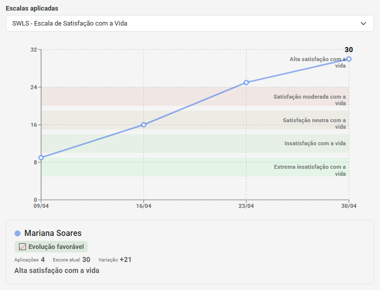
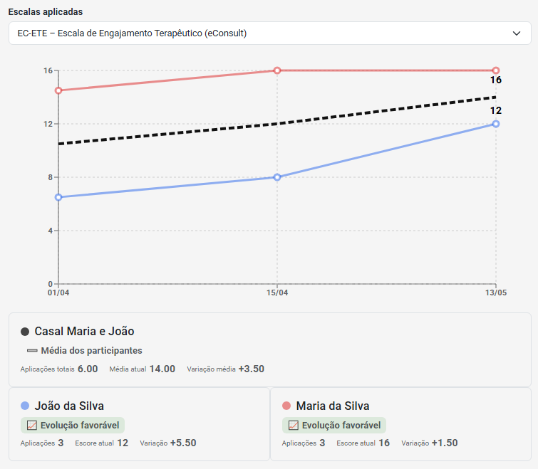
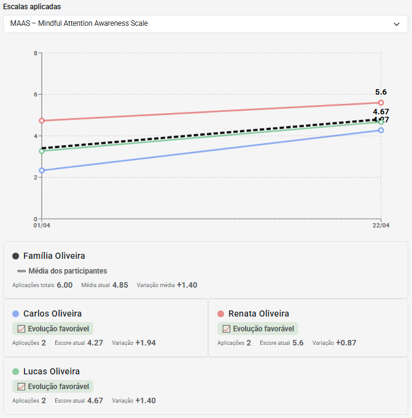
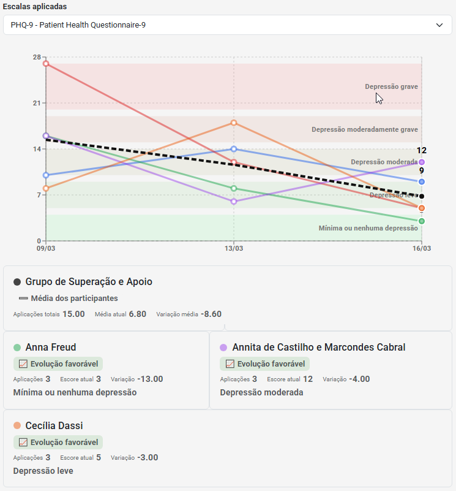
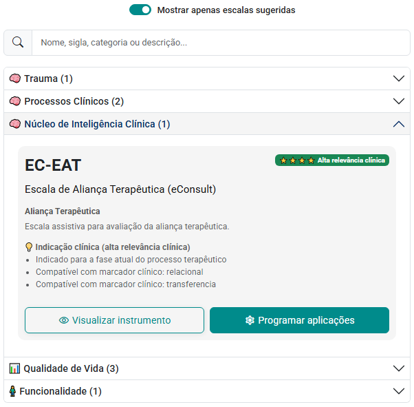
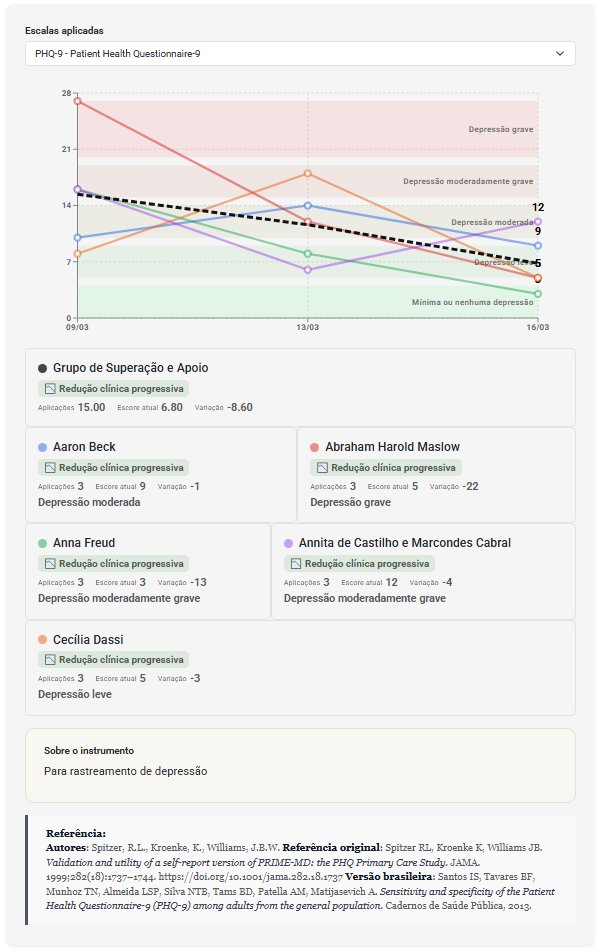

import Tabs from '@theme/Tabs';
import TabItem from '@theme/TabItem';

A avaliação psicológica faz parte da prática clínica desde o primeiro contato com a pessoa atendida.

Mesmo quando nenhum instrumento é aplicado, o profissional está continuamente observando comportamentos, identificando padrões, formulando hipóteses e acompanhando mudanças ao longo do processo terapêutico.

Por isso, avaliação psicológica não deve ser entendida apenas como aplicação de testes, escalas ou questionários.

Ela representa um processo contínuo de coleta, organização e interpretação de informações clinicamente relevantes.

Quando realizada de forma estruturada, permite:

* qualificar o raciocínio clínico;
* apoiar decisões terapêuticas;
* acompanhar evolução;
* identificar riscos;
* monitorar resultados;
* compreender a trajetória clínica ao longo do tempo.

---

## 🧭 Navegação rápida

- [🧠 O que é avaliação psicológica?](#-o-que-é-avaliação-psicológica)
- [⚖️ Avaliação psicológica e diferentes abordagens](#️-avaliação-psicológica-e-diferentes-abordagens)
- [🎯 Por que acompanhar informações ao longo do processo terapêutico?](#-por-que-acompanhar-informações-ao-longo-do-processo-terapêutico)
- [🔍 O que pode ser avaliado na prática clínica?](#-o-que-pode-ser-avaliado-na-prática-clínica)
- [📊 Que avaliação utilizar em cada contexto clínico?](#-que-avaliação-utilizar-em-cada-contexto-clínico)
- [👤 Avaliações na terapia individual](#-avaliações-na-terapia-individual)
- [💑 Avaliações na terapia de casal](#-avaliações-na-terapia-de-casal)
- [👨‍👩‍👧 Avaliações na terapia familiar](#-avaliações-na-terapia-familiar)
- [👥 Avaliações em grupos terapêuticos](#-avaliações-em-grupos-terapêuticos)
- [📈 O verdadeiro valor das avaliações: a análise longitudinal](#-o-verdadeiro-valor-das-avaliações-a-análise-longitudinal)
- [🧠 Nem tudo que importa na clínica pode ser medido por instrumentos tradicionais](#-nem-tudo-que-importa-na-clínica-pode-ser-medido-por-instrumentos-tradicionais)
- [🔄 Avaliando o próprio processo terapêutico](#-avaliando-o-próprio-processo-terapêutico)
- [🧠 Como o eConsult utiliza avaliações psicológicas](#-como-o-econsult-utiliza-avaliações-psicológicas)
- [🧭 Conclusão](#-conclusão)

---

## 🧠 O que é avaliação psicológica?

A avaliação psicológica é um processo de investigação clínica.

Seu objetivo é produzir informações que auxiliem a compreender aspectos importantes do funcionamento psicológico, emocional, comportamental, relacional e contextual da pessoa atendida.

Esse processo pode incluir:

* entrevistas;
* observação clínica;
* anamnese;
* registros de sessão;
* questionários;
* escalas;
* inventários;
* testes psicológicos;
* análise de contexto;
* indicadores clínicos.

Mais importante do que o instrumento utilizado é a capacidade de transformar informações em compreensão clínica.

---

## ⚖️ Avaliação psicológica e diferentes abordagens

A forma como a avaliação é conduzida varia entre diferentes abordagens clínicas.

Algumas abordagens utilizam frequentemente instrumentos estruturados para monitorar sintomas e evolução clínica.

Outras podem priorizar:

* entrevistas aprofundadas;
* observação clínica;
* análise relacional;
* narrativas da pessoa atendida;
* recursos próprios de investigação clínica.

Nenhuma dessas possibilidades, isoladamente, determina a qualidade da prática profissional.

O objetivo permanece o mesmo:

> compreender melhor o caso e acompanhar sua evolução ao longo do tempo.

---

## 🎯 Por que acompanhar informações ao longo do processo terapêutico?

Uma observação isolada oferece apenas uma fotografia.

A evolução clínica acontece em uma trajetória.

Quando informações são acompanhadas longitudinalmente, torna-se possível identificar:

* melhora;
* estabilidade;
* agravamento;
* recaídas;
* resposta às intervenções;
* mudanças graduais que poderiam passar despercebidas.

É justamente essa perspectiva longitudinal que amplia o valor clínico das avaliações.

---

## 🔍 O que pode ser avaliado na prática clínica?

Muitas pessoas associam avaliação psicológica apenas a sintomas.

Na realidade, a prática clínica envolve diversos domínios de observação.

### Aspectos emocionais

* ansiedade;
* depressão;
* sofrimento psicológico;
* estresse;
* trauma.

### Aspectos comportamentais

* adesão;
* evitação;
* impulsividade;
* uso de substâncias.

### Aspectos funcionais

* rotina;
* produtividade;
* autonomia;
* funcionamento global.

### Aspectos relacionais

* comunicação;
* conflitos;
* vínculo;
* dinâmica familiar;
* relacionamento conjugal.

### Aspectos do processo terapêutico

* engajamento;
* aliança terapêutica;
* continuidade;
* participação;
* estágio do processo.

### Qualidade de vida e bem-estar

* satisfação com a vida;
* autoestima;
* autoeficácia;
* qualidade de vida;
* funcionamento social.

---

## 📊 Que avaliação utilizar em cada contexto clínico?

A escolha de uma avaliação depende da demanda apresentada, dos objetivos clínicos e das informações que o profissional deseja acompanhar.

Os exemplos abaixo são ilustrativos e não substituem o julgamento clínico.

### 😟 Ansiedade

Queixas comuns:

> "Não consigo parar de me preocupar."

> "Minha mente não desliga."

Avaliações frequentemente utilizadas:

* GAD-7
* DASS-21
* PSWQ

Objetivo:

* monitorar sintomas;
* acompanhar intensidade da ansiedade;
* observar evolução ao longo do tratamento.

### 😔 Depressão

Queixas comuns:

> "Perdi o interesse pelas coisas."

> "Nada parece fazer sentido."

Avaliações frequentemente utilizadas:

* PHQ-9
* DASS-21
* K10

Objetivo:

* monitorar sintomas depressivos;
* identificar agravamentos;
* acompanhar evolução clínica.

### 😴 Problemas relacionados ao sono

Avaliações frequentemente utilizadas:

* PSQI
* ESS

Objetivo:

* compreender qualidade do sono;
* monitorar impactos funcionais;
* acompanhar mudanças ao longo do processo.

### 🍷 Uso de álcool

Avaliações frequentemente utilizadas:

* AUDIT
* CAGE

Objetivo:

* identificar padrões de consumo;
* monitorar risco;
* acompanhar mudanças comportamentais.

### 💊 Uso de substâncias

Avaliações frequentemente utilizadas:

* DAST-10

Objetivo:

* identificar uso problemático;
* acompanhar evolução;
* monitorar fatores de risco.

### 🌱 Qualidade de vida e bem-estar

Avaliações frequentemente utilizadas:

* WHOQOL-BREF
* SWLS

Objetivo:

* compreender aspectos positivos do funcionamento;
* acompanhar bem-estar;
* monitorar qualidade de vida.

### 💪 Autoestima e recursos pessoais

Avaliações frequentemente utilizadas:

* RSES
* GSE

Objetivo:

* compreender recursos internos;
* acompanhar fortalecimento da autonomia;
* observar mudanças na percepção de competência pessoal.

### 🧠 Trauma

Avaliações frequentemente utilizadas:

* PCL-5
* IES-R
* ACE

Objetivo:

* compreender impacto de experiências traumáticas;
* monitorar sintomas relacionados ao trauma;
* acompanhar evolução ao longo do tratamento.

---

## 📋 Exemplos rápidos de instrumentos por demanda clínica

| Demanda Clínica   | Instrumentos frequentemente utilizados |
| ----------------- | -------------------------------------- |
| Ansiedade         | GAD-7, DASS-21, PSWQ                   |
| Depressão         | PHQ-9, DASS-21, K10                    |
| Sono              | PSQI, ESS                              |
| Álcool            | AUDIT, CAGE                            |
| Drogas            | DAST-10                                |
| Trauma            | PCL-5, IES-R                           |
| Qualidade de Vida | WHOQOL-BREF, SWLS                      |
| Autoestima        | RSES                                   |
| Autoeficácia      | GSE                                    |
| Funcionamento     | WHODAS 2.0                             |

---

## 👥 Avaliações em diferentes contextos de atendimento

As avaliações psicológicas podem ser utilizadas em diferentes modalidades de acompanhamento, respeitando as características e os objetivos de cada contexto clínico.

Embora muitas pessoas associem avaliações apenas ao atendimento individual, elas também podem contribuir para processos terapêuticos envolvendo casais, famílias e grupos.

No eConsult, as aplicações ficam organizadas de acordo com o contexto de atendimento, permitindo acompanhar resultados, reaplicações e evolução clínica de forma estruturada.

<Tabs>
  <TabItem value="individual" label="👤 Individual">

No atendimento individual, as avaliações podem auxiliar no acompanhamento de sintomas, qualidade de vida, funcionamento psicológico, fatores de risco e evolução clínica ao longo do processo terapêutico.

  </TabItem>

  <TabItem value="casal" label="💑 Casal">

Na terapia de casal, as avaliações podem complementar a compreensão de aspectos como comunicação, vínculo, satisfação relacional e mudanças observadas durante o acompanhamento.

  </TabItem>

  <TabItem value="familia" label="👨‍👩‍👧 Família">

Na terapia familiar, as avaliações podem contribuir para a compreensão de padrões relacionais, funcionamento familiar, conflitos e transformações observadas ao longo do processo terapêutico.

  </TabItem>

  <TabItem value="grupo" label="👥 Grupo Terapêutico">

Em grupos terapêuticos, as avaliações permitem acompanhar participantes individualmente e também observar informações relacionadas ao grupo, favorecendo uma compreensão mais ampla da evolução do processo coletivo.

  </TabItem>
</Tabs>

Independentemente do contexto de atendimento, o objetivo permanece o mesmo: coletar informações clinicamente relevantes, acompanhar mudanças ao longo do tempo e apoiar o raciocínio clínico durante o processo terapêutico.

---

## 📈 O verdadeiro valor das avaliações: a análise longitudinal

Uma aplicação isolada responde:

> Como a pessoa está hoje?

A análise longitudinal responde:

> Para onde ela está caminhando?

É a trajetória que permite identificar melhora, estabilidade, agravamento e possíveis recaídas.

Quando analisadas ao longo do tempo, as avaliações deixam de ser apenas registros pontuais e passam a contribuir para a compreensão da evolução clínica.

---

## 🧠 Nem tudo que importa na clínica pode ser medido por instrumentos tradicionais

Instrumentos como PHQ-9, GAD-7 ou WHOQOL-BREF ajudam a monitorar sintomas e aspectos específicos do funcionamento.

No entanto, muitos elementos importantes da prática clínica não costumam ser contemplados por esses instrumentos.

Por exemplo:

* engajamento terapêutico;
* risco de abandono;
* qualidade da aliança terapêutica;
* estágio do processo;
* direção clínica.

Esses aspectos frequentemente dependem apenas da observação e da memória do profissional.

---

## 🔄 Avaliando o próprio processo terapêutico

Além da avaliação de sintomas, alguns modelos de acompanhamento clínico também monitoram aspectos relacionados ao próprio processo terapêutico.

### Engajamento Terapêutico

Avalia:

* adesão;
* participação;
* continuidade;
* aplicação prática entre sessões.

### Risco de Abandono

Avalia:

* frequência;
* engajamento;
* barreiras práticas;
* sinais de descontinuidade.

### Aliança Terapêutica

Avalia:

* vínculo;
* colaboração;
* confiança;
* alinhamento de objetivos.

### Direção Clínica

Avalia:

* melhora;
* estabilidade;
* agravamento;
* tendência evolutiva.

Essas informações não substituem a avaliação clínica.

Elas ajudam a estruturar e acompanhar fenômenos que normalmente permanecem apenas na memória do profissional.

---

## 🧠 Como o eConsult utiliza avaliações psicológicas

No eConsult, as avaliações fazem parte de uma proposta mais ampla de Inteligência Clínica Longitudinal.

### Instrumentos validados

O sistema reúne diversos instrumentos amplamente utilizados na prática clínica, como:

* PHQ-9;
* GAD-7;
* DASS-21;
* AUDIT;
* WHOQOL-BREF;
* PCL-5;
* WHODAS 2.0;
* PSQI;
* entre outros.

### Escalas assistivas do processo terapêutico

Além dos instrumentos tradicionais, o eConsult possui avaliações voltadas ao acompanhamento do próprio processo terapêutico.

Exemplos:

* Engajamento Terapêutico;
* Risco de Abandono;
* Estágio do Processo Terapêutico.

### Inteligência Clínica Longitudinal

O sistema também inclui avaliações estruturadas para apoiar a leitura da trajetória clínica.

Exemplos:

* Risco Clínico Dinâmico;
* Direção Clínica;
* Aliança Terapêutica.

### Sugestão contextual de avaliações

A escolha de uma avaliação nem sempre é simples.

Dependendo da demanda apresentada, do contexto clínico e dos objetivos do acompanhamento, diferentes instrumentos podem ser mais adequados em cada momento do processo terapêutico.

Para auxiliar nessa tomada de decisão, o eConsult pode sugerir avaliações com base em informações observadas durante o acompanhamento, como:

- marcadores clínicos identificados;
- contexto de atendimento;
- fase do processo terapêutico;
- fatores de risco;
- necessidades de monitoramento longitudinal.

No exemplo acima, o sistema sugere a aplicação da Escala de Aliança Terapêutica (EC-EAT) devido à sua relevância para o contexto clínico atual, apresentando também os fatores que justificam a recomendação.

Esse modelo não substitui o julgamento clínico do profissional.

Seu objetivo é apoiar a tomada de decisão, ampliar a visibilidade de instrumentos potencialmente relevantes e facilitar o acompanhamento estruturado ao longo do processo terapêutico.

### Acompanhamento longitudinal

Uma aplicação isolada fornece apenas uma fotografia de determinado momento.

O verdadeiro valor clínico surge quando as avaliações são analisadas ao longo do tempo.

Por isso, o eConsult permite realizar reaplicações sucessivas e visualizar a trajetória dos resultados em uma perspectiva longitudinal.

O acompanhamento pode ser realizado em diferentes contextos:

- atendimento individual;
- terapia de casal;
- terapia familiar;
- grupos terapêuticos.

No exemplo acima, observa-se o acompanhamento de um grupo terapêutico utilizando o PHQ-9 ao longo de múltiplas aplicações.

Além da evolução geral do grupo, o sistema permite visualizar:

- a trajetória individual de cada participante;
- tendências coletivas;
- intensidade atual dos sintomas;
- classificação clínica dos resultados;
- variação acumulada ao longo do acompanhamento.

Essa visualização facilita a identificação de padrões que muitas vezes não seriam percebidos em análises isoladas, contribuindo para uma compreensão mais ampla da evolução clínica.

Dessa forma, as avaliações deixam de ser apenas registros pontuais e passam a funcionar como instrumentos de monitoramento contínuo da trajetória terapêutica.

---

## 🧭 Conclusão

A avaliação psicológica não deve ser compreendida apenas como aplicação de escalas.

Ela representa um processo contínuo de observação, organização e interpretação de informações clinicamente relevantes.

Quando integrada a uma perspectiva longitudinal, a avaliação passa a contribuir não apenas para compreender como a pessoa está hoje, mas também para compreender sua trajetória ao longo do tempo.

Mais importante do que aplicar instrumentos é saber utilizar as informações produzidas por eles para apoiar decisões clínicas, acompanhar evolução e qualificar o cuidado oferecido.
