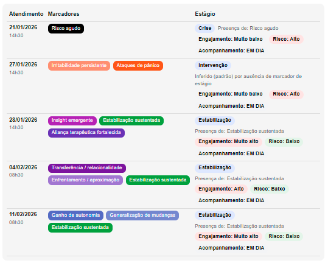
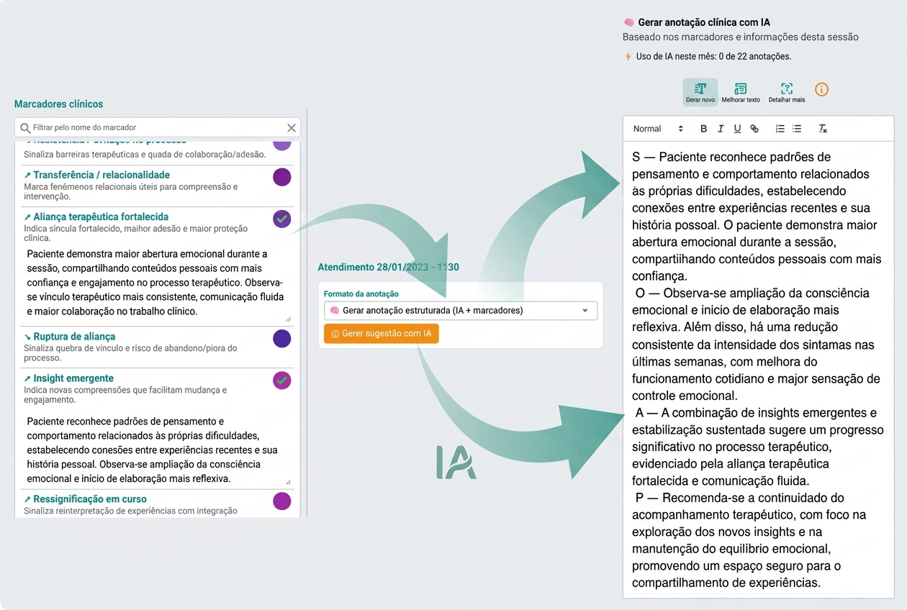

# Marcadores clínicos na psicologia

A prática clínica sempre gerou dados.

Sessões, relatos, observações, impressões.

Mas existe um problema central:

> 👉 Esses dados raramente são estruturados de forma que permitam análise ao longo do tempo.

É aqui que entram os **marcadores clínicos**.

---

## 🧭 Navegação rápida

- 🧠 O que são marcadores clínicos  
- ⚠️ Por que a clínica tradicional não usa marcadores  
- 🧩 Que problema os marcadores resolvem  
- 🛠️ Como usar marcadores na prática  
- 📊 Exemplos de marcadores clínicos  
- 📈 Marcadores e evolução clínica  
- 🔗 Marcadores, prontuário e SOAP  
- 🤖 Marcadores e inteligência artificial  

---

## 🧠 O que são marcadores clínicos

Marcadores clínicos são **indicadores estruturados que representam aspectos relevantes do estado e da evolução do paciente**.

---

👉 Diferente de anotações livres, eles são:

- Padronizados  
- Comparáveis ao longo do tempo  
- Utilizáveis para análise clínica  

---

### 📌 Exemplos simples

- Nível de risco  
- Engajamento no processo  
- Aliança terapêutica  
- Insight  
- Adesão ao tratamento  

---

👉 Em resumo:

> Marcadores clínicos transformam observações subjetivas em **informação estruturada**

---

## 🧠 Marcadores clínicos: uma prática comum em outras áreas

Em diversas áreas da saúde, o uso de marcadores é padrão.

Na medicina, por exemplo, o acompanhamento do paciente é baseado em indicadores ao longo do tempo:

- Glicemia  
- Pressão arterial  
- Hemoglobina glicada  

👉 Esses dados permitem compreender não apenas o estado atual do paciente,  
mas sua evolução clínica.

---

Na psicologia, no entanto, essa estrutura ainda é pouco utilizada.

Apesar da riqueza de informações clínicas, elas permanecem, na maioria das vezes:

- dispersas  
- não padronizadas  
- difíceis de comparar ao longo do tempo  

---

👉 É exatamente essa lacuna que os marcadores clínicos começam a preencher.

Eles trazem para a psicologia uma lógica já consolidada em outras áreas:

> transformar informação em indicadores  
> e indicadores em compreensão longitudinal do paciente

---

## ⚠️ Por que a clínica tradicional da psicologia não usa marcadores

Na maioria das práticas, o registro clínico é:

- Livre  
- Desestruturado  
- Dependente da memória  

---

### 🧩 Consequência

Mesmo com bons registros:

- Não há comparação entre sessões  
- Padrões passam despercebidos  
- A evolução não é clara  

---

👉 Resultado:

> O psicólogo **intui a evolução**, mas não a mede nem a estrutura

---

## 🧩 Que problema os marcadores resolvem

Os marcadores atacam um problema central:

> 👉 A dificuldade de transformar informação clínica em análise ao longo do tempo

---

### ⚠️ Sem marcadores

- Registros desconectados  
- Evolução subjetiva  
- Decisões baseadas em percepção  

---

### ✅ Com marcadores

- Informação organizada  
- Comparação entre sessões  
- Identificação de padrões  
- Apoio à tomada de decisão  

---

👉 Resultado:

> A prática clínica ganha **clareza e consistência**

---

## 🛠️ Como usar marcadores na prática

Marcadores não substituem o raciocínio clínico.

Eles **estruturam o raciocínio**.

---

### ✔️ Aplicação simples

Durante ou após a sessão:

- Avaliar dimensões relevantes  
- Registrar marcadores  
- Utilizar como base para análise  

---

### 🔄 Exemplo de fluxo

- Sessão clínica  
- Registro da anotação  
- Definição de marcadores  
- Integração com SOAP  
- Análise da evolução  

---

👉 Na prática:

> O psicólogo deixa de depender da memória  
> e passa a trabalhar com dados estruturados

---

### 📊 Exemplos de marcadores clínicos na prática

Na prática, marcadores clínicos podem representar diferentes dimensões do processo terapêutico:

---

### 🔴 Risco e alerta

- Agitação mental persistente  
- Resistência ou evitação no processo  
- Baixa participação social  

---

### 🟡 Vulnerabilidade e contexto

- Tomada de decisão insegura  
- Mudanças de vida significativas  
- Condições de saúde que impactam o caso  

---

### 🟢 Evolução e fatores protetivos

- Autonomia e autorresponsabilidade  
- Transferência de ganhos para a vida real  
- Evolução sustentada ao longo do tempo  

---

### 🔵 Processo terapêutico

- Engajamento  
- Adesão  
- Envolvimento no cuidado  

---

👉 Nenhum marcador isolado define o caso.

> É o conjunto deles, ao longo do tempo, que constrói a leitura clínica.

---

## 📈 Marcadores e evolução clínica

O verdadeiro valor dos marcadores aparece ao longo do tempo.

---

Eles permitem:

- Visualizar mudanças  
- Identificar padrões  
- Detectar risco  
- Avaliar resposta terapêutica  

---

👉 Ou seja:

> Marcadores são a base da **análise longitudinal**

👉 Marcadores clínicos não devem ser analisados de forma isolada.

É a sequência ao longo das sessões que revela a direção clínica.

---

👉 Aprofunde:

- 🔗 [Evolução psicológica](#)

---

## 🔗 Marcadores, prontuário e SOAP

Os marcadores não substituem os modelos clínicos.

Eles se integram a eles.

---

### 🔄 Relação prática

- Marcadores → estruturam dados  
- SOAP → organiza o registro  
- Prontuário → consolida a informação  

---

👉 Em outras palavras:

> Marcadores alimentam o raciocínio clínico  
> e o SOAP transforma isso em registro estruturado

👉 Na prática, isso significa transformar dados clínicos em hipóteses organizadas e acionáveis — sem substituir o julgamento clínico.

<small>
Exemplo real de uso no eConsult: a partir de marcadores clínicos e conteúdos da sessão, a IA estrutura automaticamente o registro em formato SOAP, sugerindo Avaliação (A) e Plano (P) para revisão do psicólogo.
</small>

---

👉 Aprofunde:

- 🔗 [SOAP na psicologia](#)  
- 🔗 [Prontuário psicológico](#)

---

## 🤖 Marcadores e inteligência artificial

A combinação entre marcadores e IA muda completamente a prática clínica.

---

### 🧠 O que isso permite

- Estruturação automática do registro  
- Sugestão de hipóteses clínicas  
- Apoio à tomada de decisão  
- Redução de carga cognitiva  

---

### ⚠️ Importante

A IA não substitui o psicólogo.

👉 Ela:

- organiza  
- sugere  
- apoia  

👉 O psicólogo:

- avalia  
- decide  
- conduz  

---

👉 Em termos práticos:

> Marcadores clínicos tornam possível transformar dados em inteligência clínica

---

## 🧠 Marcadores como base da inteligência clínica

A prática clínica está evoluindo.

---

Não basta registrar.

👉 É preciso:

- estruturar  
- analisar  
- interpretar ao longo do tempo  

---

👉 É exatamente isso que os marcadores permitem.

---

## 🚀 O que muda na prática do psicólogo

Com marcadores clínicos:

- O raciocínio se torna mais claro  
- A evolução fica visível  
- As decisões são mais consistentes  
- O prontuário ganha valor  

---

👉 Em outras palavras:

> O psicólogo passa de um registro passivo  
> para uma prática baseada em **inteligência clínica**

---

## 🧠 Aprofunde seu raciocínio clínico

- 🔗 [Prontuário psicológico](#)  
- 🔗 [Evolução psicológica](#)  
- 🔗 [SOAP na psicologia](#)  
- 🔗 [Sistema de acompanhamento clínico longitudinal](#)  

---

## ❓ Perguntas frequentes (FAQ)

### Marcadores clínicos substituem o prontuário?
Não. Eles complementam e estruturam a informação clínica.

---

### Preciso usar muitos marcadores?
Não. O ideal é usar marcadores relevantes para o caso.

---

### Marcadores são padronizados?
Podem ser adaptados, mas devem manter consistência ao longo do tempo.

---

### Marcadores servem para qualquer abordagem?
Sim, desde que adaptados ao modelo clínico do profissional.

---

## 🧭 Conclusão

Marcadores clínicos representam uma mudança na prática.

---

👉 De:

- registros soltos  
- percepção subjetiva  

---

👉 Para:

- dados estruturados  
- análise longitudinal  
- decisão clínica mais precisa  

---

> O diferencial não está em registrar melhor.  
> Está em conseguir **entender o paciente ao longo do tempo**.