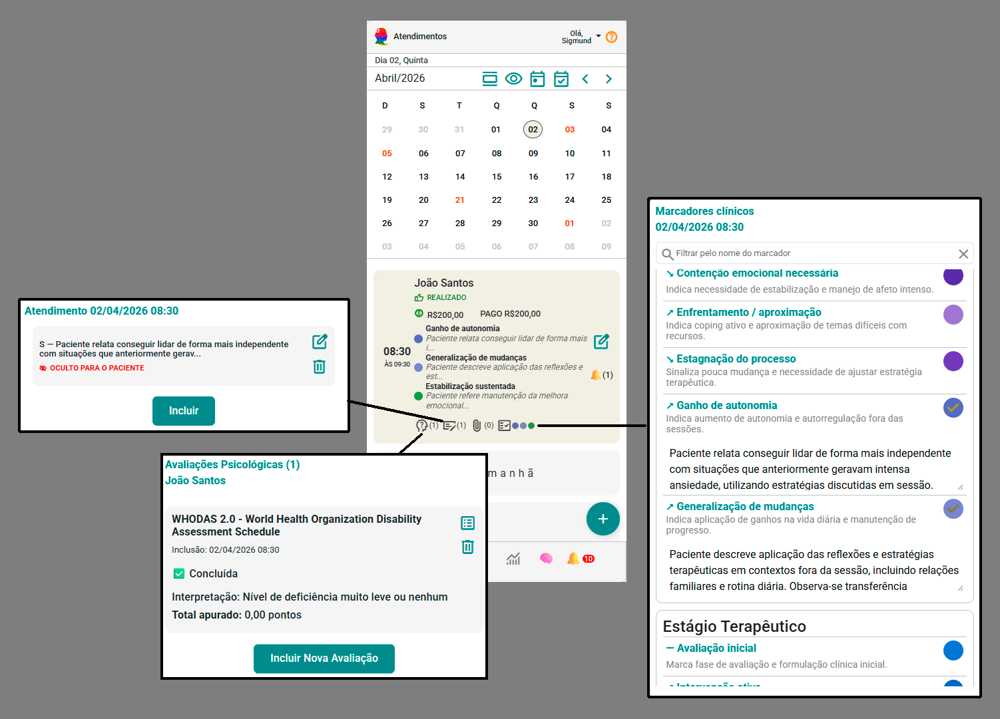

# Sistema de Acompanhamento Clínico Longitudinal: o futuro da prática em psicologia

Durante anos, sistemas para psicólogos evoluíram na gestão.

Agenda, financeiro, prontuário eletrônico, teleatendimento.

Mas existe uma pergunta central que a maioria desses sistemas ainda não responde de forma adequada:

> 👉 *O paciente está evoluindo — e como?*

Essa lacuna não é tecnológica.

É **clínica**.

---

## 🧭 Navegação rápida

- ⚠️ [O problema dos sistemas atuais](#o-problema-dos-sistemas-atuais)  
- 🧠 [O impacto clínico dessa limitação](#o-impacto-clínico-dessa-limitação)  
- 🔄 [O que é acompanhamento clínico longitudinal](#o-que-é-acompanhamento-clínico-longitudinal)  
- ⚖️ [Gestão e clínica não são opostos](#gestão-e-clínica-não-são-opostos)  
- 🎥 [Veja na prática: gestão + acompanhamento clínico](#veja-na-prática-gestão--acompanhamento-clínico)  
- 🧩 [Os pilares de um sistema longitudinal moderno](#os-pilares-de-um-sistema-longitudinal-moderno)  
- 🤖 [O papel da tecnologia e da inteligência artificial](#o-papel-da-tecnologia-e-da-inteligência-artificial)  
- 🧩 [Onde o eConsult se posiciona](#onde-o-econsult-se-posiciona)  
- 🚀 [O que muda na prática do psicólogo](#o-que-muda-na-prática-do-psicólogo)  
- 🧭 [Conclusão](#conclusão)  
- ❓ [FAQ](#faq)

---

## ⚠️ O problema dos sistemas atuais

A maioria dos sistemas disponíveis hoje resolve bem a gestão:

- Agenda  
- Financeiro  
- Organização do consultório  

Mas deixam um ponto crítico de fora:

> ❌ **Não ajudam o psicólogo a compreender a evolução clínica do paciente**

Na prática, isso significa que:

- O prontuário vira um **arquivo de sessões desconectadas**  
- A evolução depende da **memória do profissional**  
- Padrões clínicos ficam **invisíveis ao longo do tempo**  
- Decisões terapêuticas são tomadas com base em **recortes isolados**  

---

## 🧠 O impacto clínico dessa limitação

Sem uma leitura longitudinal estruturada:

- Mudanças sutis passam despercebidas  
- Riscos clínicos podem não ser identificados a tempo  
- O planejamento terapêutico perde precisão  
- O raciocínio clínico fica fragmentado  

Isso cria um paradoxo:

> 📌 Temos mais dados do que nunca — mas menos clareza clínica.

---

## 🔄 O que é acompanhamento clínico longitudinal

O acompanhamento clínico longitudinal é uma abordagem centrada em uma pergunta:

> 👉 *Como esse paciente evolui ao longo do tempo?*

Isso implica:

- Integrar dados de múltiplas sessões  
- Identificar padrões clínicos  
- Acompanhar indicadores relevantes  
- Construir uma leitura contínua do processo terapêutico  

Não se trata apenas de registrar.

Se trata de **interpretar a trajetória clínica**.

---

## ⚖️ Gestão e clínica não são opostos

Um sistema completo para psicólogos precisa fazer os dois:

- Organizar o consultório  
- Apoiar o raciocínio clínico  

O problema não é a gestão.

O problema é quando o sistema para na gestão.

> 👉 A prática clínica exige mais do que organização — exige compreensão longitudinal.

---

## 🎥 Veja na prática: gestão + acompanhamento clínico

<video controls width="100%" style={{borderRadius: '12px', margin: '1rem 0'}}>
  <source src="/video/acompanhamento-clinico-econsult.mp4" type="video/mp4" />
  Seu navegador não suporta vídeo.
</video>

<small>
Nesta visão, o sistema integra agenda, financeiro e evolução clínica em um único fluxo — permitindo ao psicólogo acompanhar o paciente ao longo do tempo enquanto mantém o controle operacional do consultório.
</small>

👉 Na prática, isso significa transformar dados clínicos em decisões terapêuticas mais seguras — sem abrir mão da organização do consultório.

---

👉 Esse tipo de abordagem já está sendo aplicado em sistemas modernos orientados à inteligência clínica longitudinal.

---

## 🧩 Os pilares de um sistema longitudinal moderno

Um sistema de acompanhamento clínico longitudinal não é apenas um prontuário melhorado.

Ele representa uma mudança de paradigma.

---

### 1. Estruturação dos dados clínicos

Informações precisam ser organizadas de forma que possam ser analisadas ao longo do tempo.

> 👉 Sem estrutura, não existe leitura clínica longitudinal.

Na prática, isso significa sair de registros soltos e passar a organizar elementos como:

- Marcadores clínicos  
- Nível de risco  
- Engajamento  
- Estágio do processo terapêutico  

---

#### 👇 O que isso permite na prática

<small>
Nesta visão, é possível identificar direção clínica, nível de risco, estágio do processo e padrões ao longo do tempo — permitindo uma leitura clara da evolução do paciente sem depender exclusivamente da memória clínica.
</small>

---

👉 Observe como o sistema transforma múltiplas sessões em uma **síntese longitudinal estruturada**, permitindo ao psicólogo compreender o caso de forma integrada.

---

### 2. Integração de informações nas sessões

Cada sessão não pode ser isolada.

Na prática clínica, isso ainda acontece com frequência:

- Anotações desconectadas  
- Avaliações não revisitadas  
- Impressões clínicas que não se acumulam  

> 👉 Isso fragmenta o raciocínio clínico e reduz a qualidade das decisões terapêuticas.

---

Para que exista continuidade real, o sistema precisa integrar:

- Impressões do psicólogo (marcadores clínicos)  
- Anotações clínicas (SOAP, PPR, etc.)  
- Avaliações psicológicas  

---

#### 👇 O que isso permite na prática

<small>
Nesta visão, diferentes elementos da prática clínica — agenda, registros, avaliações e marcadores — se conectam em torno do mesmo paciente, permitindo continuidade real do raciocínio clínico ao longo do tempo.
</small>

---

👉 Cada sessão deixa de ser um registro isolado e passa a compor uma **linha contínua de construção clínica**.

---

### 3. Leitura de padrões e tendências

Mais importante do que registrar é identificar padrões.

Sem uma visão longitudinal, isso não acontece.

> 👉 O psicólogo passa a trabalhar com percepções pontuais — não com trajetória clínica.

---

Um sistema longitudinal permite:

- Detectar melhora, estagnação ou piora  
- Identificar padrões comportamentais  
- Observar recorrências clínicas  

---

#### 👇 O que isso revela na prática

<small>
Visualização de padrões ao longo do tempo, permitindo identificar mudanças clínicas e tendências relevantes.
</small>

---

👉 Os marcadores deixam de ser eventos isolados e passam a formar uma **linha de evolução clínica**.

---

### 4. Síntese clínica assistiva

Um dos maiores desafios da prática clínica não é registrar.

É sintetizar.

> 👉 Transformar múltiplas informações em uma leitura coerente exige alto esforço cognitivo.

---

É aqui que entra a síntese clínica assistiva.

O sistema não apenas armazena dados — ele ajuda a interpretá-los.

---

Isso inclui:

- Geração de hipóteses clínicas  
- Sugestões de direção terapêutica  
- Sínteses baseadas no histórico  

---

#### 👇 O que isso permite na prática

<small>
Síntese clínica baseada em múltiplas sessões, permitindo uma leitura integrada do caso.
</small>

---

👉 O sistema organiza informações dispersas em uma **síntese longitudinal estruturada**, incluindo direção clínica, risco e manejo.

> ⚠️ Importante: a inteligência artificial atua como apoio ao raciocínio clínico — não como substituição do psicólogo.

---

## 🤖 O papel da tecnologia e da inteligência artificial

A tecnologia, quando bem aplicada, não substitui o psicólogo.

Ela **reduz carga cognitiva e amplia a capacidade de análise**.

Em um sistema longitudinal, a IA pode:

- Cruzar dados clínicos ao longo do tempo  
- Identificar padrões não óbvios  
- Auxiliar na construção de registros (ex: SOAP)  
- Apoiar o raciocínio clínico  

---

## 🧩 Onde o eConsult se posiciona

O eConsult nasce exatamente na interseção entre gestão e clínica.

Não como um sistema que “também faz clínica”.

Mas como um sistema **projetado para o raciocínio clínico longitudinal desde a base**.

---

Ele integra, em um único fluxo:

- Gestão do consultório (agenda, financeiro, comunicação)  
- Registro estruturado das sessões  
- Marcadores clínicos e indicadores  
- Leitura de padrões ao longo do tempo  
- Síntese clínica assistiva  

---

👉 O resultado não é apenas organização.

É **compreensão clínica ampliada**.

---

## 🚀 O que muda na prática do psicólogo

Ao utilizar um sistema com acompanhamento longitudinal:

- O raciocínio clínico se torna mais estruturado  
- A evolução do paciente fica clara  
- Decisões terapêuticas ganham mais precisão  
- O prontuário deixa de ser passivo e se torna ativo  

---

## 🧭 Conclusão

Sistemas para psicólogos evoluíram muito na gestão.

Mas a prática clínica exige mais.

> 👉 Não basta registrar. É preciso compreender.

O futuro não está em escolher entre gestão ou clínica.

Está em integrar ambos.

**Sistemas de acompanhamento clínico longitudinal representam essa nova geração.**

---

## ❓ FAQ

### O que é um sistema de acompanhamento clínico longitudinal?

É um sistema que organiza e interpreta dados clínicos ao longo do tempo, permitindo compreender a evolução do paciente.

---

### Qual a diferença entre prontuário eletrônico e acompanhamento longitudinal?

O prontuário registra informações.  
O acompanhamento longitudinal interpreta a evolução ao longo do tempo.

---

### Um sistema pode fazer gestão e clínica ao mesmo tempo?

Sim. Um sistema completo integra organização e suporte ao raciocínio clínico.

---

### A inteligência artificial substitui o psicólogo?

Não. Atua como suporte ao raciocínio clínico.

---

### Por que sistemas tradicionais não oferecem isso?

Porque foram projetados com foco em gestão, não em análise clínica longitudinal.

---

## 👉 Para aprofundar sua prática:

- 🔗 [Prática Clínica](/pratica-clinica)
- 🔗 [Prontuário Psicológico](/pratica-clinica/prontuario-psicologico)
- 🔗 [SOAP na Psicologia: guia completo, exemplos práticos e como aplicar na clínica](/pratica-clinica/soap-psicologia)
- 🔗 [Avaliação Psicológica na Prática Clínica: como usar instrumentos de forma ética e estratégica](/pratica-clinica/avaliacao-psicologica-pratica-clinica)
- 🔗 [Marcadores Clínicos na Psicologia: o que são, como usar e por que transformam a prática clínica](/pratica-clinica/marcadores-clinicos-psicologia)
- 🔗 [Evolução Psicológica](/pratica-clinica/evolucao-psicologica)

---